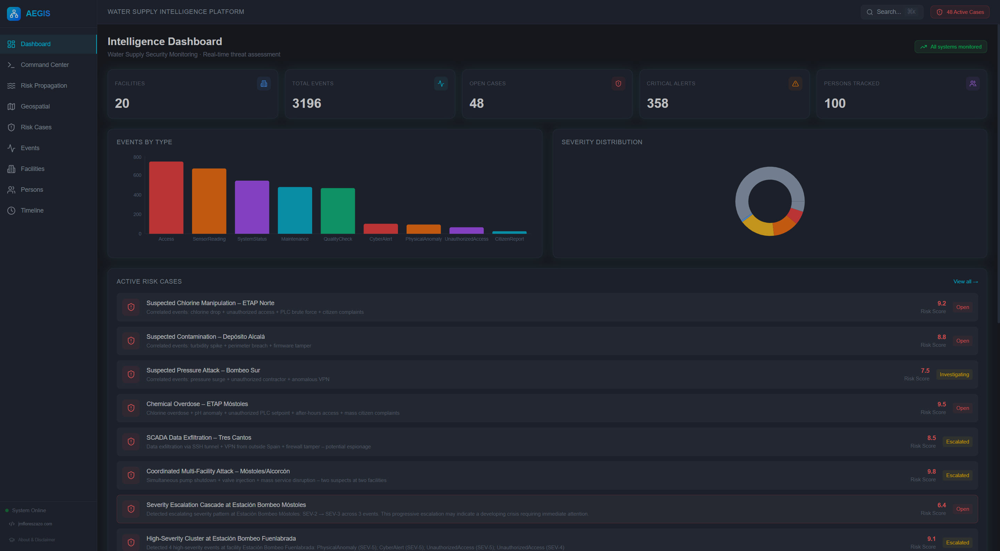
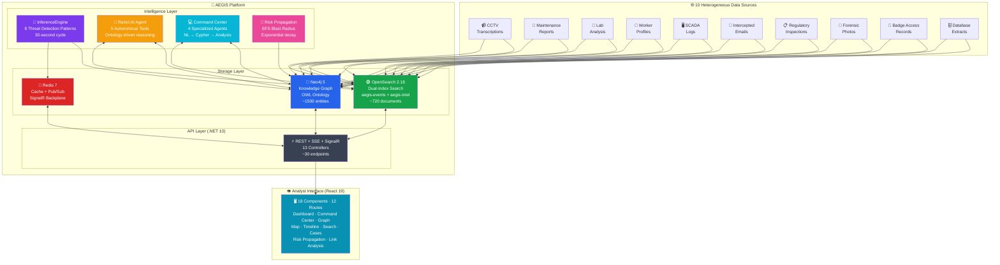

# AEGIS — Analytical Engine for Graph Intelligence & Security

### An Open-Source Palantir Gotham–Inspired Intelligence Platform for Critical Infrastructure Protection

---

<div align="center">

*Built with knowledge graphs, OWL ontologies, AI agents, and heterogeneous data fusion.*
*One `docker compose up` from a full intelligence platform.*


**Author:** [José María Flores Zazo](https://jmfloreszazo.com)

</div>

<div align="center">



*Dashboard: KPIs, event charts, active risk cases, and critical event feed.*

</div>

---

## Why This Project Exists

**Palantir Technologies** is worth over $60 billion. Their core product — **Gotham** — is an intelligence platform that connects data from hundreds of sources into a single knowledge graph, then lets analysts explore hidden connections that no human could find manually.

**AEGIS** proves that the fundamental architecture behind Gotham — ontology-driven knowledge graphs, heterogeneous data fusion, AI-powered investigation, and hidden link discovery — can be replicated with open-source tools, a local LLM, and a single engineering team. Not at Palantir's scale, but with the same architectural patterns that make these systems transformative.

This is not a toy demo. It is a **fully functional intelligence platform** with 20 monitored facilities, 100 tracked individuals, 220 heterogeneous intelligence documents, 8 real-time threat detection patterns, 4 specialized AI agents, hidden link discovery, risk propagation analysis, and a complete analyst interface — all deployable with one command.

> **This repository is a research article implemented as working software.** Every design decision is documented, every architectural pattern is explained, and every capability is mapped to its Palantir Gotham equivalent.

---

## Table of Contents

| # | Document | What It Covers |
|---|----------|----------------|
| — | **[This README](#the-core-thesis)** | The core thesis, architecture overview, quick start, and why this matters |
| 1 | **[Ontology & Knowledge Graph](docs/01-ontology-and-knowledge-graph.md)** | OWL 2.0 ontology, semantic modeling, Neo4j materialization, why schemas beat hardcoded rules |
| 2 | **[AI Agents & Prompt Engineering](docs/02-ai-agents-and-prompts.md)** | ReAct agent, Command Center (4 personas), NL→Cypher pipeline, anti-hallucination, SSE streaming |
| 3 | **[Heterogeneous Data Fusion](docs/03-heterogeneous-data-fusion.md)** | 10 document types, dual-index OpenSearch, classification levels, unified search |
| 4 | **[Graph Analysis & Link Discovery](docs/04-graph-analysis-and-link-discovery.md)** | Hidden link analysis, risk propagation BFS, emergent attack vectors, graph algorithms |
| 5 | **[Threat Detection Engine](docs/05-threat-detection-engine.md)** | 8 detection patterns, InferenceEngine, risk scoring formula, real-time alerting |
| 6 | **[Platform User Guide](docs/06-platform-user-guide.md)** | Every screen explained — Dashboard, Command Center, Graph, Map, Timeline, Search, Cases |
| 7 | **[Architecture & Deployment](docs/07-architecture-and-deployment.md)** | Clean Architecture, Docker Compose, API reference, project structure, rebuild instructions |

---

## The Core Thesis

### The Most Powerful Weapon in Security Is a Graph

Imagine you're a security analyst at a water utility. An alert fires at 3 AM: *"Chlorine levels dropped to dangerous lows at Treatment Plant ETAP Norte."*

In a traditional system, you'd open 7 different applications: SCADA dashboard, access control logs, HR database, cyber security SIEM, citizen complaints portal, email archives, and maintenance records. You might spend 4 hours correlating data manually. And the connection between the contractor who swiped in at 02:47 AM and the email he sent asking about PLC configurations three weeks ago? **You'll never find it.**

Now imagine all seven data sources feed into a single **knowledge graph**:

```
                    ┌─────────────┐
                    │  Person:    │
        ┌──────────│  Dmitri V.  │──────────┐
        │           │  Contractor │           │
        │           └─────────────┘           │
        │                  │                  │
   CONNECTED_TO      BELONGS_TO         INVOLVES_PERSON
        │                  │                  │
        ▼                  ▼                  ▼
  ┌──────────┐    ┌──────────────┐    ┌──────────────┐
  │ Person:  │    │Organization: │    │   Event:     │
  │ Carlos G.│    │ AquaServ     │    │ PLC login    │
  │ Employee │    │ Maintenance  │    │ attempt 03:12│
  └──────────┘    └──────────────┘    └──────────────┘
                         │                    │
                    OPERATES_IN          OCCURS_AT
                         │                    │
                         ▼                    ▼
                  ┌──────────────┐    ┌──────────────┐
                  │  Location:   │    │  Facility:   │
                  │  Madrid Zone │    │  ETAP Norte  │
                  └──────────────┘    └──────────────┘
                                            │
                                       HAS_SENSOR
                                            │
                                            ▼
                                     ┌──────────────┐
                                     │   Sensor:    │
                                     │  Chlorine    │
                                     │  → 0.02 mg/L │
                                     └──────────────┘
```

One query. One traversal. The relationship between Dmitri, his company, the zone they operate in, the plant in that zone, the PLC login attempt, and the chlorine sensor dropping — **all visible in a single graph exploration.**

> **This is why Palantir is worth $60 billion.** Not because they have fancy dashboards. Because they put *relationships first*.

---

## Architecture at a Glance



### Layer-by-Layer Mapping to Palantir Gotham

| Layer | Palantir Gotham | AEGIS | Open-Source Stack |
|-------|----------------|-------|-------------------|
| **Knowledge Graph** | Proprietary Dynamic Ontology | Neo4j 5 + OWL 2.0 | Cypher, APOC, labeled property graph |
| **Search** | Proprietary semantic search | OpenSearch 2.18 | Dual-index, fuzzy multi-match |
| **Real-time** | Proprietary streaming | Redis 7 + SignalR | WebSocket push, pub/sub |
| **AI / LLM** | AIP / Gaia (proprietary) | Ollama (qwen2.5:7b) | Local inference, zero cloud dependency |
| **Backend** | Java microservices | .NET 10, Clean Architecture | REST, SSE, CQRS-style |
| **Frontend** | Proprietary web platform | React 19 + Vite | Cytoscape.js, Leaflet, Tailwind CSS 4 |
| **Deployment** | Kubernetes (cloud + air-gapped) | Docker Compose | 7 containers, single command |

---

## The 15 Capabilities

| # | Capability | What AEGIS Does | Gotham Equivalent | Details |
|---|-----------|-----------------|-------------------|---------|
| 1 | **OWL Ontology** | Formal domain model (305 lines of Turtle) defines all possible entities and relationships | Dynamic Ontology | [Doc 1](docs/01-ontology-and-knowledge-graph.md) |
| 2 | **Knowledge Graph** | Neo4j with ~1,500 entities and ~2,000+ typed relationships | Entity Object Model | [Doc 1](docs/01-ontology-and-knowledge-graph.md) |
| 3 | **Graph Exploration** | Interactive Cytoscape.js canvas with expand/collapse, depth control, entity coloring | Graph Explorer | [Doc 6](docs/06-platform-user-guide.md) |
| 4 | **Hidden Link Discovery** | `allShortestPaths` between any two entities — reveals emergent attack vectors | Link Analysis | [Doc 4](docs/04-graph-analysis-and-link-discovery.md) |
| 5 | **Risk Propagation** | BFS blast radius with exponential decay through 18 weighted relationship types | Threat Propagation | [Doc 4](docs/04-graph-analysis-and-link-discovery.md) |
| 6 | **ReAct AI Agent** | Autonomous investigation with 5 tools — reads ontology, writes Cypher, searches, reasons | AIP Agent | [Doc 2](docs/02-ai-agents-and-prompts.md) |
| 7 | **Command Center** | 4 specialized agents (CENTCOM, CIVILCOM, OPSCOM, SENTINEL) with NL→Cypher pipeline | Multi-Agent Intelligence | [Doc 2](docs/02-ai-agents-and-prompts.md) |
| 8 | **Heterogeneous Data Fusion** | 10 document types across 2 search indices with classification levels | Data Integration | [Doc 3](docs/03-heterogeneous-data-fusion.md) |
| 9 | **Threat Detection** | 8 automated patterns running every 30 seconds, auto-creates risk cases | Automated Alerting | [Doc 5](docs/05-threat-detection-engine.md) |
| 10 | **Geospatial View** | Leaflet map with 20 facilities around Madrid, criticality coloring | GIS Layer | [Doc 6](docs/06-platform-user-guide.md) |
| 11 | **Event Timeline** | Chronological visualization with swim lanes, severity filter | Temporal Analysis | [Doc 6](docs/06-platform-user-guide.md) |
| 12 | **Unified Search** | Full-text across events + intel docs, classification badges, type icons | Federated Search | [Doc 3](docs/03-heterogeneous-data-fusion.md) |
| 13 | **Real-time Alerts** | SignalR WebSocket push for new events, critical alerts, risk cases | Streaming | [Doc 5](docs/05-threat-detection-engine.md) |
| 14 | **Risk Case Management** | Auto-generated cases with linked entities, confidence scores, risk scores | Case Management | [Doc 6](docs/06-platform-user-guide.md) |
| 15 | **Conversational AI** | Follow-up chat with context-aware responses grounded in the knowledge graph | Conversational Intelligence | [Doc 2](docs/02-ai-agents-and-prompts.md) |

---

## Quick Start

### Prerequisites

- **Docker Desktop 4.x** (or Docker Engine 24+ with Compose V2)
- **16 GB RAM** recommended (Neo4j + OpenSearch + Ollama)
- **GPU recommended** but not required for Ollama

### 1. Clone and Start

```bash
git clone <repository-url>
cd palantir-ghotam-like
docker compose up -d --build
```

Wait 2–3 minutes for all health checks to pass.

### 2. Seed the Database

```bash
curl -X POST http://localhost:5000/api/seed
```

This loads ~1,695 lines of Cypher (20 facilities, 100 persons, 220 documents, 6 sabotage scenarios) and indexes 220 intel documents into OpenSearch.

### 3. Access the Platform

| Service | URL | Notes |
|---------|-----|-------|
| **AEGIS UI** | http://localhost:3000 | Main analyst interface |
| **Swagger** | http://localhost:5000/swagger | Interactive API documentation |
| **Neo4j Browser** | http://localhost:7474 | Direct graph exploration (`neo4j` / `aegis2026!`) |
| **OpenSearch** | http://localhost:9200 | Search index inspection |

### 4. Explore

1. **Dashboard** — KPIs, event distribution, active risk cases
2. **Command Center** — Select an AI agent, type a natural language query, watch NL→Cypher→Analysis in real time
3. **Graph Explorer** — Click any case to explore its knowledge graph; enter Link Analysis mode to discover hidden connections
4. **Risk Propagation** — Select a risk source, watch the blast radius propagate through the graph
5. **Search** — Press `Ctrl+K`, type "chlorine tampering", see results from 10 document types
6. **Map** — See all 20 facilities around Madrid with criticality coloring
7. **Timeline** — View event chronology with swim lanes and severity filtering

---

## Technology Stack

| Layer | Technology | Purpose |
|-------|-----------|---------|
| **Frontend** | React 19, TypeScript, Vite 6 | SPA with 12 routes, 18 components |
| **Graph Visualization** | Cytoscape.js | Interactive knowledge graph with link analysis |
| **Maps** | Leaflet + react-leaflet | Geospatial view of 20 Madrid-area facilities |
| **Timeline** | vis-timeline | Chronological event visualization with swim lanes |
| **Styling** | Tailwind CSS 4 | Dark-themed intelligence UI |
| **Markdown** | react-markdown + remark-gfm | Rich AI response rendering |
| **Icons** | Lucide React | Consistent icon system |
| **Backend** | .NET 10, C#, ASP.NET Core | 13 controllers, 2 background services, Clean Architecture |
| **Knowledge Graph** | Neo4j 5 Community + APOC | ~1,500 entities, ~2,000+ relationships |
| **Search** | OpenSearch 2.18 | Dual-index: ~500 events + 220 intel documents |
| **Cache / PubSub** | Redis 7 | SignalR backplane + response caching |
| **AI / LLM** | Ollama (qwen2.5:7b) | Local LLM — zero data leaves the network |
| **Real-time** | SignalR (WebSocket) | Push notifications for events and alerts |
| **Streaming** | Server-Sent Events (SSE) | AI response streaming to frontend |
| **Ontology** | OWL 2.0 (Turtle syntax) | 305-line formal domain model |
| **Orchestration** | Docker Compose | 7 containers, one-command deployment |
| **Simulator** | Python 3.12 | Continuous event generator (~1 event/second) |

---

## Project Structure

```
palantir-ghotam-like/
├── README.md                              ← You are here
├── docs/                                  ← Detailed documentation (7 articles)
│   ├── 01-ontology-and-knowledge-graph.md
│   ├── 02-ai-agents-and-prompts.md
│   ├── 03-heterogeneous-data-fusion.md
│   ├── 04-graph-analysis-and-link-discovery.md
│   ├── 05-threat-detection-engine.md
│   ├── 06-platform-user-guide.md
│   └── 07-architecture-and-deployment.md
├── docker-compose.yml                     ← 7 services, one-command deployment
├── ontology/
│   └── water-sabotage.owl.ttl             ← OWL 2.0 ontology (305 lines)
├── data/
│   └── neo4j-init/
│       └── seed.cypher                    ← Graph seed data (~1,695 lines)
├── src/
│   ├── backend/
│   │   ├── Aegis.Domain/                  ← Entities + Interfaces (zero dependencies)
│   │   ├── Aegis.Application/             ← Services + DTOs + Business logic
│   │   ├── Aegis.Infrastructure/          ← Neo4j + OpenSearch + Ollama + AI Agents
│   │   └── Aegis.API/                     ← Controllers + Hubs + InferenceEngine
│   └── frontend/
│       └── src/
│           ├── components/                ← 18 React components
│           ├── services/                  ← API client + SSE streaming
│           ├── hooks/                     ← React Query hooks
│           └── types/                     ← TypeScript interfaces
└── tools/
    ├── generate_data.py                   ← Synthetic data generator (1,886 lines)
    └── simulate_events.py                 ← Live event simulator (748 lines)
```

---

## What This Project Proves

### 1. The Architecture Is Replicable

Neo4j + OpenSearch + LLM Agent + React is a viable open-source stack for intelligence platforms. The same patterns that make Palantir Gotham transformative — ontology-driven graphs, heterogeneous fusion, AI-augmented analysis — work with commodity hardware and open-source software.

### 2. Ontology-Driven Design Enables Evolution Without Code Changes

Add a relationship to the OWL file, materialize it in Neo4j, and the AI agent automatically reasons about it. The ontology is not documentation — it is the **instruction manual** the AI reads at inference time to generate precise Cypher queries.

### 3. AI Agents with Graph Tools Are Transformative

A 7B parameter model with access to Cypher, search, and the ontology produces genuinely useful investigative analysis. The agent doesn't hallucinate relationship names because it reads the schema first. It doesn't invent data because it queries the graph for facts.

### 4. The Graph Data Model Is the Key Differentiator

Analysis requiring dozens of SQL JOINs becomes a single Cypher traversal. Link analysis — the killer feature of intelligence platforms — is **impossible** in a relational database without pre-computing all possible paths. In a graph, it's one line: `allShortestPaths((a)-[*..6]-(b))`.

### 5. Zero Cloud Dependency Is Achievable

Ollama runs the LLM on-premise. Neo4j, OpenSearch, and Redis run locally. No data leaves the network. This matters for CNPIC, NATO, classified environments, and any organization where data sovereignty is non-negotiable.

### 6. The Barrier to Entry Has Collapsed

What required $100M+ and a team of 500 engineers ten years ago can now be prototyped by a small team with open-source tools. The architecture is the same — only the scale differs.

---

## Use Cases Beyond Water Security

The AEGIS architecture generalizes to **any domain where hidden relationships matter**. Replace the OWL ontology, regenerate the seed data, and the entire platform adapts:

| Domain | Entities | Key Relationships | Why Graphs Win |
|--------|----------|-------------------|----------------|
| **Counter-Terrorism** | Persons, locations, communications, finances | travels-to, communicates-with, transfers-funds | Cell network discovery, travel pattern convergence |
| **Fraud Detection** | Accounts, transactions, devices, identities | sends-to, shares-device, same-address | Circular transactions, identity overlap networks |
| **Insider Threat** | Employees, access logs, data transfers | accesses-system, downloads-data, contacts-external | Data exfiltration patterns, privilege escalation chains |
| **Supply Chain** | Suppliers, components, certifications | supplies-to, certified-by, ships-via | Counterfeit component chains, single-point dependencies |
| **Cyber Threat Intel** | IPs, domains, malware samples, actors | resolves-to, communicates-with, attributed-to | C2 infrastructure mapping, campaign attribution |
| **Healthcare Fraud** | Providers, patients, prescriptions, claims | prescribes-to, claims-for, refers-to | Phantom billing networks, prescription mills |

---

## AEGIS vs Palantir Gotham — Honest Comparison

| Metric | AEGIS | Palantir Gotham |
|--------|-------|-----------------|
| **Entities** | ~1,500 | Millions to billions |
| **Users** | Single analyst | Thousands (with RBAC per entity/field) |
| **Data sources** | 10 types (synthetic) | Hundreds (SIGINT, HUMINT, OSINT, sensors, APIs) |
| **AI model** | 7B parameters (local GPU) | Proprietary fine-tuned (hundreds of billions) |
| **Deployment** | Docker Compose (1 machine) | Multi-region Kubernetes (cloud + air-gapped) |
| **Ingestion rate** | ~10 events/minute | Millions/second |
| **Graph algorithms** | Visual exploration + BFS propagation | PageRank, Louvain clustering, betweenness centrality |

### What's Missing (Enterprise Gap)

| Feature | Why It Matters | Effort |
|---------|---------------|--------|
| RBAC / ACL | Field-level access control per user/role | Medium |
| Audit trail | Immutable log of who accessed what | Medium |
| Graph algorithms | PageRank, community detection, centrality | Low (Neo4j GDS) |
| Document ingestion (OCR/NLP) | Real PDFs, scanned images, audio | High |
| Data federation | Query across databases without ETL | High |
| Collaboration | Shared annotations, team workspaces | High |
| HA / DR | Multi-region, air-gapped deployment | High |

---

## The Bottom Line

Tolkien imagined the **Palantíri** as artifacts that reveal hidden truths across vast distances. Batman built a **Batcomputer** to trace invisible connections between Gotham's criminals. Palantir Technologies named their company after those seeing stones because their platform does the same thing with data.

AEGIS proves that the principle behind all of them — **the most dangerous threats hide in the relationships between things you've already seen** — can be implemented with open-source tools, a local LLM, and a well-designed ontology.

The graph is the seeing stone. The ontology is the instruction manual. The AI agent is the detective.

---

<div align="center">

**AEGIS — Analytical Engine for Graph Intelligence & Security**

*An open-source Palantir Gotham–inspired intelligence platform*

.NET 10 · React 19 · Neo4j 5 · OpenSearch 2.18 · Redis 7 · Ollama · OWL 2.0 · Docker

MIT License — For educational and demonstration purposes

**[José María Flores Zazo](https://jmfloreszazo.com)**

</div>
