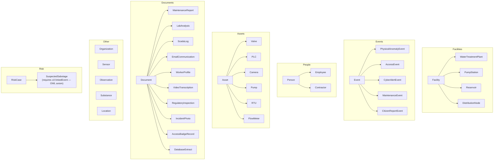
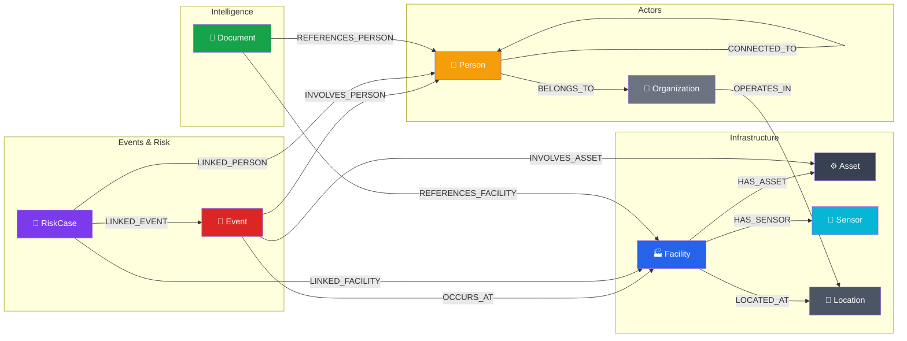

# 1. Ontology & Knowledge Graph

> **Why an OWL ontology instead of hardcoded rules? Because the ontology is not documentation — it is the engine that drives every query, every AI agent, and every hidden link discovery.**

---

## What Is an Ontology?

An ontology is a formal, machine-readable definition of **what exists** in your domain and **how things can relate to each other**. It is the schema of your knowledge graph — but unlike a SQL schema, it carries *semantic meaning*.

AEGIS uses **OWL 2.0** (Web Ontology Language) written in **Turtle syntax**. The ontology file lives at [`ontology/water-sabotage.owl.ttl`](../ontology/water-sabotage.owl.ttl) (305 lines) and defines:

- **Classes** (types of entities) — Facility, Person, Event, Asset, Sensor, Organization
- **Subclasses** (specializations) — WaterTreatmentPlant ⊂ Facility, Employee ⊂ Person
- **Object Properties** (relationships) — occursAt, involvesPerson, belongsTo, connectedTo
- **Datatype Properties** (attributes) — hasSeverity, hasTimestamp, hasLatitude
- **Axioms** (constraints) — "A SuspectedSabotage must have ≥3 linked events"

---

## Ontology vs Hardcoded Rules

| Aspect | Without Ontology | With OWL Ontology |
|--------|-----------------|-------------------|
| New entity type | Modify code, recompile, redeploy | Add 3 lines of Turtle, reload |
| New relationship | New migration, new DAO, new endpoints | Add 2 lines of Turtle, materialize in Neo4j |
| Validation | if-else chains in business logic | OWL axioms auto-validated |
| AI reasoning | Model has no structural knowledge | Agent reads ontology, generates precise queries |
| Link analysis | Only traverses known paths | Traverses ALL relationship types automatically |
| Documentation | Stale wikis, tribal knowledge | The ontology IS the documentation — always current |

---

## The Class Hierarchy (TBox)

The TBox (Terminological Box) defines the **types** of entities that can exist in the domain:



Each class becomes a **Neo4j label**. Sub-classes become **multi-labels** — a WaterTreatmentPlant node has both `:Facility` and `:WaterTreatmentPlant` labels, enabling queries at any specificity level.

---

## Object Properties — The Semantic Wiring

These are the **relationship types** that can exist in the graph. Each one is a potential path for discovering hidden connections:

| Property | Domain → Range | Meaning | Cypher |
|----------|---------------|---------|--------|
| `occursAt` | Event → Facility | Where the event happened | `(e:Event)-[:OCCURS_AT]->(f:Facility)` |
| `involvesPerson` | Event → Person | Who was involved | `(e:Event)-[:INVOLVES_PERSON]->(p:Person)` |
| `involvesAsset` | Event → Asset | What equipment was affected | `(e:Event)-[:INVOLVES_ASSET]->(a:Asset)` |
| `involvesSubstance` | Event → Substance | Chemical relevance | `(e:Event)-[:INVOLVES_SUBSTANCE]->(s:Substance)` |
| `hasSensor` | Facility → Sensor | What monitors this facility | `(f:Facility)-[:HAS_SENSOR]->(s:Sensor)` |
| `hasAsset` | Facility → Asset | What equipment is installed | `(f:Facility)-[:HAS_ASSET]->(a:Asset)` |
| `belongsTo` | Person → Organization | Employment/contract relationship | `(p:Person)-[:BELONGS_TO]->(o:Organization)` |
| `operatesIn` | Organization → Location | Geographic area of operations | `(o:Organization)-[:OPERATES_IN]->(l:Location)` |
| `locatedAt` | Facility → Location | Physical location | `(f:Facility)-[:LOCATED_AT]->(l:Location)` |
| `connectedTo` | Person ↔ Person | Social/professional connection | `(p1:Person)-[:CONNECTED_TO]->(p2:Person)` |
| `linkedEvent` | RiskCase → Event | Evidence events for the case | `(rc:RiskCase)-[:LINKED_EVENT]->(e:Event)` |
| `linkedPerson` | RiskCase → Person | Persons of interest | `(rc:RiskCase)-[:LINKED_PERSON]->(p:Person)` |
| `linkedFacility` | RiskCase → Facility | Affected facilities | `(rc:RiskCase)-[:LINKED_FACILITY]->(f:Facility)` |
| `referencesFacility` | Document → Facility | Document mentions a facility | `(d:Document)-[:REFERENCES_FACILITY]->(f:Facility)` |
| `referencesPerson` | Document → Person | Document mentions a person | `(d:Document)-[:REFERENCES_PERSON]->(p:Person)` |

> **Key insight:** Every relationship is a potential **hop** in a hidden link traversal. The more semantically rich your ontology, the more attack vectors the graph can discover automatically.

---

## OWL Axioms — Machine-Enforceable Rules

```turtle
:PhysicalAnomalyEvent rdfs:subClassOf [
    owl:onProperty :occursAt ;
    owl:someValuesFrom :Facility
] .
# → Every physical anomaly MUST occur at a facility

:AccessEvent rdfs:subClassOf [
    owl:onProperty :involvesPerson ;
    owl:someValuesFrom :Person
] .
# → Every access event MUST involve a person

:SuspectedSabotage rdfs:subClassOf [
    owl:onProperty :linkedEvent ;
    owl:minCardinality 3
] .
# → A suspected sabotage requires ≥3 linked events
```

These axioms are not just documentation — they are **enforceable constraints** that ensure data integrity. A SuspectedSabotage case with only 2 linked events would violate the ontology. This is how Palantir Gotham's Dynamic Ontology ensures data quality.

---

## From OWL to Neo4j: Materialization

The ontology classes and properties are **materialized** as Neo4j labels and relationships. The `generate_data.py` tool reads the ontology semantics and generates Cypher:

```cypher
-- OWL class → Neo4j labeled node (with multi-labels)
CREATE (f:Facility:WaterTreatmentPlant {
  facilityId: 'FAC-001', name: 'ETAP Norte', 
  type: 'treatment_plant', status: 'operational',
  latitude: 40.4168, longitude: -3.7038
})

-- OWL objectProperty → Neo4j typed relationship
CREATE (p)-[:BELONGS_TO]->(o)           -- Person → Organization
CREATE (e)-[:OCCURS_AT]->(f)            -- Event → Facility
CREATE (e)-[:INVOLVES_PERSON]->(p)      -- Event → Person
CREATE (rc)-[:LINKED_EVENT]->(e)        -- RiskCase → Event
CREATE (p1)-[:CONNECTED_TO]->(p2)       -- Person ↔ Person (symmetric)
CREATE (d)-[:REFERENCES_FACILITY]->(f)  -- Document → Facility
```

### Node Properties (Datatype Properties)

| Node Type | Key Properties |
|-----------|---------------|
| **Person** | `personId`, `name`, `role`, `personType` (employee/contractor), `clearance` |
| **Facility** | `facilityId`, `name`, `type`, `status`, `latitude`, `longitude` |
| **Event** | `eventId`, `eventType`, `severity` (0-5 integer), `description`, `timestamp` |
| **Asset** | `assetId`, `name`, `type`, `model`, `firmware` |
| **Sensor** | `sensorId`, `type`, `unit` |
| **Organization** | `orgId`, `name`, `type` |
| **Location** | `locationId`, `name`, `latitude`, `longitude` |
| **RiskCase** | `caseId`, `title`, `status`, `riskScore` |
| **Document** | `docId`, `title`, `type`, `classification` |

---

## Graph Statistics

| Metric | Count |
|--------|-------|
| **Facilities** | 20 (4 ETAPs, 5 pump stations, 5 reservoirs, 6 distribution nodes) |
| **Persons** | 100 (55 employees + 45 contractors) |
| **Organizations** | 8 (1 utility + 4 maintenance + 2 security + 1 IT) |
| **Locations** | 20 (real Madrid-area municipalities) |
| **Assets** | ~120 (RTUs, PLCs, pumps, valves, cameras, flow meters) |
| **Sensors** | ~100 (flow, pressure, chlorine, pH, turbidity, conductivity) |
| **Events** | ~500+ (generated + simulated continuously) |
| **Risk Cases** | 6 pre-seeded + auto-generated by InferenceEngine |
| **Documents** | 220 (10 types, 3 classification levels) |
| **Total Entities** | ~1,500 |
| **Total Relationships** | ~2,000+ |

---

## The Ontology's Role in the AI Pipeline

The ontology is not a static file — it is **read at runtime** by multiple components:

1. **ReAct Agent** (`AgentService.cs`): Calls `get_ontology` tool as its first action, learning what entities and relationships exist before writing Cypher queries.

2. **Command Center** (`CommandCenterService.cs`): Calls `GetOntologySchemaAsync()` to build the Cypher generation prompt with the complete graph schema, including node labels, property names, and relationship directions.

3. **Link Analysis** (`Neo4jGraphRepository.cs`): The `allShortestPaths` query traverses ALL relationship types defined in the ontology. More relationships = more potential hidden paths.

4. **Risk Propagation** (`RiskPropagationService.cs`): Each relationship type has a propagation weight (0.40 – 0.95). The ontology defines what paths risk can flow through.

5. **InferenceEngine** (`InferenceEngine.cs`): Detection patterns traverse specific relationship chains (e.g., Event → Facility, Event → Person) that correspond to ontology object properties.

### The Virtuous Cycle

```
Add relationship to OWL ontology
        ↓
Materialize in Neo4j (generate_data.py)
        ↓
AI agent automatically discovers it (get_ontology)
        ↓
Link analysis traverses it (allShortestPaths)
        ↓
Risk propagation flows through it (BFS)
        ↓
New attack vectors discovered — no code changes needed
```

> **This is the central thesis of AEGIS:** an ontology-driven architecture where the domain model is the source of truth, and every component — from AI agents to graph algorithms to detection patterns — derives its behavior from the ontology rather than from hardcoded rules.

---

## Relationship Diagram



---

*Next: [AI Agents & Prompt Engineering →](02-ai-agents-and-prompts.md)*
