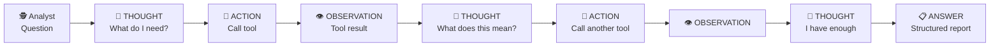
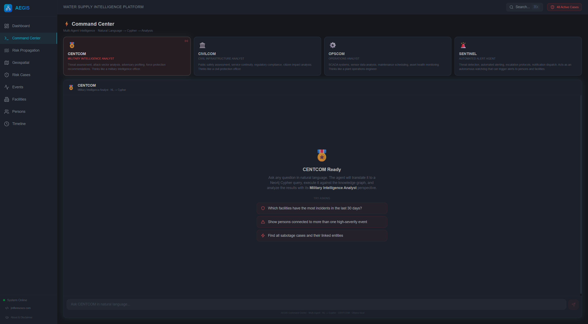
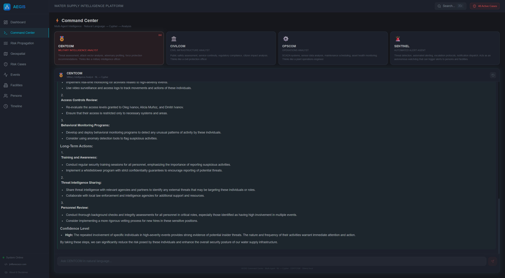
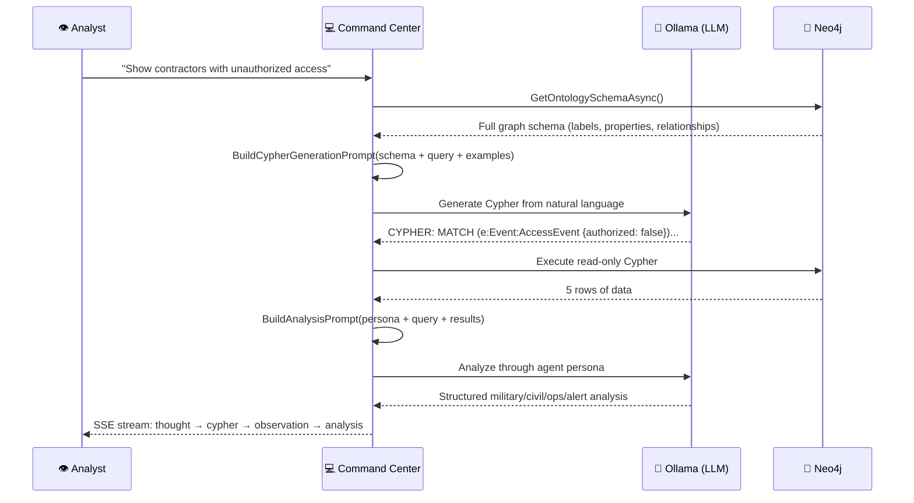

# 2. AI Agents & Prompt Engineering

> **AEGIS has two AI systems: a ReAct agent that autonomously investigates using 5 tools, and a Command Center with 4 specialized personas that translate natural language to Cypher queries. Both are ontology-driven — they read the graph schema before reasoning.**

---

## Part A: The ReAct Agent

### Architecture

The **ReAct** (Reasoning + Acting) agent is the same architecture used by ChatGPT with tools, Google Gemini, and Palantir's AIP platform. The core loop:

```
REPEAT until answer or max 8 iterations:
    1. THOUGHT  — Reason about what you know and need
    2. ACTION   — Call a tool to gather data
    3. OBSERVATION — Receive the tool's output
```



### The 5 Tools

| Tool | Source | What It Does | Why It Matters |
|------|--------|-------------|----------------|
| `get_ontology` | Neo4j | Returns the complete OWL schema (node types, properties, relationships) | Agent **learns** the graph structure at inference time |
| `query_graph` | Neo4j | Executes dynamic Cypher queries | Agent **writes its own database queries** |
| `get_node_neighbors` | Neo4j | Returns direct connections of a node | Agent **navigates** the graph autonomously |
| `search_events` | OpenSearch | Full-text search across events + intel docs | Agent **correlates** graph data with document evidence |
| `get_risk_patterns` | Runtime | Returns active risk detection patterns | Agent **understands** what the system is watching for |

### How the Agent Investigates (Real Example)

When an analyst opens CASE-006 (Coordinated Attack — Móstoles + Alcorcón) and clicks "Investigate with AI":

```
🧠 THOUGHT: I need to understand the graph structure before investigating.

🔧 ACTION: get_ontology
👁️ OBSERVATION: 14 node types, 18 relationship types. Key: Facility, Person,
   Event, RiskCase, Document. Relationships: OCCURS_AT, INVOLVES_PERSON,
   BELONGS_TO, CONNECTED_TO...

🧠 THOUGHT: Now I'll query the events linked to this risk case.

🔧 ACTION: query_graph
   MATCH (rc:RiskCase {caseId:'CASE-006'})-[:LINKED_EVENT]->(e:Event)
   OPTIONAL MATCH (e)-[:INVOLVES_PERSON]->(p:Person)
   OPTIONAL MATCH (e)-[:OCCURS_AT]->(f:Facility)
   RETURN e, p, f

👁️ OBSERVATION: 5 events across 2 facilities. 2 persons involved:
   PER-023 (contractor) and PER-067 (employee).

🧠 THOUGHT: Two people at different facilities during the attack window.
   Are they connected?

🔧 ACTION: get_node_neighbors(PER-023)
👁️ OBSERVATION: PER-023 belongs to TechServ Industrial. Connected to
   PER-067 via CONNECTED_TO relationship.

🧠 THOUGHT: Cross-company social connection. Let me search for documents.

🔧 ACTION: search_events("unauthorized access Móstoles Alcorcón")
👁️ OBSERVATION: Found: SCADA log showing PLC config download at 02:15 AM,
   badge record showing PER-023 entered at 01:47 AM, email from PER-067
   asking about "valve pressure thresholds" two weeks prior.

📋 ANSWER: [Structured intelligence report with attack reconstruction,
   hidden network discovery, and recommendations]
```

### Ontology-Driven Reasoning — The Key Insight

The agent's first action is **always** `get_ontology`. This is critical because:

| Aspect | Without Ontology | With Ontology |
|--------|-----------------|---------------|
| Query generation | Generic, template-based | Precise, schema-aware Cypher |
| Unknown relationships | Cannot discover what it doesn't know | Learns ALL relationship types from OWL |
| New data types | Requires code changes + retraining | Agent automatically adapts at inference time |
| Investigation depth | Surface-level: only pre-programmed paths | Deep: traverses ANY path the ontology defines |
| Accuracy | Hallucinates relationship names | Uses exact Neo4j labels and relationship names |

If tomorrow you add a new relationship (e.g., `suppliesChemicalsTo` between Organization and Facility), the agent **automatically** starts reasoning about it. No code changes needed.

### Implementation: `AgentService.cs`

Located at `src/backend/Aegis.Infrastructure/AI/AgentService.cs`. Key design decisions:

- **Max 8 iterations** prevents infinite loops
- **SSE streaming** — each Thought/Action/Observation is streamed to the frontend in real time
- **Context accumulation** — the scratchpad grows with each iteration, giving the LLM full conversation history
- **Error resilience** — if a tool fails, the agent receives the error as an observation and adapts
- **Follow-up chat** — previous investigation results are injected as context for conversational continuity

---

## Part B: The Command Center — Multi-Agent NL→Cypher

### The Problem

The ReAct agent is powerful but slow (5-30 seconds per investigation due to multiple LLM calls). For quick analytical queries, analysts need a faster path from natural language to data.

### The Solution: 4 Specialized Agents

The Command Center provides 4 AI agents, each with a different professional persona. All share the same NL→Cypher pipeline but analyze results through radically different lenses:

| ID | Name | Role | Icon | Perspective |
|---|---|---|---|---|
| `centcom` | **CENTCOM** | Military Intelligence Analyst | 🎖️ | Threat assessment, adversary profiling, TTPs, THREATCON levels |
| `civilcom` | **CIVILCOM** | Civil Infrastructure Analyst | 🏛️ | Public safety, citizen impact, regulatory compliance, emergency services |
| `opscom` | **OPSCOM** | Operations Analyst | ⚙️ | SCADA systems, sensor data, maintenance analysis, process chemistry |
| `sentinel` | **SENTINEL** | Automated Alert Agent | 🚨 | Threat detection, automated alerting, escalation protocols, notifications |


*Agent selection: four specialized personas ready to analyze your natural-language query.*


*Query result: generated Cypher, Neo4j data, and persona-driven analysis streamed in real time.*

### The NL→Cypher Pipeline



### Agent Personas (Prompt Engineering)

Each agent has a detailed persona that shapes HOW it interprets the same data:

#### 🎖️ CENTCOM — Military Intelligence Analyst

```
Mindset:
- Classify threats: state-sponsored, insider, opportunistic, terrorist
- Military frameworks: indicators & warnings, pattern of life, attack kill chain
- Assess ADVERSARY CAPABILITY + INTENT + OPPORTUNITY
- Terminology: OPSEC, HUMINT, SIGINT, TTPs, IOCs, THREATCON levels

Response structure:
## SITUATION
## THREAT ASSESSMENT
## INDICATORS & WARNINGS
## RECOMMENDATIONS

Confidence: LOW / MODERATE / HIGH / CONFIRMED
```

#### 🏛️ CIVILCOM — Civil Infrastructure Analyst

```
Mindset:
- Focus on PUBLIC SAFETY: how many citizens are affected?
- Service continuity: which areas lose water supply?
- Regulatory compliance: EU Drinking Water Directive, CNPIC
- Vulnerable populations: hospitals, schools, elderly care

Response structure:
## PUBLIC IMPACT
## SERVICE DISRUPTION
## REGULATORY IMPLICATIONS
## COMMUNICATION PLAN
```

#### ⚙️ OPSCOM — Operations Analyst

```
Mindset:
- SCADA/ICS: PLC configurations, HMI alarms, network segments
- Sensor interpretation: what do the readings actually mean?
- Process chemistry: chlorine residual, pH, turbidity, flow rates
- Root cause: mechanical failure vs deliberate tampering

Response structure:
## SYSTEM STATUS
## SENSOR ANALYSIS
## ROOT CAUSE
## CORRECTIVE ACTIONS
```

#### 🚨 SENTINEL — Automated Alert Agent

```
Mindset:
- Detect threats and generate actionable alerts
- Determine WHO needs to be notified
- Assess SEVERITY: info, warning, critical
- Escalation chains: operator → supervisor → director → emergency

Special capability: Generates structured alert actions:
:::ALERT:::
type: notify_person | alert_facility | escalate_case | broadcast
target: <person ID, facility ID, or "all">
message: <the alert message>
severity: info | warning | critical
:::END_ALERT:::
```

### Anti-Hallucination Engineering

The 7B parameter model (qwen2.5:7b) tends to hallucinate relationship names, invent SQL functions, and reverse edge directions. AEGIS solves this with a carefully engineered prompt in `BuildCypherGenerationPrompt()`:

#### 1. Explicit Schema Declaration

Instead of relying on the LLM's training data, the complete graph schema is injected into every prompt:

```
## RELATIONSHIPS (source)-[:TYPE]->(target) — DIRECTION MATTERS!

(Person)-[:BELONGS_TO]->(Organization)
(Event)-[:OCCURS_AT]->(Facility)         ← NOTE DIRECTION
(Event)-[:INVOLVES_PERSON]->(Person)     ← NOTE DIRECTION
...
```

#### 2. Negative Examples (What NOT to Do)

```
## ANTI-HALLUCINATION RULES:
1. ONLY use relationships listed above. If not in the list, it DOES NOT EXIST.
2. NEVER invent relationships. These DO NOT EXIST:
   - INVOLVES_EVENT ← DOES NOT EXIST
   - HAS_EVENT ← DOES NOT EXIST
   - REPORTED_BY ← DOES NOT EXIST
3. :Sensor and :Asset are TERMINAL nodes — connect ONLY to Facility, not Event.
```

#### 3. Neo4j 5 Syntax Enforcement

```
- Neo4j 5 SYNTAX: NEVER use size() on patterns. Use COUNT { pattern } instead.
  WRONG:  size((p)-[:REL]->())
  CORRECT: COUNT { (p)-[:REL]->() }

- NEVER use DATEADD, CURRENT_DATE(), GETDATE() — these are SQL, not Cypher!
  Timestamps are ISO-8601 STRINGS. Use ORDER BY timestamp DESC for "recent".
```

#### 4. Few-Shot Examples (12 Query Templates)

```
Q: Sensors with anomalous readings (MULTI-HOP)
CYPHER: MATCH (e:Event:PhysicalAnomalyEvent)-[:OCCURS_AT]->(f:Facility)
        -[:HAS_SENSOR]->(s:Sensor)
        RETURN s.type, e.metric, e.value, f.name
        ORDER BY e.timestamp DESC LIMIT 30

Q: Full chain: risk case → events → persons → organizations
CYPHER: MATCH (rc:RiskCase)-[:LINKED_EVENT]->(e:Event)
        -[:INVOLVES_PERSON]->(p:Person)-[:BELONGS_TO]->(o:Organization)
        RETURN rc.title, e.eventType, p.name, o.name LIMIT 30
```

#### 5. Retry on Failure

If the first generated Cypher fails execution, the error message is fed back to the LLM with the original prompt, asking for a corrected query. This handles edge cases where the model gets syntax slightly wrong.

### SSE Streaming Protocol

The Command Center streams results to the frontend using Server-Sent Events:

```
data: {"type":"agent","content":"{\"Id\":\"centcom\",...}"}
data: {"type":"thought","content":"Analyzing query as CENTCOM..."}
data: {"type":"cypher","content":"{\"query\":\"MATCH...\",\"explanation\":\"...\"}"}
data: {"type":"observation","content":"Results (24 rows): ..."}
data: {"type":"thought","content":"Analyzing through Military lens..."}
data: {"type":"answer","content":"## Situation\n\n..."}
data: {"type":"alert","content":"{\"type\":\"broadcast\",...}"}   ← SENTINEL only
data: [DONE]
```

Each step type maps to a different visual element in the frontend:
- `agent` → Agent card with icon and role
- `thought` → Pulsing reasoning indicator
- `cypher` → Syntax-highlighted Cypher code block
- `observation` → Data result summary
- `answer` → Full Markdown-rendered analysis
- `alert` → Alert card in the notification sidebar

### Implementation: `CommandCenterService.cs`

Located at `src/backend/Aegis.Infrastructure/AI/CommandCenterService.cs`. Key design:

- **No `yield` in try/catch** — .NET limitation. Steps are collected in a `List<AgentStep>` by `ExecuteQueryPipelineAsync()`, then yielded by the calling method.
- **Read-only enforcement** — Cypher is scanned for `DELETE`, `CREATE`, `MERGE`, `SET`, `REMOVE` before execution.
- **Auto LIMIT** — If no `LIMIT` is present, `LIMIT 25` is appended to prevent unbounded queries.
- **Alert parsing** — SENTINEL's output is scanned for `:::ALERT:::` blocks using regex, generating structured `AlertAction` objects.

---

## Part C: The LLM — Ollama with qwen2.5:7b

### Why Local?

AEGIS uses **Ollama** running `qwen2.5:7b` (7 billion parameter model) locally:

| Aspect | Cloud LLM (GPT-4, Claude) | Local LLM (Ollama) |
|--------|--------------------------|---------------------|
| **Data sovereignty** | Data leaves your network | Zero data leaves the network |
| **Cost** | Per-token pricing | Free after hardware |
| **Latency** | Network round-trip | ~2-5 seconds local |
| **Air-gapped deployment** | Impossible | Works with zero internet |
| **Compliance** | CNPIC/NATO issues | Fully compliant |
| **Model quality** | Superior (100B+ params) | Good enough for Cypher generation |

### Configuration

```csharp
// OllamaService.cs
Temperature = 0.4f    // Low temperature for precise Cypher generation
NumCtx = 4096         // Context window size
Model = "qwen2.5:7b"  // Pulled automatically on first start
```

### Performance

| Operation | Typical Time | Notes |
|-----------|-------------|-------|
| Cypher generation | 2-4 seconds | Single LLM call |
| Analysis generation | 3-8 seconds | Single LLM call |
| Full Command Center query | 5-15 seconds | 2 LLM calls + Cypher execution |
| Full ReAct investigation | 15-45 seconds | 3-8 LLM calls (iterative) |

---

## Key Takeaway

The combination of **ontology-driven prompts** + **anti-hallucination rules** + **few-shot examples** + **retry on failure** makes a 7B parameter local model produce reliably correct Cypher queries for a complex graph schema. This is the same approach Palantir uses with their AIP platform — the difference is they use proprietary fine-tuned models, while AEGIS demonstrates it's achievable with open-source models and careful prompt engineering.

> **The ontology is the agent's instruction manual. The prompt is the translation layer. The graph is the source of truth.**

---

*Previous: [← Ontology & Knowledge Graph](01-ontology-and-knowledge-graph.md) · Next: [Heterogeneous Data Fusion →](03-heterogeneous-data-fusion.md)*
