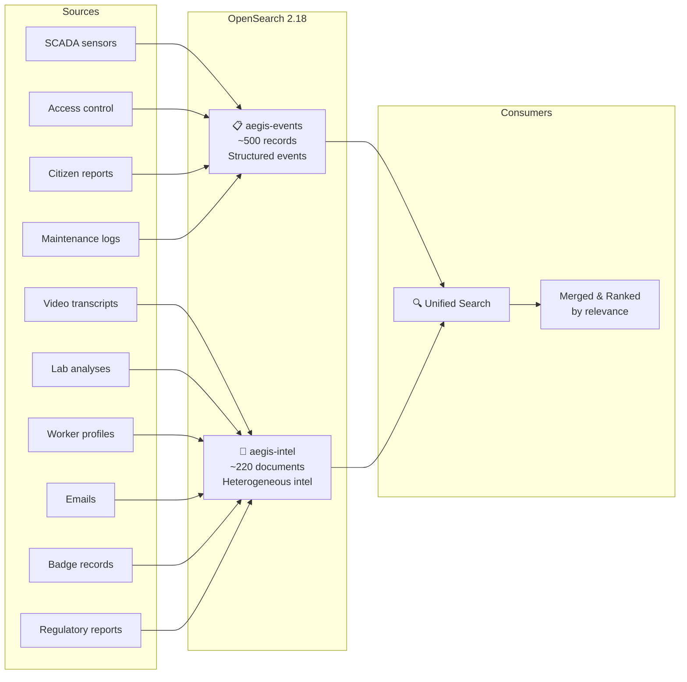
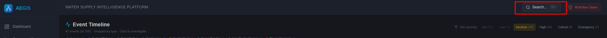
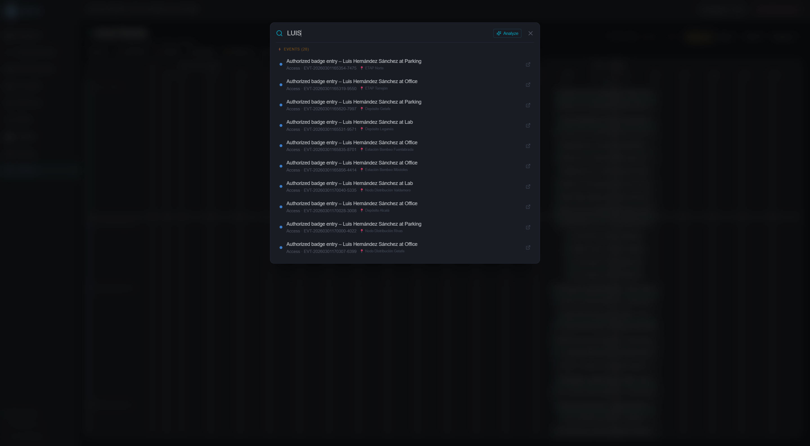
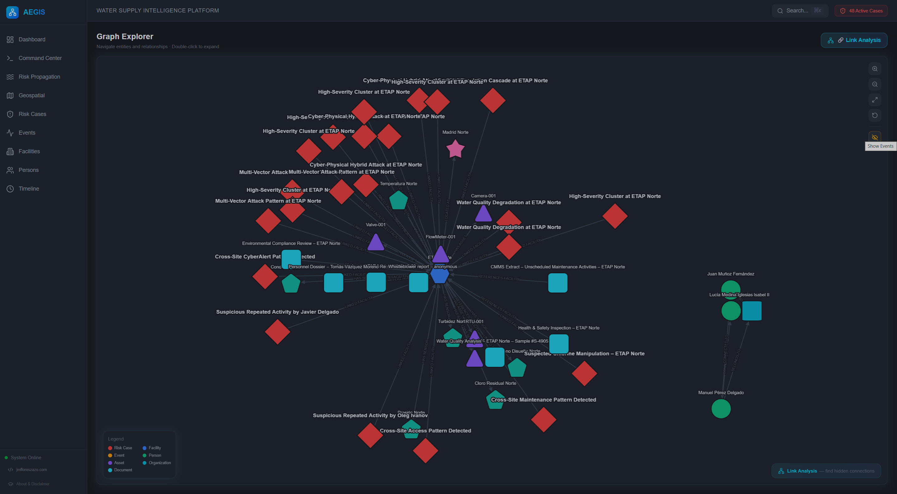
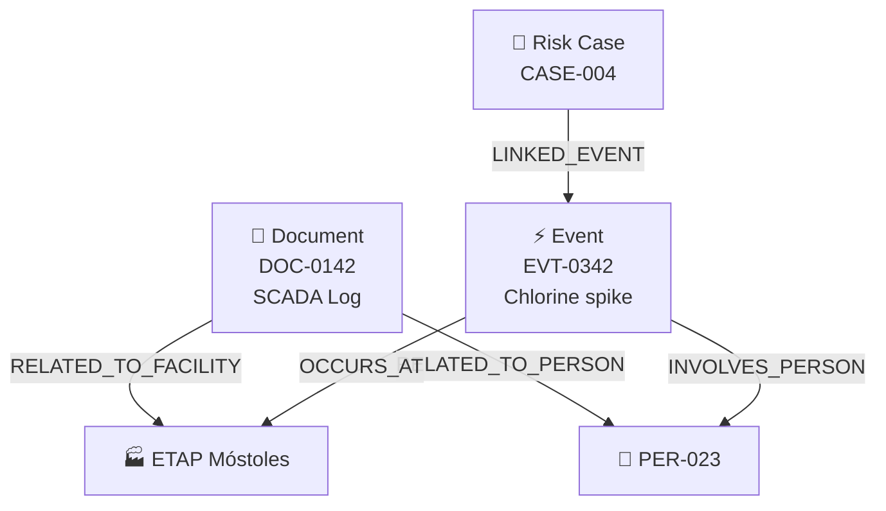
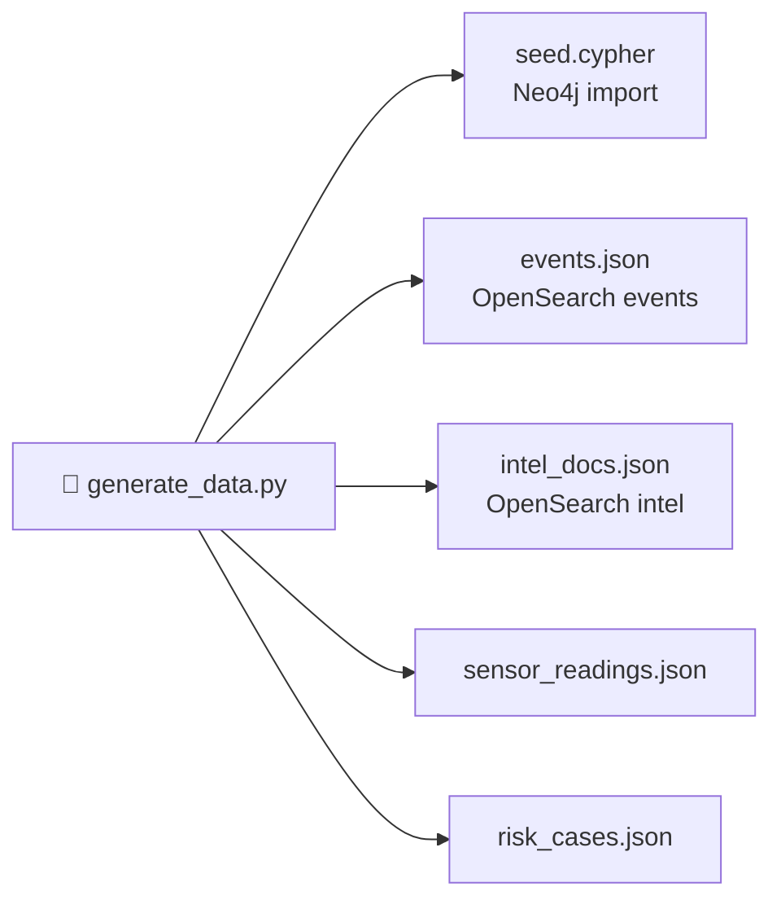
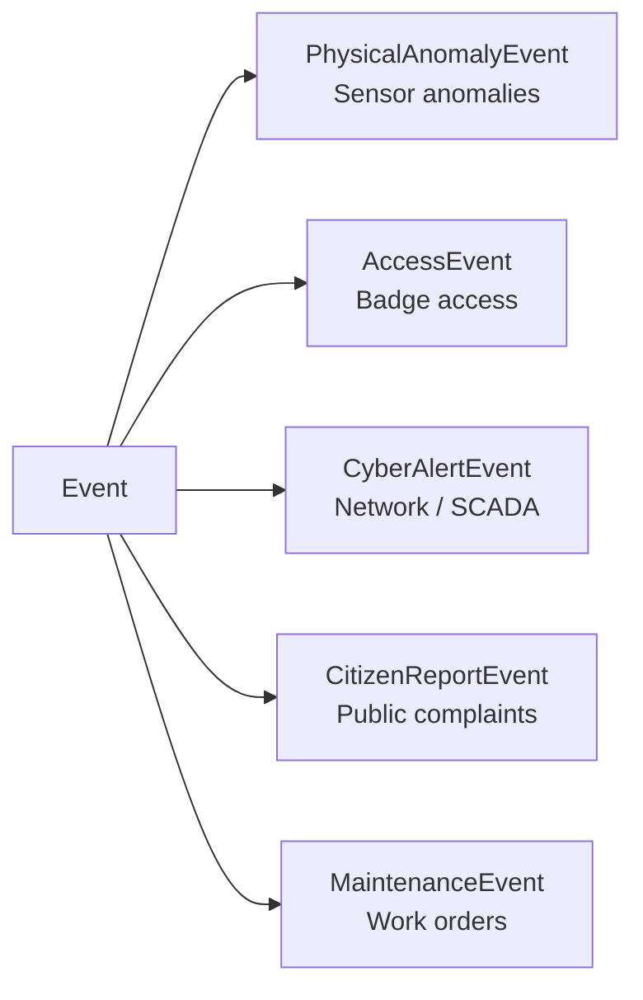

# 3. Heterogeneous Data Fusion

> **Real intelligence doesn't come from one database — it comes from correlating SCADA logs, video transcriptions, badge records, lab analyses, emails, and maintenance reports. AEGIS fuses 10 document types across 2 search indices into a single investigative surface.**

---

## The Problem: Data Silos

In a typical water utility, data lives in isolated systems:

| System | Data Type | Who Uses It | Format |
|--------|-----------|-------------|--------|
| SCADA/ICS | Sensor readings, PLC logs | Operations engineers | Binary/CSV |
| Physical security | Badge access records, CCTV | Security guards | Proprietary DB |
| HR | Worker profiles, clearances | HR department | SAP/Oracle |
| Maintenance | Work orders, inspection reports | Field technicians | PDF/Paper |
| Laboratory | Water quality analyses | Chemists | LIMS exports |
| IT Security | Network logs, cyber alerts | SOC analysts | SIEM |
| Communications | Emails, intercepts | Investigators | Exchange/Files |
| Regulatory | Inspection reports | Compliance officers | Word/PDF |

An attacker who understands these silos can move undetected — a suspicious badge access at 2 AM won't correlate with an anomalous chlorine reading because the security team and the operations team use different systems.

**AEGIS breaks these silos by indexing everything into a unified search platform.**

---

## Dual-Index Architecture

AEGIS uses **OpenSearch 2.18** with two distinct indices:

### Index 1: `aegis-events` — Structured Events

| Field | Type | Description |
|-------|------|-------------|
| `eventId` | keyword | Unique event identifier (EVT-xxx) |
| `eventType` | keyword | PhysicalAnomaly, Access, CyberAlert, CitizenReport, Maintenance |
| `description` | text | Free-text event description |
| `severity` | integer | 0 (info) to 5 (critical) |
| `timestamp` | date | ISO-8601 timestamp |
| `facilityName` | text | Facility where event occurred |

Events are generated from:
- **500 noise events**: Routine maintenance (45%), badge access (35%), citizen reports (20%)
- **1,000 sensor readings**: 8 metrics (chlorine, turbidity, pH, flow, pressure, temperature, conductivity, dissolved O₂), 5% intentionally anomalous
- **~35 scripted sabotage events**: Part of 6 attack scenarios

### Index 2: `aegis-intel` — Heterogeneous Intelligence Documents

| Field | Type | Description |
|-------|------|-------------|
| `docId` | keyword | Unique document identifier (DOC-xxx) |
| `docType` | keyword | One of 10 document types |
| `title` | text (boost: 2) | Document title (boosted for relevance) |
| `content` | text | Full document text |
| `sourceFile` | keyword | Original file path/name |
| `facilityId` | keyword | Linked facility |
| `facilityName` | text | Facility name |
| `personId` | keyword | Linked person |
| `personName` | text | Person name |
| `timestamp` | date | Document date |
| `classification` | keyword | INTERNAL, CONFIDENTIAL, or RESTRICTED |

---

## The 10 Document Types

Each type simulates a real-world intelligence source with realistic content:

### 1. 📹 Video Transcription (~25 documents)

**Classification**: RESTRICTED / CONFIDENTIAL

Simulates CCTV footage transcriptions from security cameras at facilities. Content describes observed activities, person movements, and suspicious behavior.

*Example*: "Camera 3, ETAP Norte, 2026-01-15 02:30. Individual identified as PER-023 observed near chlorine dosing equipment. Subject carrying unmarked container. Duration: 4 minutes."

### 2. 🔧 Maintenance Report (~30 documents)

**Classification**: INTERNAL

Work orders and inspection results from field technicians. Includes equipment status, calibration notes, and findings.

*Example*: "Routine inspection of Pump Station Móstoles. Flow meter FLW-012 showing 3% drift from calibration baseline. Recommended recalibration within 30 days."

### 3. 🧪 Lab Analysis (~25 documents)

**Classification**: INTERNAL

Water quality test results from the laboratory, including chemical concentrations, microbial counts, and compliance status.

*Example*: "Sample collected from Depósito Alcalá outlet. Chlorine residual: 0.12 mg/L (below minimum 0.2 mg/L). Turbidity: 1.8 NTU. pH: 7.4. E. coli: Not detected."

### 4. 👤 Worker Profile (~30 documents)

**Classification**: CONFIDENTIAL

Personnel dossiers including role, clearance level, access permissions, employment history, and background notes.

*Example*: "Carlos Mendoza (PER-045). Contractor, TechServ Industrial. Access level: Level 2. Cleared for: ETAP Norte, Bombeo Sur. Background: Former water treatment operator, 12 years experience."

### 5. 🖥️ SCADA Log (~25 documents)

**Classification**: RESTRICTED

Industrial control system logs from SCADA/PLC systems. Includes configuration changes, alarm events, and setpoint modifications.

*Example*: "PLC-ETAP-02: Setpoint modification detected. Chlorine dosing rate changed from 1.2 mg/L to 3.8 mg/L. User: OPER_REMOTE_22. Timestamp: 2026-01-15T02:15:00Z. Authorization: NONE."

### 6. 📧 Email Communication (~20 documents)

**Classification**: INTERNAL / CONFIDENTIAL / RESTRICTED

Intercepted or archived emails between personnel. May contain coordination details, complaints, or suspicious communications.

*Example*: "From: PER-067@canal.es To: PER-023@techserv.com Subject: Valve specifications. 'Can you send me the pressure threshold tables for the Móstoles station? Need them for the weekend maintenance window.'"

### 7. 📋 Regulatory Inspection (~15 documents)

**Classification**: RESTRICTED

Official inspection reports from regulatory bodies (CNPIC, health authorities). Includes compliance findings and corrective actions.

*Example*: "CNPIC Inspection Report — Tres Cantos Reservoir. Finding: SCADA network segment not isolated from corporate LAN. Risk: HIGH. Corrective action deadline: 30 days."

### 8. 📷 Incident Photo (~15 documents)

**Classification**: RESTRICTED

Metadata and descriptions from photographic evidence at incident sites.

*Example*: "Photo evidence, Bombeo Sur, 2026-02-05. Image shows cut chain-link fence at perimeter sector C. Tool marks consistent with bolt cutters. Evidence tag: PHY-2026-0205-003."

### 9. 🔑 Access Badge Record (~20 documents)

**Classification**: INTERNAL

Entry/exit logs from physical access control systems with timestamps, locations, and authorization status.

*Example*: "Badge scan: PER-023. Location: ETAP Norte, Gate B. Time: 2026-01-15 01:47:00. Status: AUTHORIZED. Note: Outside scheduled shift (normal hours: 08:00-16:00)."

### 10. 🗄️ Database Extract (~15 documents)

**Classification**: CONFIDENTIAL

Structured data exports from operational databases, including equipment inventories, supply chain records, and historical data.

*Example*: "Chemical inventory extract — ETAP Móstoles. Sodium hypochlorite: 2,400L (expected: 3,000L). Variance: -600L (20%). Last delivery: 2026-02-08. Next scheduled: 2026-02-22."

---

## Classification Levels

AEGIS implements a three-tier classification system inspired by NATO/EU standards:

| Level | Color | Meaning | Document Types |
|-------|-------|---------|----------------|
| 🟢 **INTERNAL** | Green | General operational data | Maintenance reports, lab analyses, badge records |
| 🟡 **CONFIDENTIAL** | Yellow | Personnel and business-sensitive | Worker profiles, database extracts, some emails |
| 🔴 **RESTRICTED** | Red | Critical infrastructure / security | SCADA logs, video transcriptions, regulatory inspections, incident photos |

In the frontend, classification badges are color-coded next to each search result.

---

## Unified Search: Cross-Index Fusion

*Unified search overlay: Intel documents grouped by type with classification badges alongside event results.*

*AI-powered analysis: the ReAct agent investigates the query and returns a structured intelligence report.*

*Heterogeneous results: SCADA logs, video transcriptions, maintenance reports, and events merged by relevance.*

### How It Works

When an analyst searches "chlorine Móstoles", the system:

1. **Queries `aegis-events`** with multi-match:
   - `description` (boost: **3×**)
   - `eventType` (boost: **2×**)
   - `facilityName` (no boost)
   - Fuzziness: `AUTO` (handles typos)

2. **Queries `aegis-intel`** with multi-match:
   - `title` (boost: **3×**)
   - `content` (boost: **2×**)
   - `facilityName` (no boost)
   - `personName` (no boost)
   - `docType` (no boost)
   - Fuzziness: `AUTO`

3. **Merges** all hits into a single list

4. **Re-ranks** by OpenSearch relevance score (descending)

5. **Paginates** (default: 20 results per page)

### Search Result Anatomy

Each hit carries metadata that identifies its origin:

> **🟡 CONFIDENTIAL** · 📄 `scada_log` · Score: **8.42**
>
> **PLC Setpoint Change — ETAP Móstoles**
> *"Chlorine dosing rate changed from 1.2 mg/L to 3.8 mg/L..."*
>
> Source: `scada_export_2026-01.csv` · 2026-01-15 · ETAP Móstoles

> **🟢 EVENT** · ⚠️ Severity 4 · Score: **7.91**
>
> **Physical anomaly: chlorine_mg_l at ETAP Móstoles**
> *"Chlorine level exceeded maximum threshold: 3.8 mg/L..."*
>
> `EVT-0342` · 2026-01-15T02:20:00Z · ETAP Móstoles

The key insight: the same search returns both the **SCADA log** (document evidence) and the **sensor event** (operational alert), letting the analyst see cause and effect side by side.

---

## From Silos to Knowledge Graph

Documents don't just live in OpenSearch — they're also represented as nodes in Neo4j:

This dual representation enables:

| Capability | OpenSearch | Neo4j | Together |
|-----------|-----------|-------|----------|
| Full-text search | ✅ Find documents by content | ❌ | Find evidence |
| Relationship traversal | ❌ | ✅ Follow person→org→facility | Connect entities |
| Correlation | Relevance scoring | Path analysis | Cross-reference evidence with network |
| AI agent tool | `search_events` | `query_graph`, `get_node_neighbors` | Agent uses both for investigation |

---

## Data Generation Pipeline

### The Tool: `tools/generate_data.py`

A 1,886-line Python script that generates a complete, internally consistent dataset:

### Data Volumes

| Category | Count | Details |
|----------|-------|---------|
| Facilities | 20 | 4 treatment plants, 5 pump stations, 5 reservoirs, 6 distribution nodes |
| Persons | 100 | 55 employees + 45 contractors |
| Organizations | 8 | 1 utility, 4 maintenance, 2 security, 1 IT |
| Sensors | ~100 | 4-6 per facility (chlorine, turbidity, pH, flow, pressure, temperature) |
| Assets | ~80 | 3-5 per facility (pumps, valves, PLCs, HMIs) |
| Events (noise) | 500 | Maintenance 45%, Access 35%, Citizen reports 20% |
| Events (sabotage) | ~35 | Across 6 attack scenarios |
| Sensor readings | 1,000 | 8 metric types, 5% anomalous |
| Intel documents | ~220 | 10 types across 3 classification levels |
| Risk cases | 6 | Each with linked events, persons, facilities |
| Person-person links | ~70 | Colleague links + 20 cross-org suspicious connections |

### Internal Consistency

The generator ensures referential integrity:
- Every event references valid facility and person IDs
- Every document links to real facilities and/or persons
- Sabotage events are clustered in time windows matching risk cases
- Cross-organizational connections create discoverable attack patterns
- Sensor readings at sabotage times show correlated anomalies

---

## Event Type Hierarchy

Events in Neo4j use **multi-label nodes** (ontology-driven):

Each subtype has specialized properties:

| Subtype | Extra Properties | Example |
|---------|-----------------|---------|
| PhysicalAnomalyEvent | `metric`, `value` | chlorine_mg_l = 3.8 |
| AccessEvent | `accessPoint`, `authorized` | Gate B, unauthorized |
| CyberAlertEvent | `sourceIP`, `targetSystem`, `alertType` | 192.168.1.x, PLC-02, brute_force |
| CitizenReportEvent | `reportCount`, `area` | 15 complaints, Sector 4 |
| MaintenanceEvent | `workOrderId` | WO-2026-0142 |

---

## Key Takeaway

Heterogeneous data fusion is what separates a dashboard from an intelligence platform. By ingesting 10 document types into a dual-index architecture and representing them simultaneously in a knowledge graph, AEGIS enables:

1. **Cross-domain correlation**: A SCADA log + badge record + email = attack reconstruction
2. **Evidence-based investigation**: AI agents cite specific documents, not just graph patterns
3. **Classification awareness**: Analysts see sensitivity levels before opening documents
4. **Full-text + graph**: Search finds evidence; the graph shows connections

> **The data is heterogeneous. The search is unified. The knowledge graph connects everything.**

---

*Previous: [← AI Agents & Prompts](02-ai-agents-and-prompts.md) · Next: [Graph Analysis & Link Discovery →](04-graph-analysis-and-link-discovery.md)*
