# 4. Graph Analysis & Link Discovery

> **The most dangerous connections are the ones nobody drew on purpose. AEGIS uses Neo4j shortest-path algorithms and BFS risk propagation to surface hidden relationships that no human analyst would find manually.**

---

## Part A: Hidden Link Analysis

### The Intelligence Problem

In a network of 100 persons, 20 facilities, 8 organizations, and hundreds of events, the **interesting** connections are rarely the obvious ones. A contractor at Plant A and an employee at Plant B may seem unrelated — until you discover they share an organization, attended the same events, or accessed the same assets.

Palantir Gotham calls this capability **"Object Explorer"** or **"Link Analysis"**. Intelligence analysts call it **Association Matrix Analysis**. In graph theory, it's **shortest-path discovery**.

### How It Works

Given a set of selected nodes (e.g., two persons of interest), AEGIS:

1. **Generates all pairs** from the selection
2. For each pair, runs **`allShortestPaths`** in Neo4j:
   ```cypher
   MATCH path = allShortestPaths((a)-[*..6]-(b))
   WHERE id(a) = $idA AND id(b) = $idB
   RETURN path LIMIT 5
   ```
3. **Extracts** all intermediate nodes and relationships from each path
4. **Scores** each hidden link by relevance:
   - `relevance = 1.0 / pathLength` (shorter = more relevant)
   - Direct connections (length 1) are separated from hidden links (length > 1)
5. **Deduplicates** nodes and edges across all paths
6. Returns a combined graph with all discovered connections

### Types of Emergent Attack Vectors

The hidden link analysis reveals 6 categories of previously invisible connections:

#### 1. 🏢 Organizational Chain

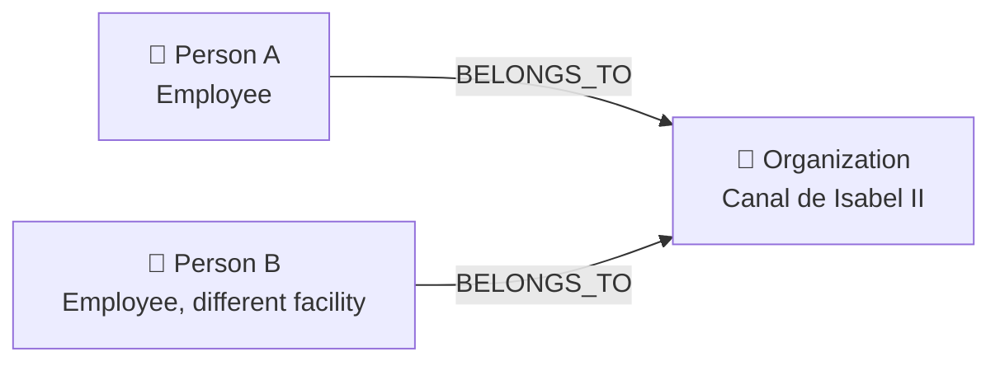

**Why it matters**: Employees at different facilities who share organizational allegiance could coordinate insider attacks across locations.

#### 2. 👥 Actor Confluence

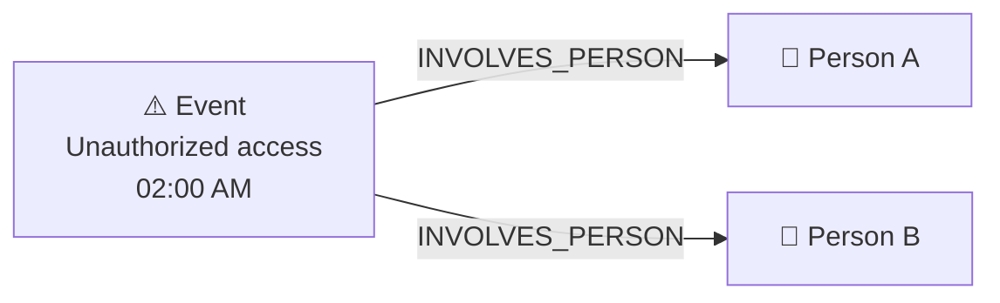

**Why it matters**: Two persons linked to the same suspicious event but not otherwise connected suggests either conspiracy or shared targeting.

#### 3. 🔧 Shared Asset Exploitation

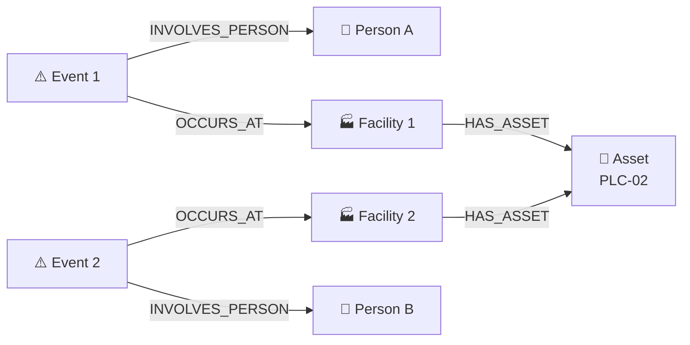

**Why it matters**: Similar assets at different facilities could share vulnerabilities. If an attacker exploits PLC-02 at one plant, all facilities with the same asset model are at risk.

#### 4. 🧪 Substance Cross-Match

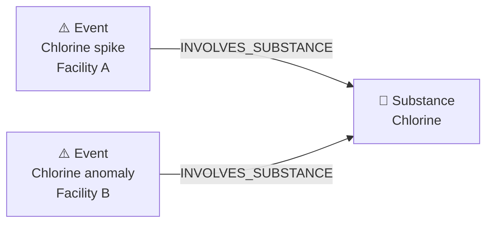

**Why it matters**: Anomalies involving the same chemical substance across facilities suggest a coordinated chemical attack.

#### 5. 📡 Sensor-Person Correlation

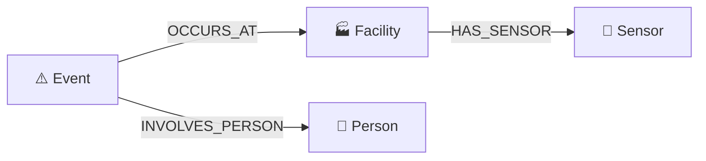

**Why it matters**: Associates a person with specific sensor anomalies through the facility graph, even when no direct person-sensor relationship exists.

#### 6. 📍 Geographic Triangle

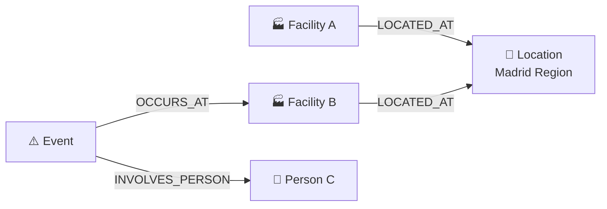

**Why it matters**: Geographic proximity of incidents can reveal territorial patterns in adversary operations.

### Implementation: `Neo4jGraphRepository.cs`

The `FindHiddenLinksAsync` method at `Aegis.Infrastructure/Neo4j/Neo4jGraphRepository.cs`:

- **Maximum depth**: 6 hops (configurable via `maxDepth` parameter)
- **Paths per pair**: Limited to 5 shortest paths
- **Node matching**: Resolves nodes across 8 ID properties (`eventId`, `facilityId`, `personId`, `assetId`, `caseId`, `orgId`, `sensorId`, `locationId`)
- **Edge deduplication**: Prevents the same relationship from appearing multiple times
- **Sorting**: Hidden links (length > 1) first, then descending by relevance score

### Visual Representation

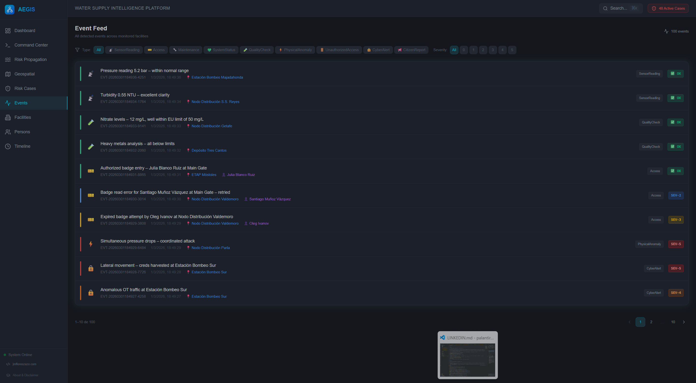
*Graph Explorer: entities rendered by type (persons, facilities, events, organizations) with expandable nodes.*

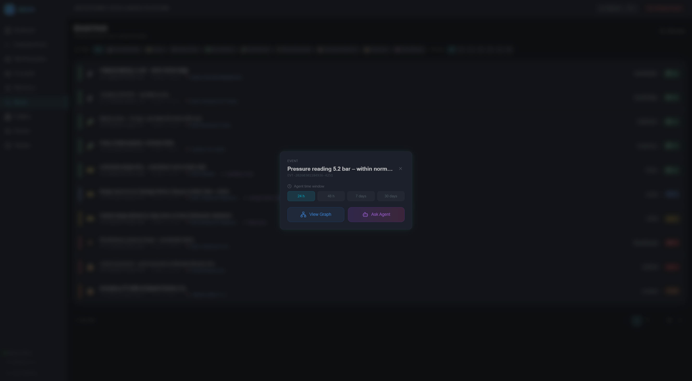
*Link Analysis mode: selecting two or more nodes to discover hidden connections between them.*

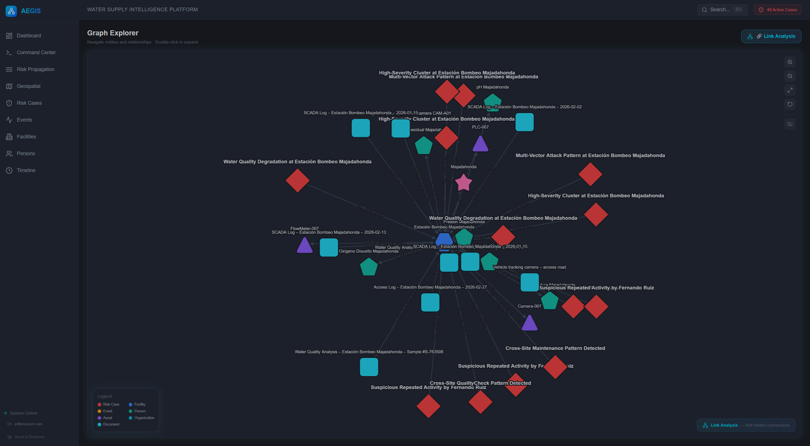
*Discovered paths: direct (green) and hidden (red dashed) connections with relevance scores.*

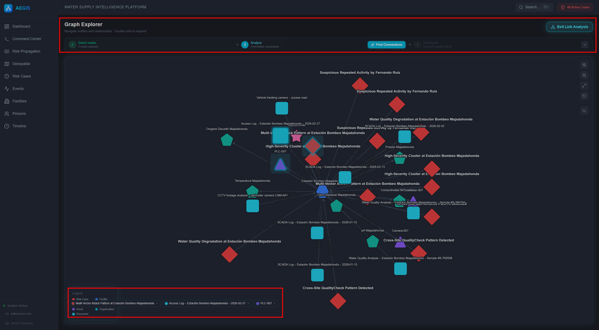
*Case investigation: risk case subgraph with AI analysis panel on the right.*

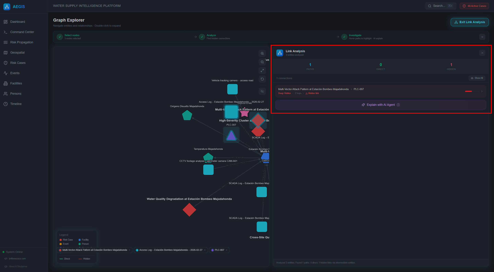
*Path highlighting: hovering a discovered path dims non-path nodes to focus attention.*

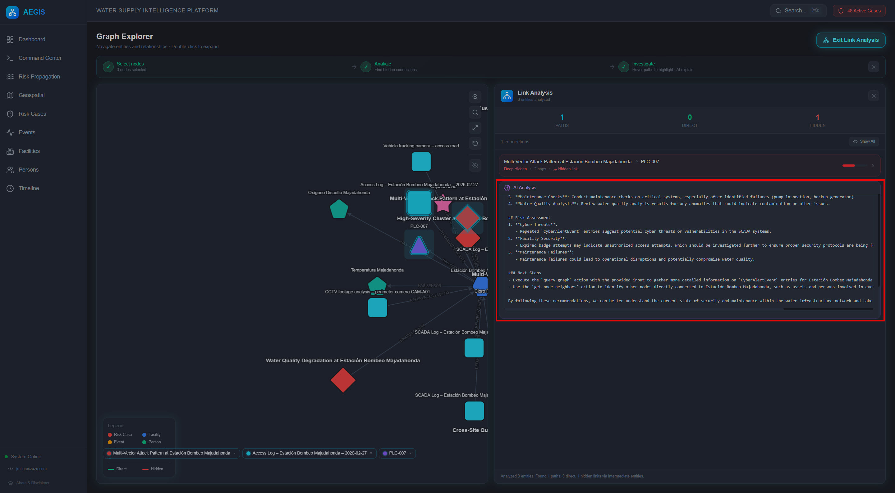
*Full analysis: all shortest paths between selected entities rendered simultaneously.*

In the Graph Explorer frontend (Cytoscape.js), hidden links are rendered with:

- **Dashed lines** for discovered (non-direct) connections
- **Opacity proportional to relevance** — stronger connections are more visible
- **Expandable nodes** — click to explore further
- **Color coding** by entity type (persons = blue, facilities = green, events = orange, etc.)

---

## Part B: Risk Propagation — BFS Blast Radius

### The Concept

When a high-severity event occurs at a facility (e.g., chlorine contamination at ETAP Norte), the risk doesn't stay contained. It propagates through the graph:

- The **facility** is directly at risk
- **Persons** who work there are compromised
- Their **organizations** may be involved
- **Other facilities** those persons access are secondarily at risk
- **Assets** at those facilities share the vulnerability
- **Downstream facilities** in the distribution network are affected

Risk propagation models this **contagion** mathematically using Breadth-First Search with exponential decay.

### The Algorithm

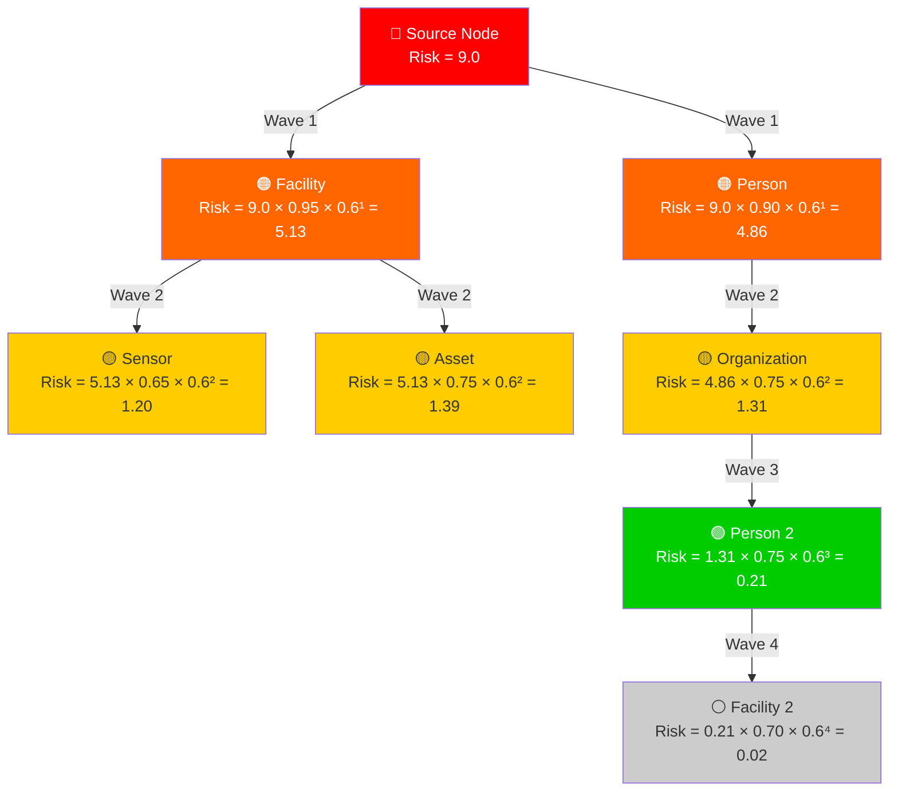

### The Formula

$$\text{propagatedRisk}(n) = \text{parentRisk}(n) \times w_r \times d^{\text{depth}}$$

Where:
- $w_r$ = relationship weight (how strongly this edge transmits risk)
- $d$ = decay factor (default **0.6** — risk drops 40% per hop)
- $\text{depth}$ = BFS depth (hop count from source)
- Floor: any risk below **0.1** is pruned (node not included)

### Relationship Weights

| Relationship | Weight | Rationale |
|-------------|--------|-----------|
| `OCCURS_AT` / `OCCURRED_AT` | **0.95** | Direct physical presence — highest transmission |
| `INVOLVES_PERSON` / `INVOLVED_IN` | **0.90** | Person directly involved in event |
| `LINKED_EVENT` / `LINKED_PERSON` / `LINKED_FACILITY` | **0.85** | Investigation links (risk case connections) |
| `CONNECTED_TO` | **0.80** | Social/professional connection |
| `BELONGS_TO` | **0.75** | Organizational membership |
| `INVOLVES_ASSET` | **0.75** | Asset involvement |
| `OPERATES_IN` / `LOCATED_AT` / `INVOLVES_SUBSTANCE` | **0.70** | Operational/geographic relationship |
| `HAS_SENSOR` / `HAS_ASSET` | **0.65** | Facility infrastructure |
| `MONITORS` | **0.50** | Monitoring relationship (weaker) |
| `REFERENCES_FACILITY` / `REFERENCES_PERSON` | **0.40** | Document references (weakest) |
| Default (unknown) | **0.50** | Fallback for new relationships |

### Source Risk Determination

The initial risk score of the source node is determined automatically:

| Source Type | Score | Logic |
|------------|-------|-------|
| RiskCase | From `riskScore` property | Uses actual calculated score |
| Event (SuspectedSabotage) | **9.0** | Maximum threat |
| Event (other) | `severity × 2.0` | Scaled from 0-5 → 0-10 |
| Facility | **7.0** | High inherent value |
| Person | **5.0** | Moderate starting risk |
| Default | **5.0** | Baseline |

### Risk Categories

| Risk Score | Category | Color |
|-----------|----------|-------|
| ≥ 7.0 | 🔴 **Critical** | Red |
| ≥ 5.0 | 🟠 **High** | Orange |
| ≥ 3.0 | 🟡 **Medium** | Yellow |
| ≥ 1.0 | 🟢 **Low** | Green |
| < 1.0 | ⚪ **Minimal** | Gray |

### Summary Statistics

After BFS completes, the system generates a propagation summary:

```json
{
  "summary": {
    "totalAffected": 34,
    "criticalNodes": 3,
    "highRiskNodes": 8,
    "facilitiesAffected": 6,
    "personsAffected": 12,
    "criticalPaths": [
      "CASE-001 → EVT-0012 → ETAP Norte → PER-023 → TechServ Industrial"
    ]
  },
  "waves": [
    { "depth": 0, "maxRisk": 9.0, "nodeCount": 1 },
    { "depth": 1, "maxRisk": 5.13, "nodeCount": 5 },
    { "depth": 2, "maxRisk": 1.39, "nodeCount": 12 },
    { "depth": 3, "maxRisk": 0.21, "nodeCount": 10 },
    { "depth": 4, "maxRisk": 0.02, "nodeCount": 6 }
  ]
}
```

### Visual Wave Animation

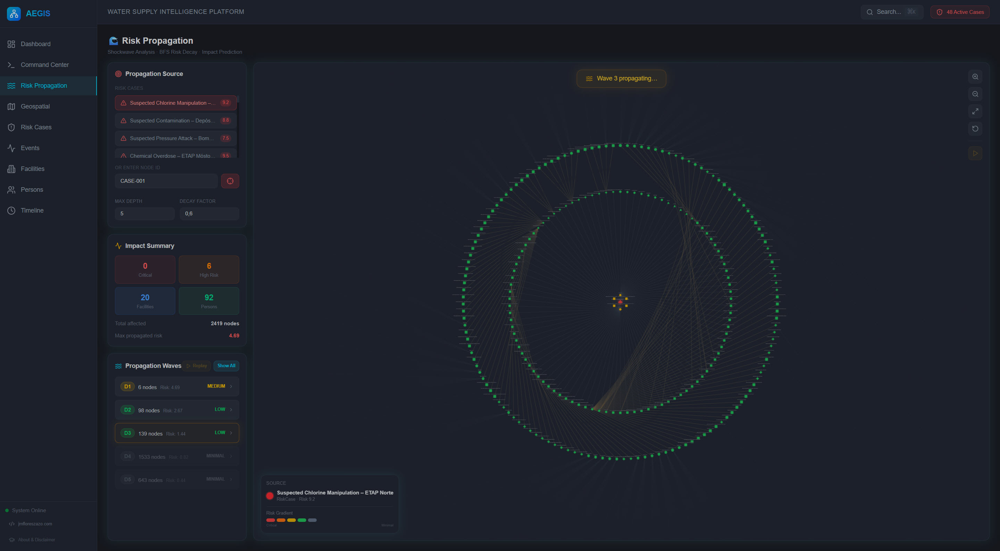
*Risk propagation: concentric waves radiate from the source node, color-coded by risk category (red → orange → yellow → green → gray).*

In the frontend, risk propagation is displayed as an **animated shockwave** on the Cytoscape.js graph:

1. **Wave 0 (Source)**: Red pulsing node
2. **Wave 1**: Orange ring expands outward (500ms animation)
3. **Wave 2**: Yellow ring (1000ms delay)
4. **Wave 3**: Green ring (1500ms delay)
5. **Wave 4+**: Gray (minimal risk, subtle animation)

Each node's **size** scales with its risk score. Each node's **color** reflects its risk category. The analyst can hover over any node to see its exact propagated risk score and the path from the source.

### Implementation: `RiskPropagationService.cs`

Located at `Aegis.Infrastructure/AI/RiskPropagationService.cs`:

- **Max depth**: 5 BFS levels (configurable)
- **Neighbor limit**: 50 per node (prevents explosion in dense subgraphs)
- **Visited set**: Prevents re-processing nodes already assigned risk
- **Pruning**: Nodes below 0.1 risk are excluded from results
- **Wave tracking**: Records concentric rings for frontend animation

---

## Part C: Graph Exploration (APOC)

For general-purpose graph navigation, AEGIS uses **APOC** (Awesome Procedures on Cypher):

```cypher
CALL apoc.path.subgraphAll(startNode, {
    maxLevel: $depth,
    labelFilter: "-ExcludedLabel1|-ExcludedLabel2"
})
YIELD nodes, relationships
```

### Features

- **Adjustable depth** (1-5 hops) via the frontend slider
- **Label exclusion** — analysts can hide certain node types (e.g., "show me only persons and facilities, hide sensors")
- **9 ID properties** supported for starting node lookup
- **Element ID resolution** — maps Neo4j internal IDs to domain IDs

### Auto-Redirect Behavior

When a user arrives at the Graph Explorer with no node selected, the system automatically loads the first available node (facility or event) to prevent an empty canvas.

---

## Key Takeaway

Graph analysis transforms a static database into a dynamic intelligence tool:

| Capability | SQL Database | Neo4j Graph |
|-----------|-------------|-------------|
| "Find related persons" | Multiple JOINs, hardcoded | 1-line Cypher, any depth |
| "Discover hidden connections" | Impossible without pre-defined queries | allShortestPaths — works on ANY path |
| "Assess blast radius" | Manual impact assessment | Automated BFS with decay |
| "Visualize attack network" | Requires BI tool | Native graph rendering |

> **The graph doesn't just store relationships — it computes new ones. The most dangerous connection is the one you haven't looked for yet.**

---

*Previous: [← Heterogeneous Data Fusion](03-heterogeneous-data-fusion.md) · Next: [Threat Detection Engine →](05-threat-detection-engine.md)*
