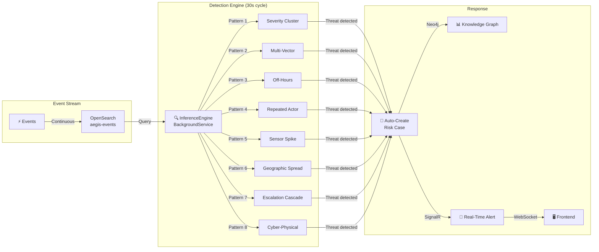
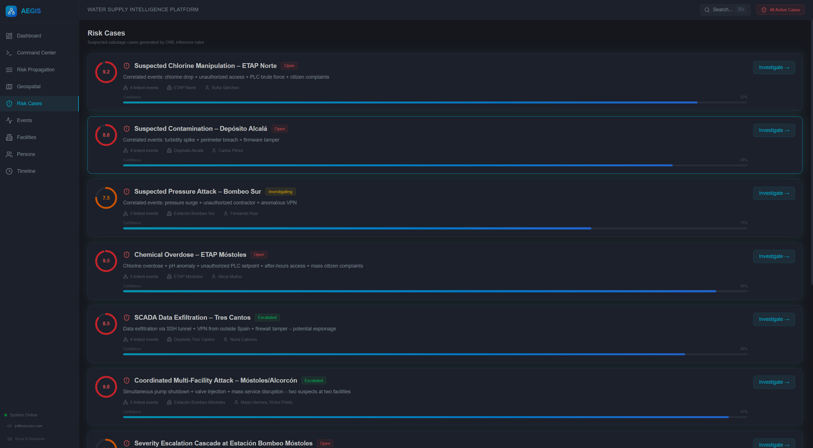
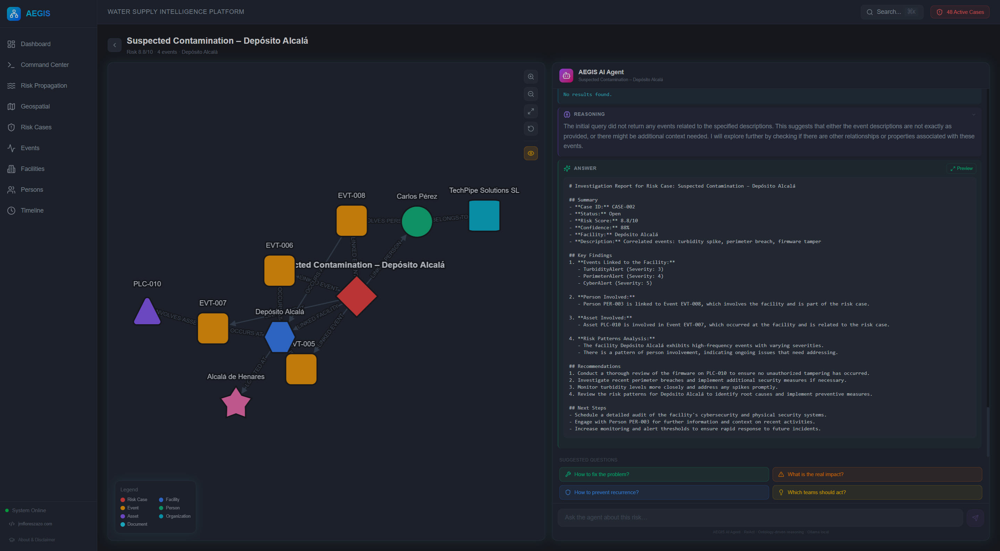
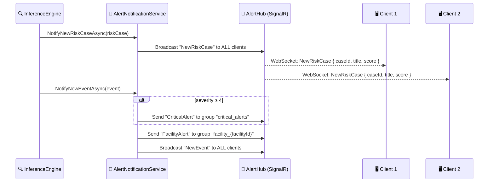

# 5. Threat Detection Engine

> **AEGIS doesn't wait for analysts to find threats — it hunts for them automatically. Every 30 seconds, 8 detection patterns scan the event stream for anomalies and auto-generate risk cases with SignalR real-time alerts.**

---

## Architecture



---

## The Detection Loop

The `InferenceEngine` is a .NET `BackgroundService` that runs continuously:

```
EVERY 30 SECONDS:
    1. Query events since last check (initially: last 1 hour)
    2. Run 8 detection patterns against the event batch
    3. For each threat detected:
       a. Check deduplication (same pattern + facility within 5 minutes?)
       b. Create risk case in Neo4j
       c. Link to involved events, persons, facilities
       d. Push SignalR alert to all connected clients
    4. Update last-check timestamp
```

### Deduplication

To prevent alert fatigue, the engine skips a detection if a risk case with the **same pattern name** and **same facility** was created within the last **5 minutes**.

---

## The 8 Detection Patterns

### Pattern 1: Severity Cluster

**Trigger**: ≥2 events with severity ≥4 at the same facility

**Logic**: High-severity events clustering at one location suggests an active incident rather than random noise.

| Parameter | Formula |
|-----------|---------|
| Confidence | $0.5 + \text{count} \times 0.15$ (max 0.95) |
| Risk Score | $\text{avg}(\text{severity}) \times 1.5 + \text{count} \times 0.5$ (max 10) |

**Example**: ETAP Norte has 3 events with severity 4, 5, 4 → confidence 0.95, risk score 8.0.

### Pattern 2: Multi-Vector Attack

**Trigger**: ≥3 distinct event types with severity ≥4 at the same facility

**Logic**: Multiple attack vectors (physical + cyber + access) at one target indicates a coordinated operation, not coincidence.

| Parameter | Formula |
|-----------|---------|
| Confidence | $0.6 + \text{types} \times 0.12$ (max 0.98) |
| Risk Score | $7.0 + \text{types} \times 0.5$ (max 10) |

**Example**: Bombeo Sur has PhysicalAnomaly + CyberAlert + AccessEvent (3 types) → confidence 0.96, risk score 8.5.

### Pattern 3: Off-Hours Anomaly

**Trigger**: `UnauthorizedAccess`, `CyberAlert`, or `Access` events with severity ≥3 between **22:00 and 06:00**

**Logic**: Security events during off-hours are inherently more suspicious. Legitimate maintenance is scheduled during business hours.

| Parameter | Formula |
|-----------|---------|
| Confidence | $0.7 + \text{count} \times 0.1$ |
| Risk Score | $5.0 + \text{count} \times 1.5$ (max 10) |

**Example**: 2 unauthorized access events at 02:00 AM → confidence 0.9, risk score 8.0.

### Pattern 4: Repeated Actor

**Trigger**: Same person appears in ≥2 events with severity ≥3

**Logic**: A single person repeatedly involved in security events is either a victim of targeting or an insider threat.

| Parameter | Formula |
|-----------|---------|
| Confidence | $0.6 + \text{count} \times 0.12$ |
| Risk Score | $4.0 + \text{count} \times 2.0$ (max 10) |

**Example**: PER-023 appears in 4 events → confidence 1.08 (capped implicitly), risk score 10.0.

### Pattern 5: Sensor Anomaly Spike

**Trigger**: ≥3 `SensorReading` events with severity ≥2 at the same facility

**Logic**: Multiple sensor anomalies at one facility suggest either equipment failure or deliberate manipulation.

| Parameter | Formula |
|-----------|---------|
| Confidence | $0.55 + \text{count} \times 0.12$ (max 0.95) |
| Risk Score | $5.0 + \text{count} \times 1.0$ (max 10) |

**Example**: ETAP Móstoles has 5 sensor spikes (chlorine, pH, turbidity) → confidence 0.95, risk score 10.0.

### Pattern 6: Geographic Spread

**Trigger**: Same event type with severity ≥3 at ≥3 different facilities

**Logic**: Coordinated attacks hit multiple targets. If the same attack type appears across many facilities simultaneously, it suggests centralized planning.

| Parameter | Formula |
|-----------|---------|
| Confidence | $0.65 + \text{facilities} \times 0.1$ (max 0.97) |
| Risk Score | $6.5 + \text{facilities} \times 1.0$ (max 10) |

**Example**: `PhysicalAnomaly` events at 4 different facilities → confidence 0.97, risk score 10.0.

### Pattern 7: Escalation Cascade

**Trigger**: ≥3 events with severity ≥2 at the same facility, with **monotonically increasing severity**

**Logic**: An attacker probing defenses will escalate: reconnaissance (severity 2) → unauthorized access (severity 3) → system compromise (severity 4) → sabotage (severity 5). A rising severity pattern is a textbook attack lifecycle.

| Parameter | Formula |
|-----------|---------|
| Confidence | $0.6 + (\text{max} - \text{min}) \times 0.15$ (max 0.92) |
| Risk Score | $\text{lastSeverity} \times 1.8 + 1.0$ (max 10) |

**Example**: Events at Depósito Alcalá with severity 2 → 3 → 4 → 5 → confidence 0.92, risk score 10.0.

### Pattern 8: Cyber-Physical Convergence

**Trigger**: Both `CyberAlert` AND `PhysicalAnomaly` events at the same facility

**Logic**: The convergence of cyber and physical attacks is the hallmark of a sophisticated adversary. SCADA manipulation (cyber) causing a chlorine spike (physical) is the most dangerous attack vector in critical infrastructure.

| Parameter | Formula |
|-----------|---------|
| Confidence | Fixed **0.90** |
| Risk Score | $8.0 + \text{count} \times 0.3$ (max 10) |

**Example**: Tres Cantos has CyberAlert (SCADA data exfiltration) + PhysicalAnomaly (pressure drop) → confidence 0.9, risk score 8.6.

---

## Auto-Generated Risk Cases


*Auto-generated risk cases: each card shows a circular risk gauge (0–10), status badge, confidence bar, and linked entities.*


*Case investigation: clicking "Investigate" opens the case in the Graph Explorer with full AI-powered analysis.*

When a pattern fires, the engine creates a risk case:

```
Case ID:     CASE-INF-20260215143000-a1b2c3
Title:       "Multi-Vector Attack: ETAP Móstoles"
Status:      "Escalated" (if riskScore ≥ 8.0) or "Open"
Risk Score:  8.5
Pattern:     "Multi-Vector Attack"
Confidence:  0.96
```

### Neo4j Relationships Created

```cypher
(riskCase:RiskCase)-[:LINKED_EVENT]->(event:Event)
(riskCase:RiskCase)-[:LINKED_FACILITY]->(facility:Facility)
(riskCase:RiskCase)-[:LINKED_PERSON]->(person:Person)
```

This means the risk case is immediately **navigable in the Graph Explorer** — analysts can click into the case and see all connected entities.

---

## Real-Time Alerts: SignalR

### Architecture



### SignalR Groups

| Group | Members | Events |
|-------|---------|--------|
| `*` (all) | All connected clients | `NewEvent`, `NewRiskCase`, `Connected` |
| `critical_alerts` | Clients subscribed to critical alerts | `CriticalAlert` (severity ≥ 4 events) |
| `facility_{id}` | Clients monitoring a specific facility | `FacilityAlert` (events at that facility) |

### Client Subscription

```typescript
// Frontend: useSignalR hook
connection.on("NewRiskCase", (data) => {
    // Show toast notification
    // Update risk case list
    // Flash dashboard indicators
});

connection.invoke("SubscribeToFacility", facilityId);
connection.invoke("SubscribeToCriticalAlerts");
```

---

## Detection Pattern Comparison

| Pattern | Event Grouping | Min Events | Severity Threshold | Max Confidence | Max Risk |
|---------|---------------|------------|-------------------|----------------|----------|
| Severity Cluster | By facility | 2 | ≥ 4 | 0.95 | 10.0 |
| Multi-Vector | By facility | 3 types | ≥ 4 | 0.98 | 10.0 |
| Off-Hours | By time window | 1 | ≥ 3 | — | 10.0 |
| Repeated Actor | By person | 2 | ≥ 3 | — | 10.0 |
| Sensor Spike | By facility | 3 | ≥ 2 | 0.95 | 10.0 |
| Geographic Spread | By event type | 3 facilities | ≥ 3 | 0.97 | 10.0 |
| Escalation Cascade | By facility | 3 (increasing) | ≥ 2 | 0.92 | 10.0 |
| Cyber-Physical | By facility | 2 (both types) | any | 0.90 | 10.0 |

---

## Why Not Machine Learning?

A conscious design choice: AEGIS uses **rule-based** detection patterns rather than ML models. Here's why:

| Aspect | ML-Based Detection | Rule-Based Detection |
|--------|-------------------|---------------------|
| **Training data** | Needs thousands of labeled incidents | Zero training data required |
| **Explainability** | "The model flagged this" (black box) | "3 cyber-physical events at Facility X" (transparent) |
| **False positive tuning** | Requires retraining | Adjust thresholds in code |
| **Domain adaptation** | Transfer learning challenges | Change patterns/weights |
| **Certification** | Regulators distrust ML | Rules can be audited line by line |
| **Speed** | GPU inference | Simple comparisons (microseconds) |

For a production system, the ideal approach is **hybrid**: rule-based patterns for known threats (speed + explainability) + ML anomaly detection for novel/unknown patterns.

---

## Extending the Detection Engine

Adding a new detection pattern requires:

1. **Define the pattern** in `InferenceEngine.cs`
2. **Group events** by the relevant dimension (facility, person, time, type)
3. **Calculate confidence** and **risk score** using your formula
4. The rest (case creation, Neo4j persistence, SignalR alerts) is automatic

```csharp
// Example: New pattern — "Chemical Supply Chain Anomaly"
// Trigger: Lab analysis shows chemical deficit AND supplier delivery delayed
private async Task DetectSupplyChainAnomaly(List<Event> events)
{
    var labEvents = events.Where(e => e.EventType == "LabAnalysis");
    var supplyEvents = events.Where(e => e.EventType == "SupplyDelivery");
    // Correlation logic here...
}
```

---

## Key Takeaway

The threat detection engine turns a passive monitoring system into an **active threat hunter**. By combining pattern-based detection with automatic risk case creation and real-time alerts, AEGIS ensures that:

1. **No pattern goes unnoticed** — even if all analysts are busy
2. **Response time is minimized** — alerts arrive within 30 seconds
3. **Escalation is automatic** — critical threats (≥ 8.0 risk) are marked "Escalated"
4. **Everything is traceable** — every auto-generated case links to its triggering events

> **The best security analyst is the one who never sleeps. The InferenceEngine runs 2,880 detection cycles per day.**

---

*Previous: [← Graph Analysis & Link Discovery](04-graph-analysis-and-link-discovery.md) · Next: [Platform User Guide →](06-platform-user-guide.md)*
