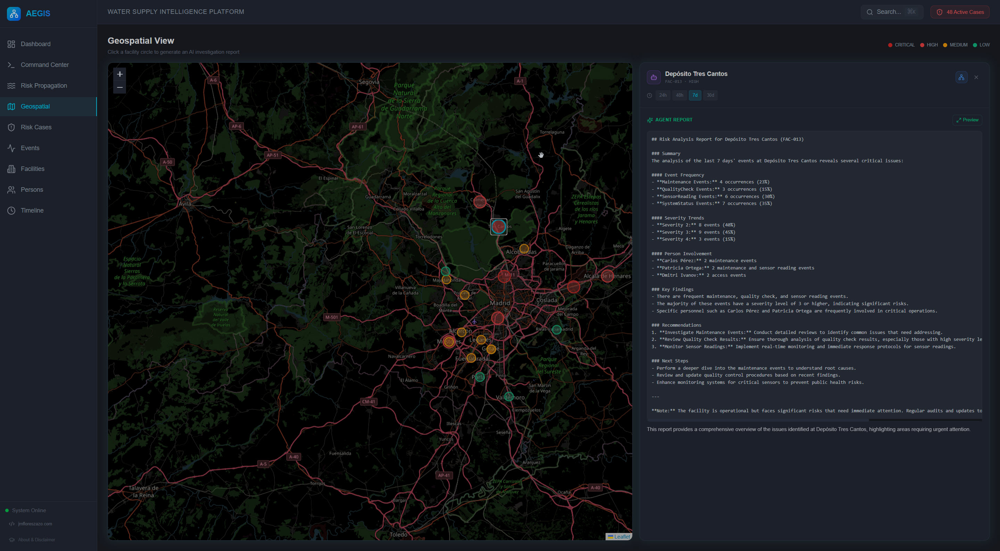
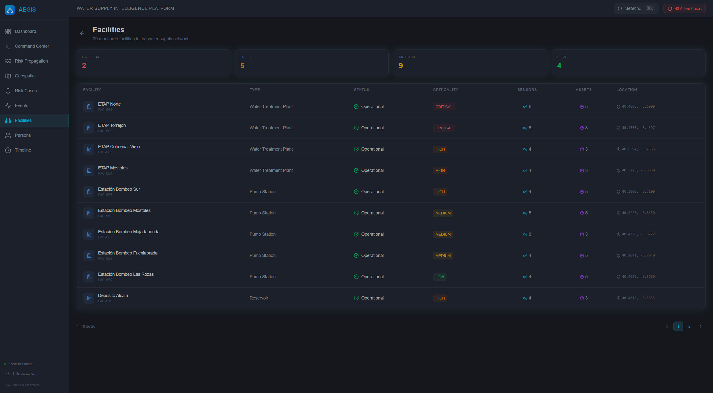
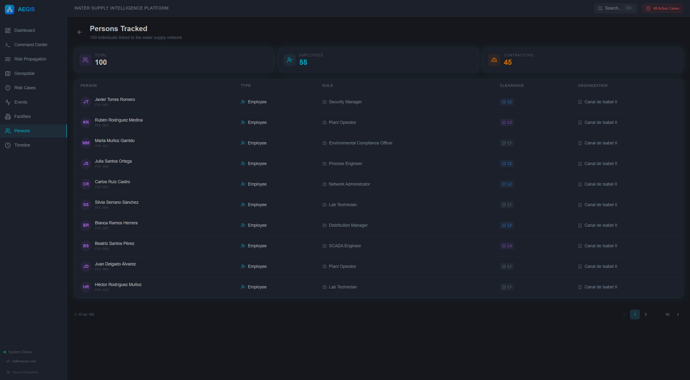
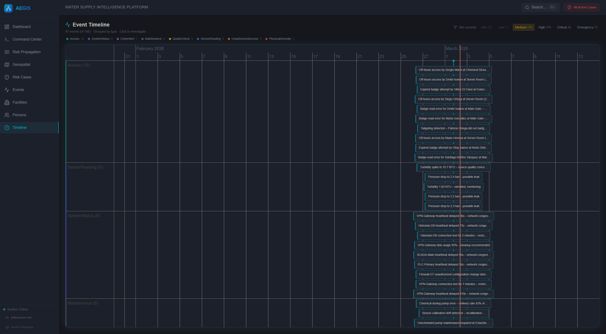
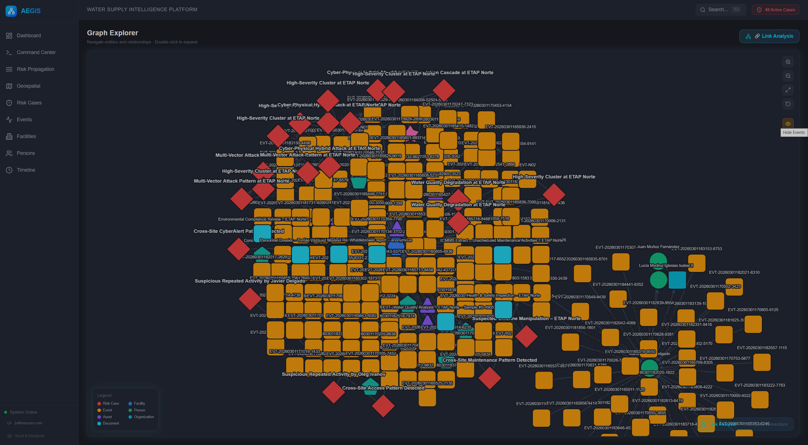

# 6. Platform User Guide

> **A screen-by-screen walkthrough of every feature in the AEGIS platform. Each section describes what you see, what you can do, and what intelligence capabilities are powered behind the scenes.**

---

## Navigation

AEGIS uses a persistent sidebar with 9 navigation items:

| Icon | Label | Route | Description |
|------|-------|-------|-------------|
| 📊 | **Dashboard** | `/` | KPIs, charts, active cases, critical events |
| ⚡ | **Command Center** | `/command-center` | Multi-agent NL→Cypher queries |
| 🔴 | **Risk Propagation** | `/risk-propagation` | BFS blast radius visualization |
| 🗺️ | **Geospatial** | `/map` | Leaflet map with AI-driven facility reports |
| 🛡️ | **Risk Cases** | `/cases` | Auto-generated investigation cases |
| 📋 | **Events** | `/events` | Full event stream with type/severity filters |
| 🏭 | **Facilities** | `/facilities` | All monitored water infrastructure |
| 👤 | **Persons** | `/persons` | Persons of interest and employees |
| ⏱️ | **Timeline** | `/timeline` | Swim-lane timeline of all events |

**Global features:**
- **Search** (`⌘K` / `Ctrl+K`): Opens the full-screen search overlay from anywhere
- **Active Cases badge**: Red counter in the top bar showing unresolved risk cases
- **System Online indicator**: Green pulsing dot in the sidebar footer
- **About & Disclaimer**: Author information and project disclaimer in the sidebar footer

*About & Disclaimer: author information, project description, and legal disclaimer.*

---

## 1. Dashboard

**What you see:**

*Dashboard overview: five KPI cards, Events by Type bar chart, Severity Distribution donut, active risk cases, and recent critical events.*

Five KPI cards across the top:
- **Facilities**: Total monitored facilities (20)
- **Total Events**: Event count from OpenSearch
- **Open Cases**: Unresolved risk cases
- **Critical Alerts**: High-severity events
- **Persons Tracked**: Persons in the knowledge graph

Two charts side by side:
- **Events by Type** (bar chart): Stacked bars colored by event type
- **Severity Distribution** (donut chart): Proportional breakdown of severity levels

Two tables:
- **Active Risk Cases** (top 10): Title, description, risk score (numeric), status badge. Click → opens case investigation
- **Recent Critical Events** (top 10): Severity color bar, description, type, timestamp. Click → opens event detail

**Behind the scenes:** `GET /api/dashboard/stats`, `GET /api/risk-cases`, `GET /api/events?minSeverity=4`

---

## 2. Command Center

**What you see:**

*Agent selector: four specialized AI personas with distinct analytical perspectives.*

| Zone | Content |
|------|---------|
| **Agent selector** (top) | 4 agent cards: CENTCOM 🎖️, CIVILCOM 🏛️, OPSCOM ⚙️, SENTINEL 🚨 |
| **Chat panel** (center) | Streaming conversation with collapsible investigation steps |
| **Alerts sidebar** (right) | SENTINEL-generated alert cards (appears when alerts exist) |
| **Input bar** (bottom) | Text area with Enter-to-send, Shift+Enter for newline |

**How to use:**

1. **Select an agent** by clicking its card. Each agent has a different analytical perspective (see [doc 02](02-ai-agents-and-prompts.md)):
   - **CENTCOM**: Military threat assessment
   - **CIVILCOM**: Public safety and citizen impact
   - **OPSCOM**: SCADA/ICS technical analysis
   - **SENTINEL**: Automated alerts with structured alert actions

2. **Type a natural language query**: e.g., "Show all contractors with unauthorized access at night"

3. **Watch the investigation stream**:
   - 🧠 **Thought** (blue): Agent's reasoning about what Cypher to generate
   - 💻 **Cypher** (green): The generated query with syntax highlighting
   - 📊 **Observation** (amber): Query results from Neo4j
   - 📋 **Answer** (white): Full Markdown analysis through the agent's persona
   - 🚨 **Alert** (red, SENTINEL only): Structured alert recommendations

4. **Suggested queries** appear when chat is empty — 3 per agent, covering common analytical questions

*Streaming result: Cypher query, data observation, and full Markdown analysis through the selected agent’s persona.*

**Keyboard**: Enter = send, Shift+Enter = newline

**Behind the scenes:** `POST /api/command-center/query` → SSE streaming (`text/event-stream`). Pipeline: ontology fetch → Cypher generation → execution → persona-based analysis.

---

## 3. Risk Propagation

**What you see:**

*Risk propagation: concentric graph layout with risk-colored nodes radiating from the source. Impact summary and wave breakdown on the left.*

| Zone | Content |
|------|---------|
| **Control panel** (left, 320px) | Source selector, parameter controls, impact summary |
| **Graph canvas** (right) | Concentric Cytoscape.js graph with risk-colored nodes |

**How to use:**

1. **Select a source node**:
   - Click a risk case from the quick-select list (shows title + risk score), OR
   - Type a custom node ID (e.g., `EVT-0342`) in the manual input

2. **Adjust parameters** (optional):
   - **Max Depth**: 1-10 (default 5) — how many hops to propagate
   - **Decay Factor**: 0.1-0.99 (default 0.6) — how quickly risk diminishes

3. **Watch the shockwave**:
   - Source node appears as a large red circle at center
   - **Wave 1** fades in (orange nodes)
   - **Wave 2** fades in (yellow nodes)
   - **Wave 3-5** fade progressively (green → gray)
   - Edges pulse with dashed amber animation during propagation

4. **Explore the impact**:
   - **Impact Summary**: Critical nodes, high-risk nodes, facilities/persons affected
   - **Critical Paths**: The most dangerous propagation chains
   - **Wave list**: Expandable per-wave node lists. Click any node → graph zooms to it
   - **Node detail**: Click node on graph → overlay with propagated risk score, category, wave depth, and "Open in Graph Explorer" link

5. **Replay**: Click the Replay button to re-animate the shockwave

**Behind the scenes:** `POST /api/graph/risk-propagation` → BFS with exponential decay. `GET /api/risk-cases` for source list.

---

## 4. Graph Explorer

**What you see:**

*Full-canvas graph with typed nodes: risk cases (red diamond), facilities (blue hexagon), events (amber rounded-rect), persons (green ellipse).*

*Link Analysis: discovered hidden paths between selected entities with AI investigation panel.*

A full-canvas Cytoscape.js graph with typed nodes:

| Entity | Shape | Color |
|--------|-------|-------|
| RiskCase | Diamond | Red |
| Facility | Hexagon | Blue |
| Event | Rounded rectangle | Amber |
| Person | Ellipse | Green |
| Asset | Triangle | Purple |
| Organization | Barrel | Cyan |
| Sensor | Pentagon | Teal |
| Document | Rounded rectangle | Gray |

**Node detail panel** (right, 320px): Shows all properties of the selected node plus "Investigate this entity →" button.

**How to use:**

1. **Navigate to a node**: Double-click any node to expand its neighborhood (loads 2-hop subgraph)
2. **Explore a risk case**: Navigate from Cases or use quick-case buttons (top-right, up to 3 cases). The graph loads the case's full subgraph (events → persons → facilities → organizations)
3. **Show/Hide Events**: Toggle the eye icon to declutter the graph by hiding event nodes
4. **Zoom controls**: Zoom In, Zoom Out, Fit to Screen, Reset Layout (top-right buttons)
5. **Auto-redirect**: If you navigate to `/graph` with no node, the system loads the first available facility automatically

**Link Analysis Mode (3-step flow):**

1. Click the "🔗 Link Analysis" button → enters selection mode (cursor changes)
2. Click 2 or more nodes — each gets a visual selection ring and a chip badge appears at the bottom
3. Click "Find Connections" → system runs `allShortestPaths` between all pairs
4. Results appear in the **Link Analysis Panel** (right side):
   - Discovered paths listed with relevance score (1.0 / hop count)
   - **Hover** a path → graph highlights the path nodes in green (direct) or red dashed (hidden), dimming non-path nodes
   - Direct connections (1 hop) vs hidden connections (2+ hops) are separated

**Case investigation**: If the URL is `/graph/CASE-xxx`, the right panel shows the **Risk Investigation** AI panel with streaming analysis.

**Behind the scenes:**
- `GET /api/graph/explore?nodeId=X&depth=2` — APOC subgraph expansion
- `GET /api/graph/case/{caseId}` — case-specific subgraph
- `POST /api/graph/link-analysis` — allShortestPaths across selected nodes

---

## 5. Geospatial (Map View)

**What you see:**

*Geospatial view: Leaflet map centered on Madrid with criticality-colored facility markers. Clicking a facility opens an AI-generated intelligence report.*

A Leaflet map centered on the Madrid metropolitan area (40.42°N, 3.55°W) showing all 20 water infrastructure facilities as colored circle markers:

| Criticality | Color | Size |
|-------------|-------|------|
| CRITICAL | Dark red | Large |
| HIGH | Red | Medium-large |
| MEDIUM | Amber | Medium |
| LOW | Green | Small |

**How to use:**

1. **Click a facility marker** → a report panel slides in from the right (2/5 width)
2. **Report panel** shows:
   - Facility name, ID, and criticality badge
   - **Time range selector**: 24h / 48h / 7d / 30d — changes trigger a new AI analysis
   - **AI-generated intelligence report** (Markdown-rendered) analyzing events at that facility for the selected period
   - Streaming steps visible during generation (thought → action → observation → answer)
   - "Preview" button → full-screen Markdown modal
   - "View Graph" button → navigates to Graph Explorer with the facility pre-selected

**Behind the scenes:** `GET /api/facilities` for locations, `POST /api/ai/investigate` (SSE streaming) for AI-powered facility reports.

---

## 6. Risk Cases

**What you see:**

*Risk case cards: circular SVG gauge (0–10), status badge, confidence bar, linked events and persons.*

*Case investigation: graph subgraph with AI-powered streaming analysis panel.*

A paginated card list of all risk cases (10 per page). Each card shows:

- **SVG circular gauge** (left): Risk score 0-10 with color gradient
- **Title** and **status badge**: Open (red), Investigating (yellow), Resolved (green)
- **Description**: What triggered the case
- **Metadata**: Number of linked events, facility name, linked person names
- **Confidence bar**: Gradient progress bar showing detection confidence (0-100%)
- **"Investigate →" button**: Opens the case in Graph Explorer with AI investigation panel

**Behind the scenes:** `GET /api/risk-cases`

---

## 7. Events Feed

**What you see:**

The complete event stream with two filter bars:

**Type filter** (10 buttons with emoji icons):
All, SensorReading 📡, Access 🚪, Maintenance 🔧, SystemStatus ⚙️, QualityCheck 🧪, PhysicalAnomaly ⚠️, UnauthorizedAccess 🚫, CyberAlert 💻, CitizenReport 📢

**Severity filter** (7 buttons, color-coded):
All, 0 (✅ OK), 1, 2, 3, 4, 5

Each event row shows:
- Severity color bar (left edge)
- Event type emoji
- Description, event ID, timestamp
- Facility name, person name (if applicable)
- Type badge + severity badge

**Interactions:** Click filters to narrow results (URL params update for bookmarkable views). Click event row → opens Entity Action Modal for further investigation.

**Behind the scenes:** `GET /api/events?eventType=X&severity=Y&facilityId=Z`

---

## 8. Facilities

**What you see:**

*Facilities list: all 20 monitored facilities with type, location, criticality level, and connected sensors/assets count.*

A list of all 20 monitored facilities with:
- Facility name, type, location
- Criticality level badge
- Connected sensors and assets count
- Click → navigate to facility in Graph Explorer

**Behind the scenes:** `GET /api/facilities`

---

## 9. Persons

**What you see:**

*Persons tracker: 100 tracked individuals with role, organization, clearance level, and associated events.*

A list of all 100 tracked persons with:
- Name, role, organization
- Clearance level
- Associated events count
- Click → navigate to person in Graph Explorer

**Behind the scenes:** `GET /api/persons`

---

## 10. Timeline

**What you see:**

*Interactive timeline: events in swim lanes grouped by type, colored by severity, with severity filter bar.*

An interactive `vis-timeline` visualization with:
- **Swim lanes** (horizontal bands) grouped by event type
- Events colored by severity (blue → green → yellow → orange → red → dark red)
- **Severity filter bar** (top): 6 buttons (Info, Low, Medium, High, Critical, Emergency) with event counts
- Default minimum filter: Medium (severity 2)
- Date range: December 2025 to March 2026
- Initial view: January 15 to February 28, 2026

**How to use:**
- **Scroll/zoom** the timeline to navigate (2-hour minimum zoom → 90-day maximum)
- **Click severity buttons** to filter by minimum severity level
- **Hover** over events for tooltips (full description, type, severity, date, facility)
- **Click an event item** → navigates to Event Detail / Entity Investigation
- **Current time line** shown as a vertical marker

**Behind the scenes:** `GET /api/timeline?from=X&to=Y`

---

## 11. Search (`⌘K` / `Ctrl+K`)

**What you see:**

*Search overlay: OpenSearch results with intel documents grouped by type and classification badges.*

*AI analysis: pressing Enter triggers a ReAct agent investigation with streaming thought/action/observation steps.*

*Cross-index results: SCADA logs, emails, lab analyses, and events merged and ranked by relevance.*

*Classification badges: RESTRICTED (red), CONFIDENTIAL (yellow), INTERNAL (green) alongside each document result.*

A full-screen overlay with blurred backdrop:

- **Large search input** (autofocus)
- As you type, **OpenSearch results** appear in real time (debounced):
  - **Intel Documents**: Grouped by type (10 types with icons), showing title, classification badge, facility, person, relevance score
  - **Events**: Colored by type, showing description, facility name
- Press **Enter** or click **"Analyze"** → triggers **agentic AI search** (SSE streaming):
  - Shows investigation steps (thought/action/observation) as mini-cards
  - Final answer rendered as rich Markdown
  - "Preview" button for full-screen view

**Keyboard shortcuts:**
- `Ctrl+K` / `⌘K` → open search from anywhere
- `Enter` → analyze with AI
- `Escape` → close
- Click backdrop → close

**Behind the scenes:** `GET /api/search?q=X` (OpenSearch), `POST /api/ai/investigate` (SSE agent)

---

## 12. Entity Investigation

When you click "Investigate →" on an entity, the system opens a full investigation view:

- **Entity header**: Name, type, all properties
- **Graph context**: The entity's immediate neighborhood visualized
- **AI investigation**: Streaming ReAct agent analysis
- **Related events**: Events involving this entity
- **Connected entities**: Direct neighbors in the knowledge graph

---

## Keyboard Shortcuts Summary

| Key | Action | Context |
|-----|--------|---------|
| `Ctrl+K` / `⌘K` | Open search overlay | Global |
| `Enter` | Send query / Analyze | Command Center, Search |
| `Shift+Enter` | New line | Command Center |
| `Escape` | Close modal/overlay | Search, Markdown Preview |

---

*Previous: [← Threat Detection Engine](05-threat-detection-engine.md) · Next: [Architecture & Deployment →](07-architecture-and-deployment.md)*
