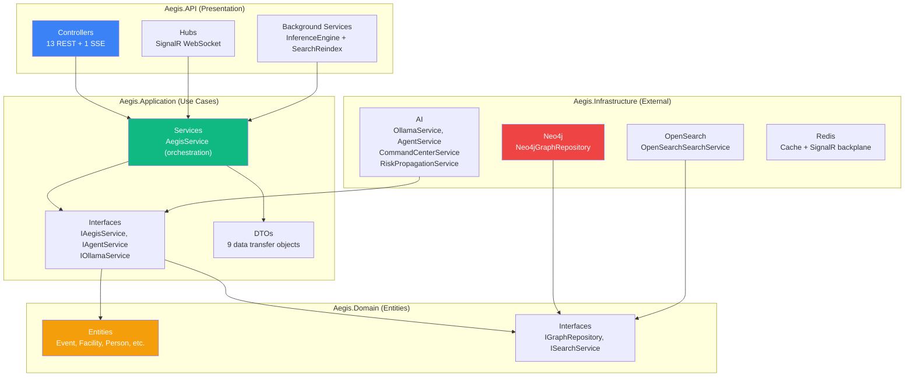
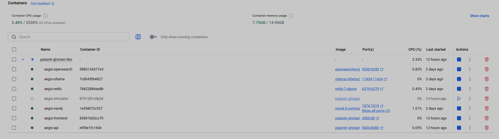
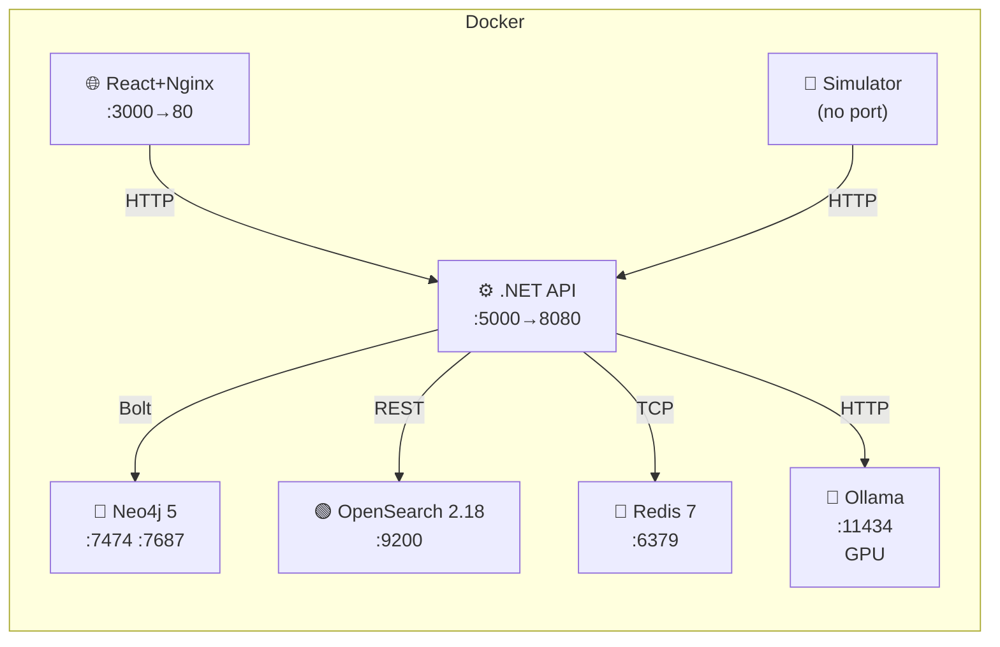

# 7. Architecture & Deployment

> **AEGIS follows Clean Architecture with 4 .NET layers, runs as 7 Docker Compose services, and starts with a single command. This document covers the software design, every REST endpoint, the real-time communication layer, and full deployment instructions.**

---

## Clean Architecture



### Layer Responsibilities

| Layer | Project | Depends On | Responsibility |
|-------|---------|------------|----------------|
| **Presentation** | `Aegis.API` | Application, Infrastructure | HTTP endpoints, SSE streaming, SignalR hub, middleware, DI composition root |
| **Application** | `Aegis.Application` | Domain | Business logic orchestration, DTOs, service interfaces |
| **Domain** | `Aegis.Domain` | Nothing | Entity definitions, repository interfaces, pure domain logic |
| **Infrastructure** | `Aegis.Infrastructure` | Domain, Application | Neo4j, OpenSearch, Redis, Ollama implementations |

**Dependency Rule**: Inner layers never reference outer layers. Domain has zero external dependencies.

---

## REST API Endpoints

### Core Data

| Method | Endpoint | Controller | Description |
|--------|----------|------------|-------------|
| `GET` | `/api/dashboard/stats` | `DashboardController` | KPI statistics (facilities, events, cases, persons) |
| `GET` | `/api/facilities` | `FacilitiesController` | All 20 facilities with metadata |
| `GET` | `/api/persons` | `PersonsController` | All 100 persons with roles and organizations |
| `GET` | `/api/events` | `EventsController` | Filtered event list (`?eventType=&severity=&facilityId=&from=&to=`) |
| `POST` | `/api/events/ingest` | `EventsController` | Ingest a new event (indexes in OpenSearch + Neo4j) |
| `GET` | `/api/risk-cases` | `RiskCasesController` | All risk cases with scores and confidence |
| `GET` | `/api/timeline` | `TimelineController` | Timeline events (`?from=&to=&facilityId=`) |
| `GET` | `/api/search` | `SearchController` | Unified search across events + intel (`?q=&page=&pageSize=`) |

### Graph Operations

| Method | Endpoint | Controller | Description |
|--------|----------|------------|-------------|
| `GET` | `/api/graph/explore` | `GraphController` | APOC subgraph expansion (`?nodeId=&depth=&excludeLabels=`) |
| `GET` | `/api/graph/case/{caseId}` | `GraphController` | Risk case full subgraph (events → persons → facilities) |
| `POST` | `/api/graph/link-analysis` | `GraphController` | Hidden link discovery via `allShortestPaths` |
| `POST` | `/api/graph/risk-propagation` | `GraphController` | BFS blast radius with decay |

### AI (SSE Streaming)

| Method | Endpoint | Controller | Response |
|--------|----------|------------|----------|
| `POST` | `/api/ai/investigate` | `AiController` | SSE stream: ReAct agent investigation |
| `POST` | `/api/command-center/query` | `CommandCenterController` | SSE stream: NL→Cypher pipeline |

### System

| Method | Endpoint | Controller | Description |
|--------|----------|------------|-------------|
| `POST` | `/api/seed` | `SeedController` | Generate and ingest all data (runs `generate_data.py` equivalent) |

### SignalR Hub

| Endpoint | Method | Description |
|----------|--------|-------------|
| `/hubs/alerts` | `OnConnectedAsync` | Sends welcome message with timestamp |
| `/hubs/alerts` | `SubscribeToFacility(id)` | Join facility-specific alert group |
| `/hubs/alerts` | `SubscribeToCriticalAlerts()` | Join critical alert group |

**Server-push events**: `Connected`, `CriticalAlert`, `FacilityAlert`, `NewEvent`, `NewRiskCase`

---

## Service Lifetimes (Dependency Injection)

| Registration | Lifetime | Why |
|-------------|----------|-----|
| `Neo4jGraphRepository` | **Singleton** | Neo4j driver is thread-safe, reuses connections |
| `OpenSearchSearchService` | **Singleton** | OpenSearch client is thread-safe |
| `OllamaService` | **Singleton** | Stateless HTTP client to Ollama |
| `AegisService` | **Scoped** | Orchestrates per-request work |
| `AgentService` | **Scoped** | Holds investigation state per request |
| `CommandCenterService` | **Scoped** | Per-query pipeline state |
| `RiskPropagationService` | **Scoped** | Per-propagation BFS state |
| `AlertNotificationService` | **Singleton** | Shared SignalR hub context |
| `InferenceEngine` | **Hosted Service** | Background loop (30-second cycle) |
| `SearchReindexService` | **Hosted Service** | Background reindexing on startup |
| `Redis Cache` | **Singleton** | `StackExchangeRedisCache` with `aegis_` prefix |

---

## Docker Compose — 7 Services


*Docker Compose: all 7 services running — Neo4j, OpenSearch, Redis, Ollama (GPU), .NET API, React frontend, and event simulator.*



### Service Details

| Service | Image | Container | Ports | Resources |
|---------|-------|-----------|-------|-----------|
| `neo4j` | `neo4j:5-community` | `aegis-neo4j` | 7474, 7687 | Heap: 512MB-1GB |
| `opensearch` | `opensearchproject/opensearch:2.18.0` | `aegis-opensearch` | 9200 | JVM: 512MB |
| `redis` | `redis:7-alpine` | `aegis-redis` | 6379 | Minimal |
| `ollama` | `ollama/ollama:latest` | `aegis-ollama` | 11434 | **GPU** (nvidia) |
| `api` | Build from `src/backend/Aegis.API/Dockerfile` | `aegis-api` | 5000→8080 | .NET 10.0 |
| `frontend` | Build from `src/frontend/Dockerfile` | `aegis-frontend` | 3000→80 | Nginx |
| `simulator` | Build from `tools/Dockerfile` | `aegis-simulator` | none | Python 3 |

### Environment Variables (API)

| Variable | Default | Description |
|----------|---------|-------------|
| `ConnectionStrings__Neo4j` | `bolt://neo4j:7687` | Neo4j Bolt endpoint |
| `ConnectionStrings__OpenSearch` | `http://opensearch:9200` | OpenSearch REST endpoint |
| `ConnectionStrings__Redis` | `redis:6379` | Redis connection |
| `Neo4j__User` | `neo4j` | Neo4j username |
| `Neo4j__Password` | `aegis2026!` | Neo4j password |
| `Ollama__BaseUrl` | `http://ollama:11434` | Ollama API endpoint |
| `Ollama__Model` | `qwen2.5:7b` | LLM model name |

### Volumes

| Volume | Mount | Purpose |
|--------|-------|---------|
| `neo4j-data` | `/data` | Graph persistence |
| `opensearch-data` | `/usr/share/opensearch/data` | Index persistence |
| `redis-data` | `/data` | Cache persistence |
| `./data/neo4j-init/seed.cypher` | `/var/lib/neo4j/import/seed.cypher` | Initial graph seed |

### Health Checks

| Service | Check | Interval |
|---------|-------|----------|
| Neo4j | `neo4j status` | 10s, 30 retries |
| OpenSearch | `curl /_cluster/health` | 10s, 30 retries |
| Redis | `redis-cli ping` | 5s, 10 retries |
| Ollama | `curl /api/tags` | 10s, 30 retries |

---

## Technology Stack

### Backend (.NET 10.0)

| Package | Version | Purpose |
|---------|---------|---------|
| `Swashbuckle.AspNetCore` | 7.* | Swagger / OpenAPI |
| `Neo4j.Driver` | 5.* | Neo4j Bolt protocol |
| `OpenSearch.Client` | * | OpenSearch REST client |
| `Microsoft.Extensions.Caching.StackExchangeRedis` | * | Redis cache |
| `Microsoft.AspNetCore.SignalR` | (built-in) | WebSocket real-time |
| `Serilog` | * | Structured logging |

### Frontend (React 19)

| Package | Purpose |
|---------|---------|
| React 19 + React DOM 19 | UI framework |
| React Router DOM 7.1 | Client-side routing (12 routes) |
| `@tanstack/react-query` 5.62 | Server state management |
| Cytoscape 3.30 + `react-cytoscapejs` | Graph visualization |
| Leaflet 1.9.4 + `react-leaflet` 5.0 | Geospatial maps |
| `vis-timeline` 7.7.3 | Interactive timeline |
| Recharts 2.15 | Dashboard charts |
| `@microsoft/signalr` 8.0.7 | Real-time WebSocket client |
| `react-markdown` 9.0 + `remark-gfm` 4.0 | Markdown rendering |
| `lucide-react` 0.468 | Icon library |
| Axios 1.7.9 | HTTP client |
| Tailwind CSS 4.0 | Utility-first CSS |
| Vite 6 + TypeScript 5.7 | Build tooling |

---

## Quick Start

### Docker Mode (Recommended)

```powershell
# Clone the repository
git clone https://github.com/your-org/aegis-platform.git
cd aegis-platform

# Launch everything (7 containers + seed + open browser)
.\launch.ps1

# Or explicitly:
.\launch.ps1 -Mode docker
```

This will:
1. ✅ Check prerequisites (Docker, Docker Compose)
2. ✅ Check port availability (3000, 5000, 7474, 7687, 9200, 6379, 11434)
3. ✅ Build and start all 7 containers
4. ✅ Wait for health checks (Neo4j, OpenSearch, Redis, API)
5. ✅ Pull `qwen2.5:7b` model into Ollama (first run only, ~4.5 GB)
6. ✅ Seed the database via `POST /api/seed`
7. ✅ Open browser at `http://localhost:3000`

### Development Mode

```powershell
# Start only infrastructure in Docker
.\launch.ps1 -Mode dev

# This starts: neo4j, opensearch, redis in Docker
# Then builds + runs the .NET API on localhost:5000
# Then starts Vite dev server on localhost:5173
```

### Shutdown

```powershell
# Stop and remove all containers + volumes
.\launch.ps1 -Down
```

### Port Summary

| Port | Service | Docker | Dev |
|------|---------|--------|-----|
| 3000 | Frontend (Nginx) | ✅ | — |
| 5173 | Frontend (Vite) | — | ✅ |
| 5000 | .NET API | ✅ | ✅ |
| 7474 | Neo4j Browser | ✅ | ✅ |
| 7687 | Neo4j Bolt | ✅ | ✅ |
| 9200 | OpenSearch | ✅ | ✅ |
| 6379 | Redis | ✅ | ✅ |
| 11434 | Ollama | ✅ | — |

---

## Project Structure

```
aegis-platform/
├── README.md                          ← You are here
├── docs/                              ← This documentation suite
│   ├── 01-ontology-and-knowledge-graph.md
│   ├── 02-ai-agents-and-prompts.md
│   ├── 03-heterogeneous-data-fusion.md
│   ├── 04-graph-analysis-and-link-discovery.md
│   ├── 05-threat-detection-engine.md
│   ├── 06-platform-user-guide.md
│   └── 07-architecture-and-deployment.md
├── docker-compose.yml                 ← 7 services orchestration
├── launch.ps1                         ← One-command launcher
├── ontology/
│   └── water-sabotage.owl.ttl         ← OWL 2.0 ontology (Turtle)
├── data/
│   └── neo4j-init/
│       └── seed.cypher                ← Initial graph seed
├── src/
│   ├── backend/
│   │   ├── Aegis.sln                  ← .NET solution
│   │   ├── Aegis.API/                 ← Presentation layer
│   │   │   ├── Controllers/           ← 10 REST controllers
│   │   │   ├── Hubs/                  ← SignalR AlertHub
│   │   │   ├── Services/              ← Background services
│   │   │   └── Contracts/             ← Request models
│   │   ├── Aegis.Application/         ← Use case layer
│   │   │   ├── DTOs/                  ← 9 data transfer objects
│   │   │   ├── Interfaces/            ← Service contracts
│   │   │   └── Services/              ← AegisService
│   │   ├── Aegis.Domain/              ← Domain layer
│   │   │   ├── Entities/              ← 10+ entity types
│   │   │   └── Interfaces/            ← Repository contracts
│   │   └── Aegis.Infrastructure/      ← External integrations
│   │       ├── AI/                    ← Ollama, Agent, CommandCenter, RiskPropagation
│   │       ├── Neo4j/                 ← Graph repository
│   │       └── Search/                ← OpenSearch service
│   └── frontend/
│       ├── src/
│       │   ├── components/            ← 18 React components
│       │   ├── hooks/                 ← Custom hooks (SignalR, etc.)
│       │   ├── services/              ← API client functions
│       │   └── types/                 ← TypeScript type definitions
│       └── vite.config.ts
└── tools/
    ├── generate_data.py               ← 1,886-line data generator
    └── simulate_events.py             ← Real-time event simulator
```

---

## Rebuild Commands

```powershell
# Rebuild only the API
docker compose build api && docker compose up -d api

# Rebuild only the frontend
docker compose build frontend && docker compose up -d frontend

# Rebuild everything
docker compose up -d --build

# Re-seed the database (destructive: clears existing data)
Invoke-WebRequest -Method POST -Uri http://localhost:5000/api/seed

# Pull a different Ollama model
docker exec aegis-ollama ollama pull llama3.1:8b
# Then update Ollama__Model in docker-compose.yml
```

---

## Scaling Considerations

| Component | Current | Production Recommendation |
|-----------|---------|--------------------------|
| Neo4j | Community (single node) | Enterprise (causal cluster, 3+ nodes) |
| OpenSearch | Single node, security disabled | 3-node cluster, TLS, authentication |
| Redis | Single instance | Redis Sentinel or Redis Cluster |
| Ollama | Single GPU | vLLM or TGI for multi-GPU inference |
| API | Single instance | Multiple instances behind load balancer |
| Frontend | Nginx | CDN (CloudFront, Azure CDN) |

---

*Previous: [← Platform User Guide](06-platform-user-guide.md) · Back to [Main README →](../README.md)*
