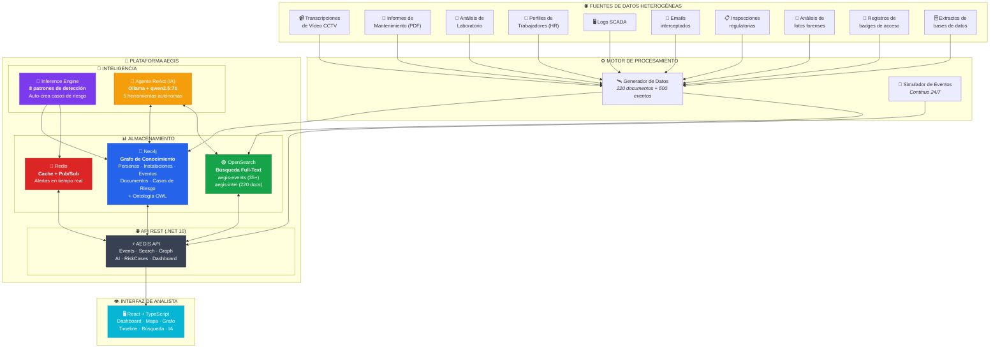
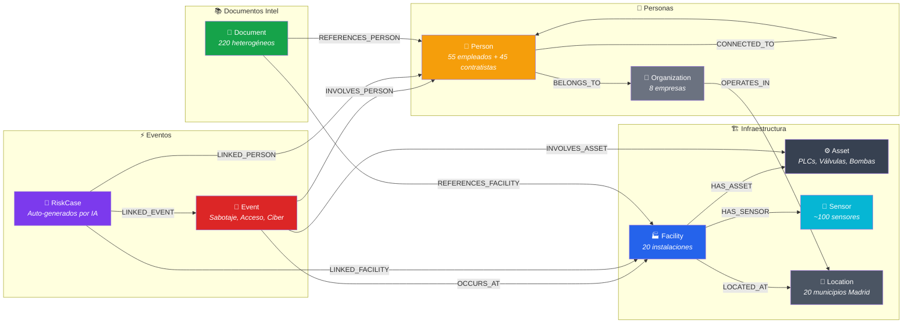
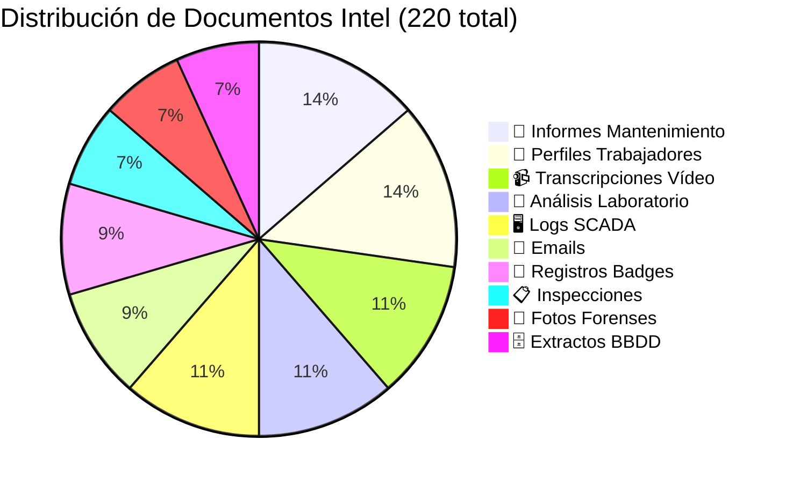
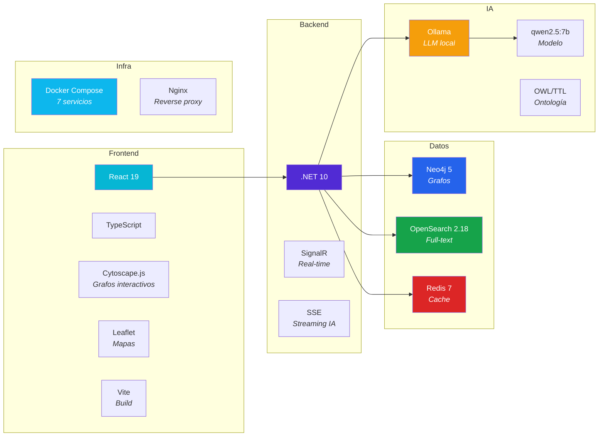
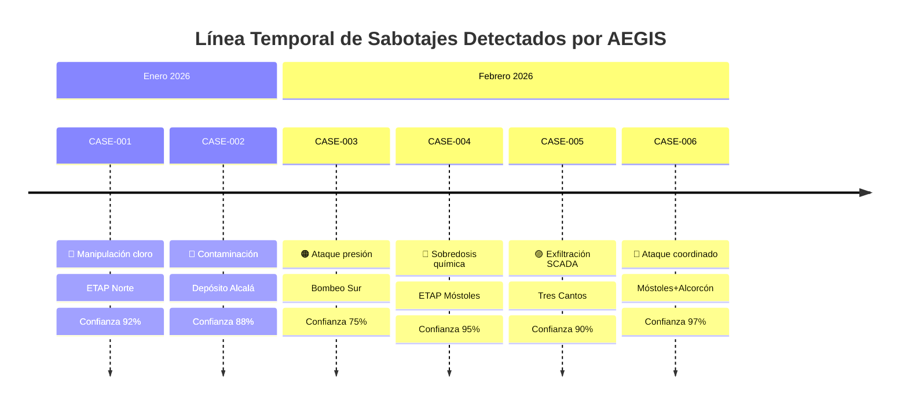

# 🛡️ AEGIS — Executive Overview

> **Plataforma de Inteligencia para Protección de Infraestructuras Críticas del Agua**
>
> Sistema inspirado en Palantir Gotham, construido con IA, grafos de conocimiento y búsqueda heterogénea
> para detectar sabotajes en redes de abastecimiento de agua.

---

## 1. Arquitectura General



---

## 2. Flujo Principal: De Datos Brutos a Inteligencia Accionable

```mermaid
sequenceDiagram
    autonumber
    participant SRC as 📁 Fuentes<br/>Heterogéneas
    participant GEN as 🛰️ Generador
    participant NEO as 🔵 Neo4j<br/>Grafo
    participant OS as 🟢 OpenSearch<br/>Búsqueda
    participant IE as 🧠 Inference<br/>Engine
    participant RED as 🔴 Redis<br/>Alertas
    participant API as ⚡ API
    participant AI as 🤖 Agente IA<br/>ReAct
    participant UI as 👁️ Analista<br/>Dashboard

    rect rgb(30, 40, 60)
        Note over SRC,OS: 📥 FASE 1 — Ingestión de Datos Heterogéneos
        SRC->>GEN: 10 tipos: CCTV, PDFs, lab, SCADA,<br/>emails, badges, fotos, HR...
        GEN->>NEO: seed.cypher<br/>20 instalaciones · 100 personas<br/>220 documentos · 6 escenarios
        GEN->>OS: intel_documents.json<br/>220 docs indexados full-text
    end

    rect rgb(40, 20, 50)
        Note over IE,RED: 🔍 FASE 2 — Detección Automática (cada 30s)
        IE->>NEO: Consulta: eventos recientes ≥ severidad 4
        NEO-->>IE: Eventos correlacionados
        IE->>IE: Aplica 8 patrones:<br/>① Cluster severidad<br/>② Correlación multi-tipo<br/>③ Acceso fuera de horario<br/>④ Actor repetitivo<br/>⑤ Spike de sensores<br/>⑥ Propagación geográfica<br/>⑦ Cascada de escalación<br/>⑧ Convergencia ciber-física
        IE->>NEO: Crea RiskCase automático<br/>(confianza + puntuación)
        IE->>RED: Publica alerta SignalR
        RED-->>UI: 🚨 Push: "Nuevo caso de riesgo"
    end

    rect rgb(20, 40, 40)
        Note over UI,AI: 🕵️ FASE 3 — Investigación IA Autónoma
        UI->>API: Analista abre caso CASE-006
        API->>AI: Investiga caso (SSE streaming)
        AI->>AI: Thought: "Necesito entender<br/>el grafo primero"
        AI->>NEO: 🔧 get_ontology
        NEO-->>AI: Esquema: nodos, relaciones
        AI->>NEO: 🔧 query_graph<br/>MATCH (rc:RiskCase)-[:LINKED_EVENT]->(e)...
        NEO-->>AI: Eventos vinculados + personas
        AI->>NEO: 🔧 get_node_neighbors<br/>Explora conexiones del sospechoso
        NEO-->>AI: Red social, instalaciones visitadas
        AI->>OS: 🔧 search_events<br/>"unauthorized access Móstoles"
        OS-->>AI: Docs relevantes: emails,<br/>logs SCADA, badges, fotos
        AI->>AI: 🧠 Sintetiza hallazgos:<br/>Conexiones ocultas descubiertas
        AI-->>UI: 📋 Informe completo<br/>(streaming Markdown)
    end

    rect rgb(40, 35, 20)
        Note over UI,OS: 🔎 FASE 4 — Búsqueda Heterogénea
        UI->>API: Buscar: "chlorine tampering"
        API->>OS: Multi-match en aegis-events<br/>+ aegis-intel (fuzzy)
        OS-->>API: Resultados mezclados:<br/>📄 Informe maint. (score 11.2)<br/>🔬 Lab análisis (score 9.8)<br/>⚡ Evento sensor (score 8.7)<br/>📧 Email sospechoso (score 7.1)
        API-->>UI: Resultados con tipo, clasificación,<br/>instalación, persona, archivo fuente
    end
```



---

## 3. Grafo de Conocimiento: Entidades y Relaciones



---

## 4. Capacidades del Agente IA (ReAct)

```mermaid
flowchart TD
    START(("🕵️ Analista<br/>solicita investigación")) --> T1

    T1["🧠 Thought<br/><i>Necesito entender la estructura<br/>del grafo de conocimiento</i>"]
    T1 --> A1["🔧 Action: get_ontology<br/><i>Obtener esquema completo</i>"]
    A1 --> O1["👁️ Observation<br/><i>14 tipos de nodo, 18 relaciones,<br/>propiedades clave identificadas</i>"]

    O1 --> T2["🧠 Thought<br/><i>Ahora consulto los eventos<br/>vinculados al caso</i>"]
    T2 --> A2["🔧 Action: query_graph<br/><i>Cypher dinámico contra Neo4j</i>"]
    A2 --> O2["👁️ Observation<br/><i>5 eventos, 2 instalaciones,<br/>2 sospechosos identificados</i>"]

    O2 --> T3["🧠 Thought<br/><i>Exploro las conexiones sociales<br/>del sospechoso principal</i>"]
    T3 --> A3["🔧 Action: get_node_neighbors<br/><i>Red de contactos del sospechoso</i>"]
    A3 --> O3["👁️ Observation<br/><i>Conexión cruzada entre contratistas<br/>de empresas diferentes</i>"]

    O3 --> T4["🧠 Thought<br/><i>Busco documentos relevantes:<br/>logs SCADA, emails, informes</i>"]
    T4 --> A4["🔧 Action: search_events<br/><i>Búsqueda full-text OpenSearch</i>"]
    A4 --> O4["👁️ Observation<br/><i>Email sospechoso + log SCADA<br/>con acceso no autorizado</i>"]

    O4 --> ANSWER["📋 Answer<br/><b>Informe completo con:</b><br/>• Vector de ataque reconstruido<br/>• Red de actores identificada<br/>• Conexiones ocultas reveladas<br/>• Recomendaciones de mitigación"]

    style T1 fill:#7c3aed,color:#fff
    style T2 fill:#7c3aed,color:#fff
    style T3 fill:#7c3aed,color:#fff
    style T4 fill:#7c3aed,color:#fff
    style A1 fill:#f59e0b,color:#fff
    style A2 fill:#f59e0b,color:#fff
    style A3 fill:#f59e0b,color:#fff
    style A4 fill:#f59e0b,color:#fff
    style O1 fill:#06b6d4,color:#fff
    style O2 fill:#06b6d4,color:#fff
    style O3 fill:#06b6d4,color:#fff
    style O4 fill:#06b6d4,color:#fff
    style ANSWER fill:#16a34a,color:#fff
    style START fill:#dc2626,color:#fff
```



---

## 5. Tipos de Documentos Intel Indexados



---

## 6. Stack Tecnológico



---

## 7. Beneficios Clave

| Capacidad | Descripción | Impacto |
|-----------|-------------|---------|
| 🧠 **Detección automática** | 8 patrones ejecutándose cada 30s | De horas a **segundos** en detección |
| 🔗 **Descubrimiento de enlaces ocultos** | El grafo revela conexiones que un analista no vería | Descubre **redes de actores** cross-empresa |
| 📚 **Búsqueda heterogénea** | 10 tipos de documento en un solo buscador | Un analista busca "chlorine" y encuentra **emails + logs SCADA + informes de lab** a la vez |
| 🤖 **Investigación IA autónoma** | El agente navega el grafo y busca documentos solo | De **4h** de investigación manual a **2 min** de informe IA |
| 🌐 **Ontología semántica** | OWL/TTL define qué relaciones son posibles | La IA descubre **vectores de ataque emergentes** no programados |
| ⚡ **Tiempo real** | SignalR push + SSE streaming | El analista ve los **hallazgos en vivo** mientras la IA trabaja |
| 🔒 **IA local** | Ollama ejecuta el modelo on-premise | **Cero datos enviados** a cloud — cumple normativa CNPIC |
| 📊 **Visualización multi-capa** | Grafo + Mapa + Timeline + Dashboard | **Contexto completo** en una sola pantalla |

---

## 8. Escenarios de Sabotaje Detectados



---

## 9. Ejemplo de Búsqueda: Lo que ve el analista

Cuando un analista busca **"chlorine tampering"**, AEGIS devuelve resultados de **múltiples fuentes** en un solo panel:

```
📚 Intel Documents (31 resultados)
├── 📄 Maintenance Report – Chlorine dosing pump at ETAP Norte     [INTERNAL]    📍 ETAP Norte        score 11.2
├── 📄 Maintenance Report – Chlorine dosing pump at Fuenlabrada    [INTERNAL]    📍 Bombeo Fuenlabrada score 11.2
├── 🔬 Lab Analysis – ETAP Móstoles – Sample #S-847291            [INTERNAL]    📍 ETAP Móstoles     score 9.8
├── 📧 Email: "Question about PLC configuration at ETAP Norte"     [CONFIDENTIAL] 👤 Carlos García    score 8.4
├── 🖥️ SCADA Log – ETAP Norte – 2026-01-15                       [RESTRICTED]  📍 ETAP Norte        score 7.9
├── 📸 Photo Analysis – Tampered sensor housing                    [RESTRICTED]  📍 ETAP Móstoles     score 7.1
└── 👤 Personnel Dossier – Dmitri Volkov                           [CONFIDENTIAL] 👤 Dmitri Volkov    score 6.3

⚡ Events (10 resultados)
├── 🔴 Chlorine residual dropped to 0.05 mg/L – critically low                  📍 ETAP Norte        score 8.7
├── 🟠 Chlorine level surged to 5.2 mg/L – dangerous overdose                   📍 ETAP Móstoles     score 8.2
└── 🔵 23 households report strong chlorine taste – Móstoles centro              📍 ETAP Móstoles     score 7.8
```

> **Sin AEGIS:** el analista tendría que revisar manualmente 10 sistemas diferentes.
> **Con AEGIS:** todo aparece en una sola búsqueda, rankeado por relevancia, con clasificación de seguridad.

---

## 10. Resumen Ejecutivo

```
┌─────────────────────────────────────────────────────────────────┐
│                    🛡️  AEGIS en Números                        │
├─────────────────────────────────────────────────────────────────┤
│                                                                 │
│   20 instalaciones monitorizadas (ETAPs, bombeos, depósitos)    │
│   100 personas tracked (empleados + contratistas)               │
│   220 documentos intel de 10 tipos diferentes                   │
│   8 patrones de detección automática                            │
│   6 escenarios de sabotaje detectados                           │
│   5 herramientas IA autónomas                                   │
│   2 índices de búsqueda (eventos + documentos)                  │
│   30s ciclo de detección                                        │
│   0 datos enviados a la nube                                    │
│                                                                 │
│   ⏱️  De 4h de investigación manual → 2 min con agente IA      │
│   🔍 De 10 sistemas separados → 1 búsqueda unificada           │
│   🧠 De detección reactiva → detección proactiva en 30s        │
│                                                                 │
└─────────────────────────────────────────────────────────────────┘
```

---

*Documento generado para presentación C-Level — AEGIS Platform v1.0*
*Basado en infraestructura real de Canal de Isabel II (Madrid)*
