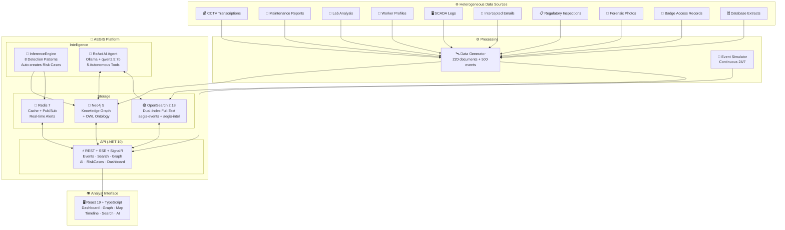
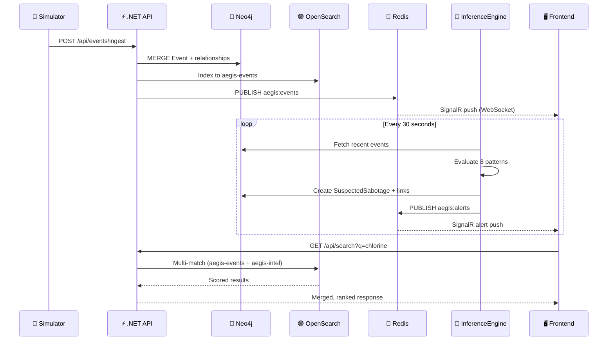
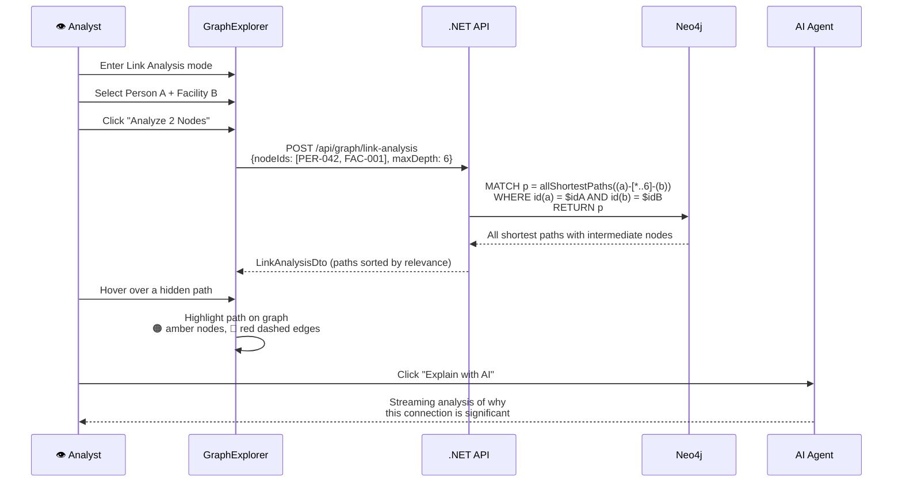
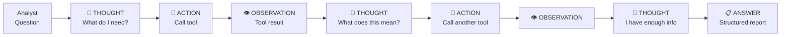
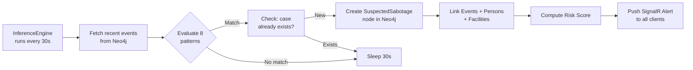
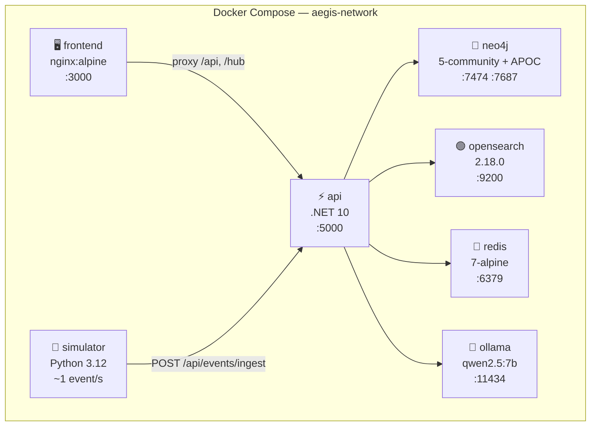

# What Do Tolkien, Batman, and Your Tap Water Have in Common?

### A Seeing Stone. A Dark Knight. And the Graph That Connects Everything You Can't See.

---

<div align="center">

**AEGIS — Analytical Engine for Graph Intelligence & Security**

*An open-source Palantir Gotham / Foundry–inspired intelligence platform*
*for critical infrastructure protection, built with knowledge graphs,*
*OWL ontologies, AI agents, and heterogeneous data fusion.*


</div>

---

## The Naming Isn't Accidental

**Palantír** (plural: *palantíri*) are the Seeing Stones from J.R.R. Tolkien's *The Lord of the Rings* — ancient artifacts that let their wielder see across vast distances, perceive hidden truths, and discover connections invisible to the naked eye. When the founders of Palantir Technologies named their company, they chose deliberately: their platform would be the digital equivalent of a Seeing Stone — a tool that reveals what is hidden in oceans of data.

**Gotham** — the city where Batman operates — is a place defined by corruption, hidden networks, and invisible alliances between crime families, corrupt officials, and shadow organizations. Batman doesn't fight crime with brute force alone. He is the **World's Greatest Detective**: he connects evidence, maps criminal networks, traces financial flows, and discovers the hidden links between seemingly unrelated events. The Batcomputer is essentially an intelligence platform — a knowledge graph avant la lettre.

**AEGIS** — in Greek mythology, the shield of Zeus and Athena — represents protection through intelligence. Our platform carries that name because it protects critical infrastructure not through walls or guards, but through the power of *knowing*.

These three names converge on a single idea: **the most powerful weapon in security isn't a gun or a firewall — it's a graph**.

---

## Table of Contents

| Part | Section | What You'll Learn |
|------|---------|-------------------|
| **I** | [Why Graphs Change Everything](#part-i--why-graphs-change-everything) | The theory: why relationships beat tables |
| **II** | [The Ontology: Giving Meaning to Data](#part-ii--the-ontology-giving-meaning-to-data) | OWL 2.0, semantic modeling, and why schemas matter |
| **III** | [The Architecture of an Intelligence Platform](#part-iii--the-architecture-of-an-intelligence-platform) | How Palantir Gotham actually works (and how we replicate it) |
| **IV** | [Hidden Link Discovery: The Killer Feature](#part-iv--hidden-link-discovery-the-killer-feature) | Finding connections a human would never see |
| **V** | [AI Agents on Knowledge Graphs](#part-v--ai-agents-on-knowledge-graphs) | ReAct architecture, tool use, and ontology-driven reasoning |
| **VI** | [Heterogeneous Data Fusion](#part-vi--heterogeneous-data-fusion) | 10 document types, dual-index search, classification levels |
| **VII** | [Detection Patterns: The InferenceEngine](#part-vii--detection-patterns-the-inferenceengine) | 8 real-time detection patterns running every 30 seconds |
| **VIII** | [The Platform: AEGIS in Practice](#part-viii--the-platform-aegis-in-practice) | The real system — architecture, APIs, UI modules |
| **IX** | [AEGIS vs Palantir Gotham: Honest Comparison](#part-ix--aegis-vs-palantir-gotham-honest-comparison) | What we replicate, what we don't, and what it proves |
| **X** | [Quick Start](#part-x--quick-start) | `docker compose up` and you're in |

---

# Part I — Why Graphs Change Everything

## The Problem with Tables

Imagine you're a security analyst at a water utility. You receive an alert: *"Chlorine levels dropped to dangerous lows at Treatment Plant ETAP Norte at 03:00 AM."*

In a traditional system, you'd:

1. Open the **SCADA dashboard** — check sensor readings ✓
2. Open the **access control system** — who swiped in last night? ✓
3. Open the **HR database** — who is that person? What company? ✓
4. Open the **cyber security SIEM** — any PLC login attempts? ✓
5. Open the **citizen complaints portal** — anyone reporting bad water? ✓
6. Open **email archives** — any suspicious communications? ✓
7. Open **maintenance records** — was there scheduled work? ✓

Seven systems. Seven logins. Seven mental models. And the connection between the contractor who swiped in at 02:47 AM and the email he sent asking about PLC configurations three weeks ago? **You'll never find it.** Not because it isn't there, but because no human brain can hold seven datasets in working memory and traverse the relationships between them.

## The Graph Alternative

Now imagine all seven data sources feed into a single **knowledge graph** — a data structure where entities (people, places, events, devices) are **nodes**, and the relationships between them (works-at, occurred-at, involves-person, connected-to) are **edges**.

```
                    ┌─────────────┐
                    │  Person:    │
        ┌──────────│  Dmitri V.  │──────────┐
        │           │  Contractor │           │
        │           └─────────────┘           │
        │                  │                  │
   CONNECTED_TO      BELONGS_TO         INVOLVES_PERSON
        │                  │                  │
        ▼                  ▼                  ▼
  ┌──────────┐    ┌──────────────┐    ┌──────────────┐
  │ Person:  │    │Organization: │    │   Event:     │
  │ Carlos G.│    │ AquaServ     │    │ PLC login    │
  │ Employee │    │ Maintenance  │    │ attempt 03:12│
  └──────────┘    └──────────────┘    └──────────────┘
                         │                    │
                    OPERATES_IN          OCCURS_AT
                         │                    │
                         ▼                    ▼
                  ┌──────────────┐    ┌──────────────┐
                  │  Location:   │    │  Facility:   │
                  │  Madrid Zone │    │  ETAP Norte  │
                  │  Central     │    │  Criticality │
                  └──────────────┘    │  HIGH        │
                         ▲            └──────────────┘
                         │                    │
                    LOCATED_AT           HAS_SENSOR
                         │                    │
                         │                    ▼
                  ┌──────────────┐    ┌──────────────┐
                  │  Facility:   │    │   Sensor:    │
                  │  ETAP Norte  │────│  Chlorine    │
                  └──────────────┘    │  → 0.02 mg/L │
                                      └──────────────┘
```

One query. One traversal. The relationship between Dmitri (contractor), his company (AquaServ), the zone they operate in (Madrid Central), the plant in that zone (ETAP Norte), the PLC login attempt at 03:12, the chlorine sensor dropping at 03:15, and Dmitri's social connection to a plant employee — **all visible in a single graph exploration.**

> **This is why Palantir is worth $60 billion.** Not because they have fancy dashboards. Because they put *relationships first*.

## Graphs vs Relational Databases: The Fundamental Difference

| Aspect | Relational (SQL) | Knowledge Graph |
|--------|-------------------|-----------------|
| **Storage model** | Tables with rows and columns | Nodes with properties and typed edges |
| **Relationships** | Foreign keys, JOINs at query time | First-class citizens, stored directly |
| **Schema** | Rigid, predefined, ALTER TABLE | Flexible, ontology-driven, additive |
| **Core question** | "What data fits this table?" | "How is everything connected?" |
| **N-hop traversals** | Exponential JOINs, performance cliff | Native traversal, constant-time per hop |
| **Pattern discovery** | Must know the pattern a priori | `allShortestPaths` discovers patterns you never imagined |

The critical insight: **in a relational database, you can only find what you know how to ask for.** In a knowledge graph, you can ask: *"What connections exist between these two entities that I haven't explicitly defined?"* — and the graph will find them.

---

# Part II — The Ontology: Giving Meaning to Data

## What Is an Ontology?

An ontology is a formal, machine-readable definition of **what exists** in your domain and **how things can relate to each other**. It's the schema of your knowledge graph — but unlike a SQL schema, it carries *semantic meaning*.

AEGIS uses **OWL 2.0** (Web Ontology Language) written in **Turtle syntax**. The ontology file lives at `ontology/water-sabotage.owl.ttl` and defines:

- **Classes** (types of entities) — Facility, Person, Event, Asset, Sensor, Organization
- **Subclasses** (specializations) — WaterTreatmentPlant ⊂ Facility, Employee ⊂ Person
- **Object Properties** (relationships) — occursAt, involvesPerson, belongsTo, connectedTo
- **Axioms** (constraints) — "A SuspectedSabotage must have ≥3 linked events"

### Why Ontology vs Hardcoded Rules?

| Aspect | Without Ontology | With OWL Ontology |
|--------|-----------------|-------------------|
| New entity type | Modify code, recompile, redeploy | Add 3 lines of Turtle, reload |
| New relationship | New migration, new DAO, new endpoints | Add 2 lines of Turtle, materialize in Neo4j |
| Validation | if-else chains in business logic | OWL axioms auto-validated |
| AI reasoning | Model has no structural knowledge | Agent reads ontology, generates precise queries |
| Link analysis | Only traverses known paths | Traverses ALL relationship types automatically |
| Documentation | Stale wikis, tribal knowledge | The ontology IS the documentation — always current |

### The Class Hierarchy (TBox)

```
Facility                          Event
├── WaterTreatmentPlant           ├── PhysicalAnomalyEvent
├── PumpStation                   ├── AccessEvent
├── Reservoir                     ├── CyberAlertEvent
└── DistributionNode              ├── MaintenanceEvent
                                  └── CitizenReportEvent
Person                    
├── Employee              Asset                    Organization
└── Contractor            ├── Valve                Sensor
                          ├── PLC                  Observation
                          ├── Camera               Substance
                          └── Pump                 Location

RiskCase
└── SuspectedSabotage  ← Requires ≥3 linkedEvent (OWL axiom)
```

### Object Properties — The Semantic Wiring

These are the **relationship types** that can exist in the graph. Each one is a potential path for discovering hidden connections:

| Property | Domain → Range | Meaning |
|----------|---------------|---------|
| `occursAt` | Event → Facility | Where the event took place |
| `involvesPerson` | Event → Person | Who was involved |
| `involvesAsset` | Event → Asset | What equipment was affected |
| `involvesSubstance` | Event → Substance | What chemical substance is relevant |
| `hasSensor` | Facility → Sensor | What monitors this facility |
| `hasAsset` | Facility → Asset | What equipment is installed here |
| `belongsTo` | Person → Organization | Employment/contract relationship |
| `operatesIn` | Organization → Location | Geographic area of operations |
| `locatedAt` | Facility → Location | Physical location |
| `connectedTo` | Person ↔ Person | Social/professional connection (symmetric) |
| `linkedEvent` | RiskCase → Event | Evidence events for the case |
| `linkedPerson` | RiskCase → Person | Persons of interest |
| `linkedFacility` | RiskCase → Facility | Affected facilities |

### OWL Axioms — Machine-Enforceable Rules

```turtle
:PhysicalAnomalyEvent rdfs:subClassOf [
    owl:onProperty :occursAt ;
    owl:someValuesFrom :Facility       # Every physical anomaly MUST occur at a facility
] .

:AccessEvent rdfs:subClassOf [
    owl:onProperty :involvesPerson ;
    owl:someValuesFrom :Person         # Every access event MUST involve a person
] .

:SuspectedSabotage rdfs:subClassOf [
    owl:onProperty :linkedEvent ;
    owl:minCardinality 3               # A suspected sabotage requires ≥3 linked events
] .
```

### From OWL to Neo4j: Materialization

The ontology classes become Neo4j labels and relationships. The `generate_data.py` tool reads the ontology semantics and generates Cypher:

```cypher
-- OWL class → Neo4j labeled node
CREATE (f:Facility:WaterTreatmentPlant {
  facilityId: 'FAC-001', name: 'ETAP Norte', criticality: 'HIGH'
})

-- OWL objectProperty → Neo4j typed relationship
CREATE (p)-[:BELONGS_TO]->(o)           -- Person → Organization
CREATE (e)-[:OCCURS_AT]->(f)            -- Event → Facility
CREATE (e)-[:INVOLVES_PERSON]->(p)      -- Event → Person
CREATE (rc)-[:LINKED_EVENT]->(e)        -- RiskCase → Event
CREATE (p1)-[:CONNECTED_TO]->(p2)       -- Person ↔ Person
```

---

# Part III — The Architecture of an Intelligence Platform

## How Palantir Gotham Works (Simplified)

Palantir Gotham, stripped to its essence, is four things:

1. **A knowledge graph** that stores entities and their relationships
2. **A search engine** that indexes everything for full-text retrieval
3. **A set of analytical views** (graph, map, timeline, dashboard) over the same data
4. **An AI layer** that reasons about the data to accelerate human analysts

AEGIS replicates this architecture with open-source components:



### Layer-by-Layer Mapping

| Layer | Palantir Gotham | AEGIS | Technology |
|-------|----------------|-------|------------|
| **Knowledge Graph** | Proprietary Dynamic Ontology | Neo4j 5 + OWL 2.0 | Cypher, APOC, labeled property graph |
| **Search** | Proprietary semantic search | OpenSearch 2.18 | Dual-index (events + intel), fuzzy multi-match |
| **Real-time** | Proprietary streaming | Redis 7 + SignalR | WebSocket push, pub/sub |
| **AI/LLM** | AIP / Gaia | Ollama (qwen2.5:7b) | Local inference, zero cloud dependency |
| **Backend** | Java microservices | .NET 10, Clean Architecture | REST, SSE streaming, DI |
| **Frontend** | Proprietary web platform | React 19 + Vite | Cytoscape.js, Leaflet, Tailwind CSS 4 |
| **Deployment** | Kubernetes (cloud + air-gapped) | Docker Compose | 7 containers, single command |

### The Data Flow



---

# Part IV — Hidden Link Discovery: The Killer Feature

## The Feature That Makes Intelligence Platforms Worth Billions

Every intelligence platform — Palantir, i2 Analyst's Notebook, IBM Intelligence Suite — has one feature that separates it from a fancy dashboard: **link analysis**. The ability to select two or more entities and ask:

> *"What connections exist between these entities that I don't already know about?"*

This is the single most powerful capability in investigative analytics. And it's only possible with a knowledge graph.

### How It Works in AEGIS



### The Cypher Query Behind the Magic

```cypher
MATCH p = allShortestPaths((a)-[*..6]-(b))
WHERE a.personId = 'PER-042' AND b.facilityId = 'FAC-001'
RETURN p
```

This single line of Cypher asks Neo4j: *"Find ALL shortest paths between Person PER-042 and Facility FAC-001, traversing up to 6 relationships of ANY type."*

The graph engine does the rest — it explores every possible route through the ontology's relationship types and returns the most efficient paths.

### A Concrete Example: Discovering an Insider Threat

An analyst selects two nodes:
- **PER-042** (Carlos, contractor at AquaServ Maintenance)
- **FAC-001** (ETAP Norte, critical water treatment plant)

Carlos has **never been directly linked** to any event at FAC-001. The InferenceEngine has flagged nothing about him. But Link Analysis discovers:

```
PER-042 (Carlos)
  ──[:BELONGS_TO]──▶ ORG-AquaServ
      ──[:OPERATES_IN]──▶ LOC-Madrid-Central
          ◀──[:LOCATED_AT]── FAC-001 (ETAP Norte)
              ──[:HAS_ASSET]──▶ PLC-001
                  ◀──[:INVOLVES_ASSET]── EVT-xxx (CyberAlert: PLC login attempt)
                      ──[:INVOLVES_PERSON]──▶ PER-007 (Pedro, another AquaServ contractor)
                          ──[:CONNECTED_TO]──▶ PER-042 (Carlos)  ← FULL CIRCLE
```

**What was just discovered:**

1. Carlos works for the same company as Pedro
2. That company operates in the same zone as the treatment plant
3. Pedro was involved in a PLC login attempt at that plant
4. Carlos and Pedro have a direct social connection

**No pre-programmed rule would have caught this.** There is no rule for *"contractor at the same company as a suspect who has a social connection with him."* This is an **emergent attack vector** — it arises from the *structure* of the graph, not from any programmed logic.

### The 6 Types of Emergent Attack Vectors

| Vector Type | Path Pattern | Question Answered |
|-------------|-------------|-------------------|
| **Organizational Chain** | Person → Organization → Location ← Facility | "Which people's companies operate near this facility?" |
| **Actor Confluence** | Person A ↔ Person B → Event → Facility | "Is anyone socially connected to someone already under suspicion?" |
| **Shared Asset** | Event₁ → Asset ← Event₂ | "Did two unrelated events affect the same equipment?" |
| **Substance Cross-Match** | Event₁ → Substance ← Event₂ (different facility) | "Same contaminant at different plants — common source?" |
| **Sensor-Person** | Sensor → Facility ← Event → Person | "Who was present when this sensor triggered?" |
| **Geographic Triangle** | Person → Org → Location ← Facility₁, Facility₂, Facility₃ | "One company covering multiple critical facilities?" |

### Visual Cues on the Graph

When an analyst hovers over a discovered path:

- 🟢 **Green solid edges** — direct connections (length = 1)
- 🔴 **Red dashed edges** — hidden connections through intermediate entities (length > 1)
- 🟠 **Amber glowing nodes** — entities along the highlighted path
- All other nodes dim to 15% opacity to focus attention

**Relevance scoring**: paths are scored as $\frac{1}{\text{length}}$ — shorter paths score higher because they represent more *direct, stronger* connections. But longer paths are often more *interesting* because they reveal hidden links invisible to the naked eye.

---

# Part V — AI Agents on Knowledge Graphs

## The ReAct Architecture

AEGIS implements a **ReAct** (Reasoning + Acting) agent — the same architecture used by modern AI systems like ChatGPT with tools, Google's Gemini, and Palantir's AIP platform.

The core loop:

```
REPEAT until answer or max iterations:
    1. THOUGHT  — The agent reasons about what it knows and what it needs
    2. ACTION   — The agent calls one of its tools to gather data
    3. OBSERVATION — The agent receives the tool's output
```



### The 5 Tools

| Tool | What It Does | Why It Matters |
|------|-------------|----------------|
| `get_ontology` | Returns the complete OWL schema | The agent *learns* what entities and relationships exist |
| `query_graph` | Executes dynamic Cypher against Neo4j | The agent *writes its own database queries* |
| `get_node_neighbors` | Explores a node's direct connections | The agent *navigates* the graph autonomously |
| `search_events` | Full-text search across OpenSearch | The agent *correlates* graph data with document evidence |
| `get_risk_patterns` | Returns active risk detection patterns | The agent *understands* what the system is looking for |

### How It Investigates: A Real Example

When an analyst opens CASE-006 (Coordinated Attack — Móstoles + Alcorcón) and clicks "Investigate with AI":

```
🧠 THOUGHT: I need to understand the graph structure before investigating.

🔧 ACTION: get_ontology
👁️ OBSERVATION: 14 node types, 18 relationship types. Key entities: Facility, 
   Person, Event, RiskCase, Document. Key relationships: OCCURS_AT, 
   INVOLVES_PERSON, BELONGS_TO, CONNECTED_TO...

🧠 THOUGHT: Now I'll query the events linked to this risk case.

🔧 ACTION: query_graph
   MATCH (rc:RiskCase {caseId:'CASE-006'})-[:LINKED_EVENT]->(e:Event)
   OPTIONAL MATCH (e)-[:INVOLVES_PERSON]->(p:Person)
   OPTIONAL MATCH (e)-[:OCCURS_AT]->(f:Facility)
   RETURN e, p, f

👁️ OBSERVATION: 5 events across 2 facilities. 2 persons involved: 
   PER-023 (contractor) and PER-067 (employee). Events include PLC 
   brute-force, chlorine spike, and unauthorized night access.

🧠 THOUGHT: These two people appeared at different facilities during the 
   attack window. Let me check if they're connected.

🔧 ACTION: get_node_neighbors(PER-023)
👁️ OBSERVATION: PER-023 belongs to TechServ Industrial. Connected to 
   PER-067 via CONNECTED_TO relationship. Also connected to PER-045.

🧠 THOUGHT: Cross-company social connection between a contractor and an 
   employee — this is significant. Let me search for supporting documents.

🔧 ACTION: search_events("unauthorized access Móstoles Alcorcón")
👁️ OBSERVATION: Found 12 results including: SCADA log showing PLC 
   configuration download at 02:15 AM, badge record showing PER-023 
   entered Alcorcón plant at 01:47 AM, email from PER-067 asking about 
   "valve pressure thresholds" two weeks prior.

📋 ANSWER: 
## Investigation Report: CASE-006

### Attack Vector Reconstruction
The evidence suggests a coordinated insider attack executed by PER-023 
(contractor, TechServ Industrial) with possible facilitation by PER-067 
(employee). The attack followed a clear pattern:

1. **Reconnaissance phase** (2 weeks prior): PER-067 sent emails inquiring 
   about valve pressure thresholds — information not needed for their role.
2. **Physical access** (01:47 AM): PER-023 badge swipe at Alcorcón facility 
   during off-hours — no scheduled maintenance.
3. **Cyber attack** (02:15 AM): PLC configuration download from SCADA system.
4. **Physical effect** (02:30 AM): Chlorine dosing spike detected by sensors.

### Hidden Network Discovered
PER-023 and PER-067 share a CONNECTED_TO relationship despite working for 
different organizations. Both were present at the affected facilities 
within the attack window...
```

### The Key Insight: Ontology-Driven Reasoning

The agent doesn't have hard-coded rules. It **reads the ontology first** (via `get_ontology`), learns what relationships are possible, and then writes Cypher queries that exploit those relationships. 

Compare these two approaches:

| Aspect | Without Ontology | With Ontology |
|--------|-----------------|---------------|
| Query generation | Generic, template-based | Precise, schema-aware Cypher |
| Unknown relationships | Cannot discover what it doesn't know | Learns ALL relationship types from OWL |
| New data types | Requires code changes + retraining | Agent automatically adapts at inference time |
| Investigation depth | Surface-level: only pre-programmed paths | Deep: traverses ANY path the ontology defines |
| Accuracy | Hallucinates relationship names | Uses exact Neo4j label and relationship names |

If tomorrow you add a new relationship type to the ontology (e.g., `suppliesChemicalsTo` between Organization and Facility), the agent will **automatically** start reasoning about it. No code changes needed. The ontology is the agent's instruction manual.

---

# Part VI — Heterogeneous Data Fusion

## The Problem: Real Intelligence Is Messy

In the real world, the evidence that reveals an attack doesn't live in one clean database. It's scattered across dozens of systems, in different formats, at different classification levels. Palantir Gotham's original value proposition was *"we'll connect all your data silos into one graph."*

AEGIS demonstrates this with 10 document types and a **dual-index** architecture:

### The 10 Intel Document Types

| # | Type | Icon | What It Contains |
|---|------|------|------------------|
| 1 | 📹 Video Transcription | Film reel | OCR/transcribed CCTV footage descriptions |
| 2 | 📄 Maintenance Report | Wrench | Equipment service records, technician notes |
| 3 | 🔬 Lab Analysis | Flask | Water quality test results, contaminant levels |
| 4 | 👤 Worker Profile | ID badge | HR dossier, clearance level, affiliations |
| 5 | 🖥️ SCADA Log | Terminal | Industrial control system event records |
| 6 | 📧 Email | Envelope | Intercepted or reported communications |
| 7 | 📋 Regulatory Inspection | Clipboard | Government compliance audit findings |
| 8 | 📸 Incident Photo | Camera | Forensic photography analysis reports |
| 9 | 🔑 Badge Access Record | Key | Physical access control logs |
| 10 | 🗄️ Database Extract | Database | Legacy system data exports |

### Dual-Index Architecture

```
┌─────────────────────────────────────────────┐
│            OpenSearch 2.18                   │
├─────────────────────┬───────────────────────┤
│  aegis-events       │  aegis-intel          │
│  (Events index)     │  (Documents index)    │
├─────────────────────┼───────────────────────┤
│  eventId            │  docId                │
│  title              │  title                │
│  description        │  content              │
│  type               │  docType              │
│  severity           │  sourceFile           │
│  facilityName       │  facilityName         │
│  timestamp          │  personName           │
│                     │  classification       │
│                     │  timestamp            │
├─────────────────────┼───────────────────────┤
│  ~500 records       │  220 records          │
└─────────────────────┴───────────────────────┘
```

Both indices are searched simultaneously. Results are merged, sorted by relevance score, and presented in a unified search experience with type-specific icons and classification badges.

### Classification Levels

| Level | Badge Color | Meaning |
|-------|------------|---------|
| `RESTRICTED` | 🔴 Red | Limited distribution, need-to-know basis |
| `CONFIDENTIAL` | 🟡 Amber | Sensitive, restricted access |
| `INTERNAL` | ⚪ Gray | General internal use |

### What the Analyst Sees

When an analyst presses `Ctrl+K` and searches **"chlorine tampering"**:

```
📚 Intel Documents
├── 📄 Maintenance Report – Chlorine dosing pump at ETAP Norte      [INTERNAL]      
├── 🔬 Lab Analysis – ETAP Móstoles – Sample #S-847291              [INTERNAL]      
├── 📧 Email – RE: PLC configuration at ETAP Norte                  [CONFIDENTIAL]  
├── 🖥️ SCADA Log – ETAP Norte – 2026-01-15                         [RESTRICTED]    
├── 📸 Photo Analysis – Tampered sensor housing                     [RESTRICTED]    
└── 👤 Personnel Dossier – Dmitri Volkov                            [CONFIDENTIAL]  

⚡ Events
├── 🔴 Chlorine residual dropped to 0.02 mg/L                      severity: 5
├── 🟠 Chlorine level surged to 5.2 mg/L                           severity: 4
└── 🔵 23 households report strong chlorine taste                   severity: 3
```

**Without AEGIS:** the analyst would need to search 10 different systems.
**With AEGIS:** one search, ranked by relevance, with security classification badges.

---

# Part VII — Detection Patterns: The InferenceEngine

## 8 Patterns, 30 Seconds, Zero Human Intervention

The `InferenceEngine` runs as a .NET `BackgroundService`, executing every 30 seconds. It fetches recent events from Neo4j, evaluates 8 detection patterns, and **automatically creates risk cases** when matches are found.



### The 8 Detection Patterns

| # | Pattern | Description | What It Catches |
|---|---------|-------------|-----------------|
| 1 | **Severity Cluster** | ≥2 events with severity ≥4 at the same facility within 4 hours | Concentrated attack on one target |
| 2 | **Multi-Vector Attack** | ≥3 different event types (physical + cyber + access) at one facility within 6h | Coordinated multi-domain assault |
| 3 | **Off-Hours Anomaly** | Access or cyber events between 22:00–06:00 with severity ≥3 | Night intrusion, insider after hours |
| 4 | **Repeated Actor** | Same person linked to ≥2 suspicious events across any facilities | Person of interest across incidents |
| 5 | **Sensor Spike** | ≥3 anomalous sensor readings at the same facility | Water contamination or induced failure |
| 6 | **Geographic Spread** | Same event type at ≥3 different facilities | Coordinated multi-site attack |
| 7 | **Escalation Cascade** | Events with increasing severity (3→4→5) at the same facility | Crisis developing in phases |
| 8 | **Cyber-Physical Convergence** | CyberAlert + PhysicalAnomaly at the same facility within 2 hours | Hybrid attack: SCADA compromise + physical effect |

### Risk Score Formula

$$
\text{RiskScore} = \min\left(10,\ \frac{\sum_{i=1}^{n} w_i \cdot s_i}{n} + \alpha \cdot \log_2(C) + \beta \cdot F_{crit}\right)
$$

Where:
- $w_i$ = weight for event type $i$ (physical=0.4, cyber=0.35, access=0.25)
- $s_i$ = severity of event $i$ (1–5 scale)
- $C$ = number of correlated events
- $\alpha, \beta$ = tuning constants
- $F_{crit}$ = facility criticality multiplier (HIGH=1.5, MEDIUM=1.0)

### Pre-Seeded Sabotage Scenarios

The data generator creates 6 realistic sabotage scenarios that the InferenceEngine can detect:

| Case | Name | Facility | Attack Vector | Risk |
|------|------|----------|---------------|------|
| CASE-001 | Chlorine Manipulation | ETAP Norte | SCADA tampering + night access + PLC brute-force | 9.2 |
| CASE-002 | Contamination Attempt | Depósito Alcalá | Foreign substance + restricted zone breach + citizen reports | 8.8 |
| CASE-003 | Pressure Attack | Bombeo Sur | Pressure surge + VFD manipulation + contractor after-hours | 7.5 |
| CASE-004 | Chemical Overdose | ETAP Móstoles | Chlorine spike + SCADA alarm suppression + chemical mismatch | 9.5 |
| CASE-005 | SCADA Exfiltration | Tres Cantos | Data exfiltration + PLC config download + network anomaly | 8.5 |
| CASE-006 | Coordinated Attack | Móstoles + Alcorcón | Multi-site simultaneous + insider social network | 9.7 |

---

# Part VIII — The Platform: AEGIS in Practice

## Technology Stack

| Layer | Technology | Purpose |
|-------|-----------|---------|
| **Frontend** | React 19, TypeScript, Vite 6 | SPA with 10+ routes |
| **Graph Visualization** | Cytoscape.js | Interactive knowledge graph with link analysis |
| **Maps** | Leaflet + react-leaflet | Geospatial view of 20 facilities around Madrid |
| **Timeline** | vis-timeline | Chronological event visualization with swim lanes |
| **Styling** | Tailwind CSS 4 | Dark-themed intelligence UI |
| **Backend** | .NET 10, Clean Architecture | 9 controllers, 2 background services |
| **Knowledge Graph** | Neo4j 5 + APOC | ~1,500 entities, ~2,000 relationships |
| **Search** | OpenSearch 2.18 | Dual-index: 500 events + 220 intel docs |
| **Cache/PubSub** | Redis 7 | SignalR backplane + response caching |
| **AI** | Ollama (qwen2.5:7b) | Local LLM — zero data leaves the network |
| **Ontology** | OWL 2.0 (Turtle) | Formal domain model, 305 lines |
| **Orchestration** | Docker Compose | 7 containers, one-command deployment |

## Frontend Modules

| Module | Description |
|--------|-------------|
| **Dashboard** | KPIs, event distribution charts, active cases, critical event feed |
| **Graph Explorer** | Cytoscape.js canvas — expand nodes, link analysis mode, show/hide events, AI investigation panel |
| **Link Analysis Panel** | Hidden path discovery — relevance bars, path visualization, AI explanation via SSE |
| **Map View** | Leaflet map of 20 facilities around Madrid — criticality coloring, click to investigate |
| **Timeline** | Chronological event strip — event type swim lanes, severity filter |
| **Cases** | Risk case cards — circular score indicators, status badges, confidence bars |
| **Events** | Filterable event feed — type and severity filters |
| **Search** | Full-screen modal — agentic AI search + OpenSearch results grouped by type |
| **Entity Investigation** | AI-powered deep dive into any person, facility, or event |
| **Risk Investigation** | AI agent panel for case investigation with follow-up chat |

## API Reference

### REST Endpoints

| Method | Endpoint | Description |
|--------|----------|-------------|
| `GET` | `/api/dashboard/stats` | Dashboard KPIs |
| `GET` | `/api/facilities` | All 20 facilities |
| `GET` | `/api/events?type=&severity=&facility=&from=&to=` | Filtered events |
| `POST` | `/api/events/ingest` | Ingest event (simulator uses this) |
| `GET` | `/api/persons` | All 100 persons |
| `GET` | `/api/riskcases` | All risk cases |
| `GET` | `/api/riskcases/{id}/graph` | Full case graph (nodes + edges) |
| `GET` | `/api/graph/explore/{nodeId}?depth=2` | Node neighborhood expansion |
| `POST` | `/api/graph/link-analysis` | **Hidden link discovery** |
| `GET` | `/api/timeline?from=&to=` | Timeline events |
| `GET` | `/api/search?q=` | Full-text search (events + intel docs) |
| `POST` | `/api/seed` | Seed database from Cypher + JSON |

### AI Endpoints (SSE Streaming)

| Method | Endpoint | Description |
|--------|----------|-------------|
| `POST` | `/api/ai/investigate/{caseId}` | AI agent case investigation |
| `POST` | `/api/ai/investigate-entity` | AI entity investigation |
| `POST` | `/api/ai/agentic-search` | AI-enriched search |
| `POST` | `/api/ai/chat/{caseId}` | Follow-up chat with context |

### Real-time

| Protocol | Endpoint | Description |
|----------|----------|-------------|
| WebSocket | `/hub/alerts` | SignalR — new events + risk case alerts |

## Docker Compose Services



| Service | Image | Ports | Notes |
|---------|-------|-------|-------|
| **neo4j** | neo4j:5-community + APOC | 7474, 7687 | Credentials: `neo4j` / `aegis2026!` |
| **opensearch** | opensearch:2.18.0 | 9200 | Security disabled (dev mode) |
| **redis** | redis:7-alpine | 6379 | Cache + SignalR backplane |
| **ollama** | ollama/ollama | 11434 | Pulls `qwen2.5:7b` on first start |
| **api** | .NET 10 (Dockerfile) | 5000 | Backend + InferenceEngine |
| **frontend** | Node 20 → nginx:alpine | 3000 | SPA + reverse proxy |
| **simulator** | Python 3.12 (Dockerfile) | — | Generates ~1 event/second |

## Backend: Clean Architecture

```
Aegis.Domain        → Entities + Interfaces (zero dependencies)
Aegis.Application   → Services + DTOs + Business logic
Aegis.Infrastructure→ Neo4j + OpenSearch + Ollama implementations
Aegis.API           → Controllers + Hubs + InferenceEngine
```

---

# Part IX — AEGIS vs Palantir Gotham: Honest Comparison

## The 13 Capabilities

| # | Capability | Palantir Gotham | AEGIS | Status |
|---|-----------|----------------|-------|--------|
| 1 | Entity ontology with typed relationships | Dynamic Ontology (proprietary) | Neo4j + OWL 2.0 | ✅ Equivalent |
| 2 | Interactive graph exploration | Canvas with expand/collapse/filter | Cytoscape.js with depth expansion | ✅ Equivalent |
| 3 | Link analysis (hidden paths) | Core investigative feature | `allShortestPaths` + relevance scoring | ✅ Equivalent |
| 4 | Geospatial view | Full GIS with layers | Leaflet with facility markers | ✅ Functional |
| 5 | Event timeline | Temporal swim lanes | vis-timeline with severity filter | ✅ Functional |
| 6 | Full-text search | Federated semantic search | OpenSearch dual-index (events + intel) | ✅ Equivalent |
| 7 | Risk case management | Case workflow + evidence linking | Auto-created cases with linked entities | ✅ Functional |
| 8 | AI agent investigation | AIP with tool use | ReAct agent + 5 tools + SSE streaming | ✅ Equivalent |
| 9 | Conversational follow-up | Context-aware chat | Chat with conversation history | ✅ Equivalent |
| 10 | Real-time alerts | Streaming infrastructure | SignalR WebSocket push | ✅ Equivalent |
| 11 | Dashboard analytics | KPIs, trend analysis | Stats, charts, case overview | ✅ Functional |
| 12 | Heterogeneous data fusion | Hundreds of source types | 10 document types across 2 indices | ✅ Demonstrated |
| 13 | Automated threat detection | ML + rules | 8-pattern InferenceEngine, 30s cycle | ✅ Functional |

## What's Missing (Enterprise Gap)

| Feature | Why It Matters | Complexity |
|---------|---------------|------------|
| RBAC / ACL | Field-level access control per user/role | Medium |
| Audit trail | Immutable log of who accessed what | Medium |
| Graph algorithms | PageRank, community detection, centrality | Low (Neo4j GDS plugin) |
| Document ingestion (OCR/NLP) | Real PDFs, scanned images, audio transcription | High |
| Data federation | Query across databases without ETL | High |
| Collaboration | Shared annotations, team workspaces | High |
| HA / DR | Multi-region, air-gapped deployment | High |
| ML model training | Custom models for domain-specific patterns | High |

## Scale Perspective

| Metric | AEGIS | Palantir Gotham |
|--------|-------|-----------------|
| Entities | ~1,500 | Millions to billions |
| Users | Single analyst | Thousands (with RBAC) |
| Data sources | 10 types (generated) | Hundreds (SIGINT, HUMINT, OSINT, etc.) |
| AI model | 7B parameters (local) | Proprietary fine-tuned (hundreds of billions) |
| Deployment | Docker Compose (1 machine) | Multi-region Kubernetes |
| Ingestion rate | ~10 events/minute | Millions/second |

## What This Project Proves

1. **The architecture is replicable.** Neo4j + OpenSearch + LLM Agent + React is a viable open-source stack for intelligence platforms.

2. **AI agents with graph tools are transformative.** A 7B parameter model with access to Cypher, search, and the ontology produces genuinely useful investigative analysis.

3. **The graph data model is the differentiator.** Analysis requiring dozens of SQL JOINs becomes a single Cypher traversal. Link analysis — the killer feature — is *impossible* in a relational database without pre-computing all paths.

4. **The barrier to entry has collapsed.** What required $100M+ and a team of 500 engineers ten years ago can be prototyped by a small team with open-source tools and a local LLM.

5. **Zero cloud dependency is achievable.** Ollama runs the model on-premise — no data leaves the network. This matters for CNPIC, NATO, classified environments, and any organization where data sovereignty is non-negotiable.

6. **Ontology-driven design enables evolution without code changes.** Add a relationship to the OWL file, materialize it in Neo4j, and the AI agent automatically reasons about it.

---

# Part X — Quick Start

## Prerequisites

- Docker Desktop 4.x (or Docker Engine 24+ with Compose V2)
- 16 GB RAM recommended (Neo4j + OpenSearch + Ollama)
- GPU recommended but not required for Ollama

## 1. Clone and Start

```bash
git clone <repository-url>
cd palantir-ghotam-like
docker compose up -d --build
```

Wait 2–3 minutes for all health checks to pass.

## 2. Seed the Database

```bash
curl -X POST http://localhost:5000/api/seed
```

This loads 1,695 lines of Cypher (20 facilities, 100 persons, 220 documents, 6 sabotage scenarios) and indexes 220 intel documents into OpenSearch.

## 3. Access the Platform

| Service | URL | Notes |
|---------|-----|-------|
| **AEGIS UI** | http://localhost:3000 | Main investigative interface |
| **Swagger** | http://localhost:5000/swagger | Interactive API docs |
| **Neo4j Browser** | http://localhost:7474 | Direct graph exploration (`neo4j` / `aegis2026!`) |
| **OpenSearch** | http://localhost:9200 | Index inspection |

## 4. Explore

1. **Dashboard** — see the KPIs and active risk cases
2. **Graph** — click any case to explore its knowledge graph
3. **Link Analysis** — enter select mode, pick 2+ nodes, click "Analyze"
4. **AI Investigation** — click the sparkle icon on any case for AI agent analysis
5. **Search** — press `Ctrl+K`, type "chlorine tampering", see results from 10 document types
6. **Map** — see all 20 facilities around Madrid with criticality coloring
7. **Timeline** — view event chronology with severity filtering

## Rebuild After Changes

```bash
# Frontend (always use --no-cache)
docker compose build --no-cache frontend && docker compose up -d frontend

# Backend
docker compose build api && docker compose up -d api

# Full rebuild
docker compose down -v && docker compose up -d --build
```

## Project Structure

```
palantir-ghotam-like/
├── docker-compose.yml           # 7 services, one-command deployment
├── README.md                    # This document
├── ontology/
│   └── water-sabotage.owl.ttl   # OWL 2.0 ontology (305 lines)
├── data/
│   ├── neo4j-init/
│   │   └── seed.cypher          # 1695 lines: entities + relationships
│   └── seed/
│       └── intel_documents.json # 220 heterogeneous intel documents
├── src/
│   ├── backend/
│   │   ├── Aegis.Domain/        # Entities, Interfaces (zero deps)
│   │   ├── Aegis.Application/   # Services, DTOs, Business logic
│   │   ├── Aegis.Infrastructure/# Neo4j, OpenSearch, Ollama
│   │   └── Aegis.API/           # Controllers, Hubs, InferenceEngine
│   └── frontend/
│       └── src/
│           ├── components/      # 15+ React components
│           ├── services/        # API client + SSE streaming
│           ├── hooks/           # React Query hooks
│           └── types/           # TypeScript interfaces
└── tools/
    ├── generate_data.py         # Synthetic data generator
    └── simulate_events.py       # Live event simulator
```

---

## Use Cases Beyond Water Security

The AEGIS architecture generalizes to any domain where hidden relationships matter:

| Domain | Entities | Key Relationships | Detection Patterns |
|--------|----------|-------------------|-------------------|
| **Counter-Terrorism** | Persons, locations, communications, finances | Travels-to, communicates-with, transfers-funds | Cell network formation, travel pattern convergence |
| **Fraud Detection** | Accounts, transactions, devices, identities | Sends-to, shares-device, same-address | Circular transactions, identity overlap, velocity anomalies |
| **Insider Threat** | Employees, access logs, data transfers, communications | Accesses-system, downloads-data, contacts-external | Data exfiltration patterns, privilege escalation, behavioral anomaly |
| **Supply Chain Security** | Suppliers, components, certifications, shipments | Supplies-to, certified-by, ships-via | Counterfeit component chains, single-point dependencies |
| **Cyber Threat Intelligence** | IPs, domains, malware samples, actors | Resolves-to, communicates-with, attributed-to | C2 infrastructure mapping, campaign attribution |
| **Healthcare Fraud** | Providers, patients, prescriptions, claims | Prescribes-to, claims-for, refers-to | Phantom billing, prescription mills, doctor shopping |

Replace the OWL ontology, regenerate the seed data, and the entire platform — graph, search, AI agent, detection patterns — adapts to the new domain.

---

## The Bottom Line

Tolkien imagined the Palantíri as tools of immense power — artifacts that could reveal hidden truths across vast distances. Batman built a cave full of technology to trace invisible connections between Gotham's criminals. Both understood the same fundamental principle:

> **The most dangerous threats aren't the ones you can see. They're the ones hiding in the relationships between things you've already seen.**

AEGIS is a proof that this principle — the principle behind $60B intelligence platforms — can be implemented with open-source tools, a local LLM, and a well-designed ontology. The graph is the seeing stone. The ontology is the instruction manual. The AI agent is the detective.

The water is safe. Because the graph sees what you can't.

---

<div align="center">

**AEGIS — Analytical Engine for Graph Intelligence & Security**

*An open-source Palantir Gotham–inspired intelligence platform*

.NET 10 · React 19 · Neo4j 5 · OpenSearch 2.18 · Redis 7 · Ollama · OWL 2.0 · Docker

MIT License — For educational and demonstration purposes

</div>
